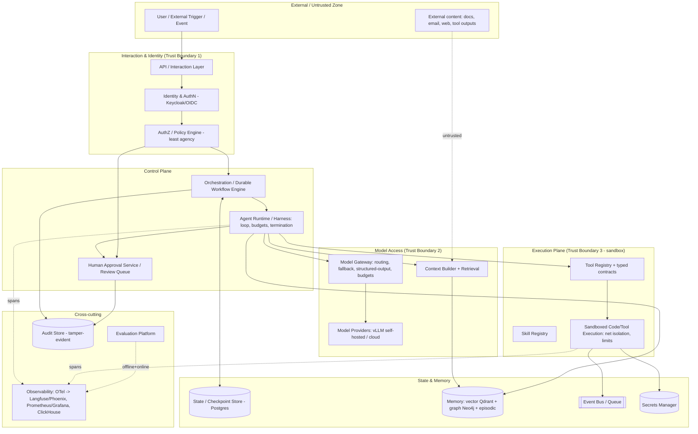

# Production-Ready AI Agents in 2026: An Engineering Guide for Design, Evaluation, Deployment, and Operation

*Vendor-neutral, with first-class treatment of on-premises / EU-sovereign, open-source, self-hostable stacks (vLLM, LiteLLM, Qdrant, PostgreSQL, Neo4j, ClickHouse, Langfuse/Phoenix, K3s, Keycloak) and a Mastra-based platform build.*

## 1. Executive Summary

The single most important finding: **in 2026 an agent's production reliability is determined mostly by the harness and surrounding deterministic system, not by the model.** Anthropic's own experiments make this concrete — in a controlled long-running coding experiment, the *same* Opus 4.5 with the *same* prompt but no harness produced roughly $9 of broken, half-implemented output in ~20 minutes, whereas a planner+generator+evaluator harness produced a working full-stack result over a ~6-hour, ~$200 autonomous session. The reliability came from scaffolding — an initializer agent, a feature list, a progress file, git checkpoints, and end-to-end self-verification — not from a better model. Arize's 2026 production analysis is quoted as finding that 88% of agent failures trace to infrastructure gaps rather than model quality, with the incident mix dominated by context blindness (31.6%), rogue actions (30.3%), silent degradation (24.9%), memory corruption (8.1%), and runaway execution (5.1%). The discipline that closes this gap now has a name — *harness engineering* — and it is the center of gravity for production agents.

The 10–15 most consequential findings, ranked:

1. **Agent = Model + Harness; the harness is where reliability lives.** The canonical formulation — "if you're not the model, you're the harness" — comes from LangChain's Vivek Trivedy ("The Anatomy of an Agent Harness"); Anthropic's own docs describe the Claude Agent SDK as "the agent harness that powers Claude Code." Marginal model gains rarely fix a brittle harness.
2. **Durable execution is now a baseline requirement, not an optimization.** LangGraph, Pydantic AI, and the OpenAI Agents SDK have all adopted durable execution as a first-class feature; Temporal raised a $300M Series D at a $5B valuation (led by Andreessen Horowitz, with Lightspeed and Sapphire Ventures) on February 17, 2026, on the strength of this thesis. Persist *completed execution boundaries* (model decision, tool input, result receipt, approval, checkpoint) and resume without repeating side effects.
3. **Session memory is NOT durable workflow state.** Saving chat history helps an agent "remember," but does not prove which shell command ran, which email was sent, or whether a retry would duplicate a side effect. Conflating the two is a top production error.
4. **Context is a finite, decaying resource ("context rot").** Effective agents curate the smallest set of high-signal tokens via compaction, structured note-taking, just-in-time retrieval, and sub-agent isolation.
5. **Prompt injection / goal hijack is the #1 agentic security risk (OWASP ASI01) and is not solvable at the model layer alone.** Controls must sit *outside* the model: least agency, treating all tool/retrieved content as untrusted, and deterministic policy enforcement.
6. **Evaluate trajectories and outcomes, not just final answers.** Grade the end state in the environment; use pass@k vs pass^k to reason about consistency; combine code, model, and human graders.
7. **Separate model failures from harness and infrastructure failures.** Anthropic showed infrastructure configuration alone (container resource headroom) can move agentic benchmark scores by more than the gap between leading models: running Terminal-Bench 2.0 on GKE, strict 1x enforcement caused 5.8% of tasks to fail on infrastructure errors (OOM kills), dropping to 2.1% at 3x headroom while success scores stayed within noise, and a ~6 percentage-point gap opened between least- and most-resourced configs.
8. **Least agency > blanket human approval.** Use a risk-based approval framework keyed to reversibility and blast radius, not "approve everything."
9. **Code execution over many narrow tools improves context efficiency dramatically** — Anthropic's "Code execution with MCP" (Nov 2025) reports a reduction from 150,000 to 2,000 tokens (98.7%) in one case, plus faster execution via progressive disclosure — but only inside a sandbox with resource limits and network isolation.
10. **The minimum production platform separates nine concerns:** agent logic, model access (gateway), orchestration/durable workflow, tools, memory, policy/identity, observability, evaluation, and infrastructure.
11. **Structured-output validity and idempotency must be guaranteed by the system, never delegated to the model.** Use typed contracts (Zod/Pydantic), validation + repair, and idempotency keys.
12. **Observability must be semantic, not just "did it run."** Adopt OpenTelemetry GenAI semantic conventions (invoke_agent / chat / execute_tool span tree); store prompts/completions as span events, not indexed attributes.
13. **Hybrid vector + graph + episodic memory is the emerging standard;** pure vector remains fine for simple chat-shaped agents. Temporal reasoning and multi-hop remain weak spots.
14. **Multi-agent vs single-agent is a task-shape decision, not an ideology.** Isolation helps parallel read/research; it hurts tightly-coupled write/coding tasks.
15. **For a TypeScript, self-hostable, EU-sovereign build, Mastra + an external durable engine (Inngest) + LiteLLM/vLLM + Qdrant/Postgres + Langfuse/OTel is a coherent, open-source (Apache 2.0) stack** — with the caveat that Mastra is fast-moving and its default engine does not explicitly guarantee exactly-once semantics.

## 2. Definition of Production Readiness

Production readiness is measurable along ten axes. Avoiding circularity, each is defined by an observable test:

- **Correctness** — task success rate and side-effect correctness on a held-out eval suite reflecting real traffic (thresholds set per use case; e.g., ≥95% pass^k for customer-facing flows). Correctness is judged on the *outcome* (environment end state), not the final text.
- **Reliability** — the probability the system reaches a correct terminal state despite transient model/tool/infra failures. Measured by success under injected faults (chaos tests) and by mean steps-to-recovery.
- **Safety** — absence of harmful/unauthorized actions. Measured by adversarial/red-team pass rates and by the rate of blocked policy violations.
- **Security** — resistance to prompt injection, data exfiltration, privilege escalation, cross-tenant leakage. Measured against OWASP ASI Top 10 with red-team suites (AgentDojo-style).
- **Observability** — ability to reconstruct *why* any action happened. Test: can an on-call engineer replay a specific production trace and identify the originating step of a failure?
- **Recoverability** — ability to resume from the latest valid checkpoint without duplicating side effects. Test: kill the worker mid-run; verify exactly-once business effect on resume.
- **Scalability** — throughput under concurrency with bounded tail latency and no retry-storm collapse (circuit breakers, backpressure verified under load).
- **Maintainability** — ability to change prompts/tools/models with versioning, regression gates, and rollback. Test: upgrade a model and detect regressions before shipping.
- **Cost efficiency** — cost per successful task within budget, with hard spend caps that terminate runaway loops.
- **Governance** — auditable identity, authorization, data classification, retention/deletion, and accountability for every consequential action.

An agent is "production-ready" for a given use case only when it meets the *thresholds defined in advance* for each axis at the maturity level appropriate to its blast radius (Section 3).

## 3. Production-Readiness Capability Model

| Level | Permitted autonomy | Required architecture | Evaluation maturity | Observability | Recovery | Security controls | Human oversight | Deployment | Suitable use cases | Unacceptable |
|---|---|---|---|---|---|---|---|---|---|---|
| **L1 Experimental prototype** | Read-only, sandbox | Single agent, in-memory state | Manual/dogfooding, 20–50 tasks | Full tracing in dev | None required | Dev secrets only | Developer in loop | Laptop / dev | Demos, internal spikes | Any real data or side effects |
| **L2 Controlled pilot** | Reversible writes to non-critical systems | Deterministic workflow + agent step; durable state introduced | 50+ tasks, regression suite, CI evals | OTel traces + cost/latency | Checkpoint + retry | Least privilege, scoped keys, input sanitization | Approval on all writes | Staging / limited prod, few users | Internal copilots, drafting | Irreversible or regulated actions |
| **L3 Limited production** | Bounded writes; irreversible actions gated | Control/execution plane split; durable workflow; model gateway | ≥500 cases, trajectory + adversarial evals, canary | SLO dashboards, alerting, replay | Durable execution, sagas/compensation | Policy engine, sandboxing, audit logs, tenant isolation | Risk-based approvals; review queue | Canary → prod, monitored | Support, ops automation, internal agents | High-value financial/safety-critical autonomy |
| **L4 Production-grade** | Autonomous within a bounded domain | Full reference architecture (Section 5) | Continuous eval, shadow/A-B, long-horizon tests | Full semantic telemetry, SLIs/SLOs, incident response | Exactly-once business effects, tested recovery | Full OWASP ASI controls, secret rotation, supply-chain checks | Exception-based HITL, escalation policy | HA, horizontal scaling, change mgmt | Customer-facing agents at scale | Unbounded autonomy in high-risk domains |
| **L5 Mission-critical** | Autonomous in high-impact domain | L4 + formal verification of critical paths, redundancy | Adversarial + chaos + formal methods; certified datasets | Real-time anomaly detection, tamper-evident audit | Multi-region durability, provable compensation | Defense-in-depth, dual control, continuous red-team | Mandatory dual approval on irreversible high-value actions | Regulated, audited, DR-tested | Payments, healthcare, industrial control (with human accountability) | Fully removing human accountability |

## 4. Crucial-Factor Matrix

| Priority | Factor | Why It Matters | Common Failure Mode | Required Controls | Recommended Pattern | Maturity 2026 | Key Sources |
|---|---|---|---|---|---|---|---|
| P0 | Durable execution / checkpointing | Long-running agents must survive crashes without redoing side effects | Crash restarts from scratch; duplicate emails/orders | Persist completed boundaries; idempotency keys; at-least-once activity + idempotent effect = effective exactly-once | Temporal/Inngest/DBOS or LangGraph checkpointer; Mastra + Inngest | Mature | Temporal, Inngest, Pydantic AI, Zylos |
| P0 | Harness quality (loop, budgets, termination) | Determines reliability more than model | Infinite loops, premature "done", context exhaustion | Hard step caps + (tool,args) hash loop detection; token/iteration budgets | Initializer + worker agents, progress files, self-verification | Mature | Anthropic harness posts |
| P0 | Typed tool contracts + validation | Malformed params corrupt downstream steps | Invalid tool parameters silently propagate | Zod/Pydantic schemas, output validation + repair (ModelRetry) | Structured outputs enforced at gateway | Mature | Pydantic AI, Mastra |
| P0 | Prompt-injection / least agency | #1 agentic risk; enables data exfil, unauthorized actions | Goal hijack via poisoned doc/email/tool output | Treat all external content as untrusted; least agency; policy engine outside model | Information-flow controls, allowlists, human gate on high-risk | Emerging (unsolved) | OWASP ASI 2026, arXiv IPI |
| P0 | Semantic observability | Cannot operate what you cannot explain | "Flying blind"; can't distinguish regression from noise | OTel GenAI spans; prompts as events; session/trace correlation | invoke_agent/chat/execute_tool tree → Langfuse/Phoenix | Mature (spec pre-1.0) | OpenTelemetry, LangChain |
| P0 | Separation of memory vs workflow state | Recovery correctness depends on it | Using chat history as source of truth for side effects | Durable state store distinct from memory store | Event log for effects; memory store for knowledge | Mature | Zylos, Inngest |
| P1 | Evaluation (trajectory + outcome) | Prevents silent regression; enables model upgrades | One-shot answer evals miss unsafe paths | Outcome grading + trajectory scoring; ≥500 cases | Eval pyramid (Section 8); LLM-as-judge calibrated to humans | Maturing | Anthropic evals, Confident AI |
| P1 | Infrastructure-noise control in evals | Confounds model vs harness vs infra | OOM kills counted as model failures | Separate guaranteed vs kill limits (~3x headroom); isolated trials | Clean-env trials; resource bands as first-class variable | Emerging | Anthropic infra-noise |
| P1 | Model gateway / routing / fallback | Provider outages, cost, sovereignty | Single-provider outage takes system down | Gateway with fallback chains, virtual keys, budgets | LiteLLM/Pydantic Gateway in front of vLLM + cloud | Mature | LiteLLM |
| P1 | Sandboxing for code execution | Agent-generated code is dangerous | Unsafe code, network exfil | Containerized sandbox, resource limits, network isolation, least privilege | Code execution with MCP inside sandbox | Maturing | Anthropic code-exec, Claude sandboxing |
| P1 | Memory hygiene (provenance, decay, conflict) | Corrupted memory poisons future runs | Memory poisoning; stale/contradictory facts | Provenance, confidence, expiry, correction/deletion, access control | Hybrid vector+graph+episodic; consolidation | Maturing | mem0, Zep, CoALA, AWS AgentCore |
| P2 | Multi-agent orchestration | Capability for wide/parallel tasks | Coordination failures, conflicting writes | Isolation boundaries; supervisor; economic justification | Sub-agents for parallel reads; single thread for writes | Contested | Anthropic vs Cognition |
| P2 | Cost/performance engineering | Token/context growth balloons cost | Multi-turn cost compounds 3x–5x faster than naive "turns × avg cost" models predict (Growth Engineer 2026) | Caching, compaction, model routing, batching, spend caps | Small model default, escalate to frontier | Maturing | Growth Engineer, Anthropic |

## 5. Reference Architecture

A vendor-neutral logical architecture. Trust boundaries are marked; the model and any agent-generated content are treated as *untrusted* relative to policy enforcement and side-effect execution.



**Component-by-component:**
- **API / interaction layer** — synchronous request/response and async event ingress; enforces schema and rate limits.
- **Identity & AuthZ / policy engine** — every agent acts under a scoped identity (Keycloak/OIDC). The policy engine enforces *least agency*: the minimum autonomy and tool/data permissions for the declared task. This is the first line of defense against excessive agency and goal hijack.
- **Orchestration / durable workflow engine** — owns state transitions, retries, timers, human waits, and saga compensation. This is where exactly-once business effects are guaranteed.
- **Agent runtime / harness** — the execution loop: context assembly, iteration/token budgets, termination conditions, loop detection, cancellation, progress tracking, artifact management.
- **Model gateway** — one interface to many providers; routing, provider fallback, structured-output enforcement, virtual keys, budgets, caching. Enables sovereignty by routing to self-hosted vLLM first.
- **Context builder + retrieval** — assembles the smallest high-signal context; performs just-in-time retrieval; separates durable state from conversational context.
- **Tool & skill registries** — typed contracts, side-effect classification, permissions; skills as versioned folders (SKILL.md) loaded via progressive disclosure.
- **Sandboxed execution** — isolated runtime for code/tool execution with resource limits and network isolation.
- **State/checkpoint store** (Postgres), **memory** (Qdrant vector + Neo4j graph + episodic log), **event bus/queue**, **secrets manager** — distinct stores with distinct lifecycles and access controls.
- **Observability, evaluation, audit** — cross-cutting; OTel spans to Langfuse/Phoenix; tamper-evident audit of all consequential actions.

**Data-flow & failure-recovery flow:** A trigger authenticates → policy engine authorizes scope → orchestration starts a durable workflow → harness assembles context, calls model via gateway, validates structured output, selects a tool → high-risk/irreversible actions route to the approval service → side effects execute in the sandbox with an idempotency key and are recorded on the event bus and audit store → each completed boundary is checkpointed. On crash, the workflow resumes from the last checkpoint; already-committed side effects are skipped via idempotency keys; partial multi-step transactions are unwound by compensating actions (saga).

## 6. Deterministic vs Agentic Responsibility Matrix

| Responsibility | Model (delegated) | Deterministic (system) | Shared | Human approval |
|---|---|---|---|---|
| Planning / task decomposition | ✔ (proposes) | | ✔ (harness constrains via feature list/plan file) | |
| Authorization / permissions | | ✔ (policy engine) | | (grants of new scope) ✔ |
| Tool selection | ✔ (chooses) | ✔ (registry filters allowed set) | ✔ | |
| Parameter validation | | ✔ (schema validation + repair) | | |
| State transitions | | ✔ (workflow engine) | | |
| Retries / backoff | | ✔ (durable engine) | | |
| Side effects (irreversible/high-value) | | ✔ (executed deterministically w/ idempotency) | | ✔ |
| Memory writes | ✔ (proposes facts) | ✔ (consolidation, provenance, dedup) | ✔ | (deletion of regulated data) ✔ |
| Termination | ✔ (signals done) | ✔ (hard caps, loop detection are authoritative) | ✔ | |
| Policy enforcement | | ✔ | | |
| Escalation | ✔ (can request) | ✔ (thresholds trigger) | ✔ | |
| Rollback / compensation | | ✔ (saga) | | (irreversible) ✔ |

Principle: **anything whose failure is unrecoverable or unbounded must not be delegated to the model.** The model proposes; deterministic components dispose.

## 7. Failure-Mode Analysis

| Failure Mode | Root Cause | Detection | Prevention | Containment | Recovery | Test Strategy |
|---|---|---|---|---|---|---|
| Infinite loop / no-progress | Blind retry on unhandled error class; non-terminating planning | (tool,args) hash repeats ≥3; duration > p99 with no stop_reason | Hard step cap; cycle detector; inject synthetic observation on repeat | Terminate at cap, return partial | Resume from checkpoint with revised plan | Replay traces; loop-injection tests |
| Retry storm / thundering herd | Many agents retry a dead dependency | Spike in error rate + concurrent identical calls | Exponential backoff + jitter; circuit breakers; rate limits at gateway | Circuit breaker opens; queue backpressure | Gradual half-open recovery | Chaos test: kill dependency under load |
| Duplicated side effect | At-least-once execution without idempotency | Duplicate detection on effect ledger | Idempotency keys; dedup at effect boundary | Compensating action | Saga rollback | Kill-mid-run test; assert single effect |
| Partial execution / lost progress | Crash between steps | Missing terminal state in workflow history | Durable checkpoints at each boundary | Workflow marked incomplete | Resume from last valid checkpoint | Crash-injection during multi-step |
| Malformed structured output | Model emits invalid JSON/schema | Schema validation failure | Typed contracts; constrained decoding; validation+repair | Reject + repair loop (bounded) | ModelRetry with error text | Adversarial output tests |
| Invalid tool parameters | Model hallucination | Output-schema validation; state check | Zod/Pydantic input schemas; enums | Block call; return typed error | Re-plan | Fuzz tool inputs |
| Hallucinated action/tool | Ambiguous/bloated tool set | Tool-not-found; unexpected call | Minimal, non-overlapping tools; clear descriptions | Reject unknown tool | Re-prompt with valid set | Tool-selection evals |
| Prompt injection / goal hijack | Untrusted content in context | Anomaly in goal/tool pattern; injection classifier | Treat all external content untrusted; least agency; information-flow control | Human gate on high-risk; revoke tool | Halt, audit, rotate creds | AgentDojo-style red-team |
| Memory poisoning / stale state | Corrupted or contradictory memory | Provenance/confidence checks; conflict detection | Provenance, expiry, validation on write | Quarantine memory namespace | Rollback memory; re-consolidate | Inject poisoned memories |
| Provider outage / rate limit | External dependency | Gateway error codes | Multi-provider fallback chains | Fallback to secondary/self-hosted | Automatic reroute | Fault injection at gateway |
| Concurrent state modification | Parallel writes to same resource | Version conflict | Optimistic concurrency / leases | Reject conflicting write | Retry with fresh state | Race-condition tests |
| Silent quality degradation | Model/prompt drift | Production quality monitor; eval canary | Continuous eval; regression gates | Alert + rollback | Revert to prior version | Shadow + A/B |

Prioritize by likelihood × business impact: duplicated side effects, prompt injection, silent degradation, and infinite loops/cost runaways are the highest-priority classes for most deployments.

## 8. Evaluation Framework

An **evaluation pyramid** (broad/cheap at the base → narrow/expensive at the top):

1. **Unit-level (base):** deterministic tests for pure functions, prompt templates, parsers. Fast, in CI.
2. **Tool-contract testing:** validate each tool against its schema; assert idempotency and side-effect classification; test failure/error paths. Deterministic.
3. **Workflow testing:** integration tests of the durable workflow — suspend/resume, retries, compensation. Assert exactly-once effects under crash injection.
4. **Trajectory evaluation:** score the path — tool selection, argument correctness, step efficiency, plan adherence, recovery behavior. Deterministic checks for tool names/params; LLM-as-judge for reasoning quality. Grade *what was produced*, not a rigid golden path (Anthropic found step-sequence grading too brittle).
5. **Outcome evaluation:** verify the environment end state (DB row, file, API state) — the authoritative signal. Use pass@k where one success suffices, pass^k where consistency matters (a 75% per-trial rate is only ~42% pass^3).
6. **Memory evaluation:** retrieval precision/recall, temporal reasoning, conflict resolution, poisoning resistance.
7. **Adversarial / red-team:** prompt injection, jailbreak, tool misuse (AgentDojo, OWASP ASI presets in Promptfoo).
8. **Infrastructure-noise controls:** isolate each trial in a clean environment; set container guaranteed vs kill limits with headroom (~3x); treat resource config as a first-class experimental variable; run multiple trials.
9. **Long-horizon tests:** multi-session tasks with context resets; verify progress files/checkpoints bridge sessions.
10. **Production monitoring:** online quality signals, cost/latency SLIs, human-intervention rate, failure clustering.
11. **Human review:** calibrate LLM judges; spot-check transcripts weekly; systematic studies for subjective/regulated domains.
12. **Release gates:** capability evals (start low, hill-climb) + regression evals (~100% pass). Block release on regression.

**Recommended metrics:** task success (outcome), trajectory/tool-call correctness, instruction adherence, safety pass rate, human-intervention rate, side-effect correctness, latency (TTFT, tokens/sec), cost/task, recovery success rate. **Example thresholds:** ≥95% regression pass; ≥500 labeled cases before trusting aggregates (a figure recurring across 2025–26 eval research); LLM-judge–human agreement (Pearson) ≥0.8 on a 0–5 scale (the Grading Scale study found 0–5 scales best-aligned, ~0.89, and 10-point scales added noise); adversarial pass rate targets per risk tier. **Limitations:** LLM-as-judge is non-deterministic, biased (length/position/self-preference), too expensive per-turn, and drifts when the judge model updates; benchmark contamination inflates scores; offline evals create false confidence if they diverge from real traffic. No single layer catches everything (Swiss-cheese model). Read the transcripts — a 0% pass@100 usually signals a broken task or grader, not an incapable agent (as when Opus 4.5 jumped from 42% to 95% on CORE-Bench after grading/spec fixes).

## 9. Observability Specification

Adopt the OpenTelemetry GenAI semantic conventions (spans: `invoke_agent`, `chat`, `execute_tool`; attributes `gen_ai.*`). OpenTelemetry graduated the CNCF on May 21, 2026, and the GenAI conventions reached v1.42.0 (June 12, 2026) but remain pre-1.0/Development — so store prompts/completions as **span events**, not indexed attributes (size limits, PII), and pin the spec version behind a thin mapping layer.

| Signal | Scope | Required Attributes | Retention | Alert Condition | Primary Use |
|---|---|---|---|---|---|
| Agent run span | Per invocation | agent.id/name, session/trace id, user/tenant, model+prompt version, outcome status | 30–90d | Error status; duration > p99 | Trace correlation, incident triage |
| Model call span | Per LLM call | gen_ai.system, request.model, usage.input/output_tokens, finish_reason, cost | 30–90d | Token/cost spike; finish_reason=length loop | Cost, latency, drift |
| Tool call span | Per tool | tool name, args (redacted), result status, latency, side-effect class, idempotency key | 90d | Error rate; retry count; unknown tool | Debug decisions, audit |
| State transition | Per checkpoint | workflow id, step, status, checkpoint ref | ≥ workflow life + audit | Missing terminal state | Recovery, replay |
| Retrieval / memory r/w | Per event | store, query, top-k ids, scores, provenance | 30–90d | Retrieval miss rate ↑ | Memory quality |
| Safety decision | Per gate | policy id, decision, reason, identity | ≥1y (audit) | Any block; injection detected | Security, compliance |
| Human intervention | Per gate | approver, action, reversible?, latency | ≥1y (audit) | Approval backlog; fatigue signal | HITL accountability |
| Prompt/model version | Per deploy | version hashes, dataset id | Indefinite | Version mismatch | Change mgmt, reproducibility |

Privacy-aware logging: redact/tokenize PII (as in code-execution-with-MCP, where the MCP client tokenizes PII before it reaches the model); use tail-based sampling (keep all error traces, sample ~10% of successes). OTel overhead is <1ms per call — storage volume, not latency, is the cost.

**Sample trace structure (one agent execution):**
```
invoke_agent (session=..., tenant=..., model=claude-... , prompt_v=..)
├─ chat (input_tokens, output_tokens, finish_reason)         [context assembly + plan]
├─ retrieval (store=qdrant, top_k, scores, provenance)
├─ execute_tool: read_file (status=ok, latency)
├─ chat (decision to write)                                   [safety span: policy=allow]
├─ human_approval (approver, action=refund<=100, reversible=false)
├─ execute_tool: process_refund (idempotency_key=..., status=ok)  [state transition: checkpoint]
└─ outcome (state_check: refund.status=processed)             [status=success, cost=$..]
```

## 10. Security and Governance Checklist

Separate **model-level safety** (does the model refuse harmful outputs?) from **system-level security** (can the system be made to take harmful actions?). The latter dominates for agents. OWASP's Top 10 for Agentic Applications 2026 (ASI01–ASI10) foregrounds two principles: *least agency* (autonomy earned, not default) and *strong observability*.

**Mandatory (all production):**
- [ ] Every agent runs under a scoped, per-task identity (least agency); no shared god-credentials.
- [ ] All external content (docs, email, web, tool outputs, retrieved memory) treated as untrusted; not allowed to alter goals or tool calls without policy checks.
- [ ] Tool permissions enforced by a policy engine outside the model; tools individually revocable without redeploy.
- [ ] Irreversible/high-value actions require human approval or dual control.
- [ ] Code/tool execution runs in a sandbox with resource limits and network isolation.
- [ ] Secrets in a manager, never in prompts/context; PII tokenized before reaching the model where possible.
- [ ] Tamper-evident audit log of every consequential action with identity and reason.
- [ ] Tenant isolation across state, memory, and vector stores.
- [ ] Structured-output validation on all tool inputs; idempotency keys on all side effects.

**Risk-dependent:**
- [ ] Injection detection/classifier on high-exposure ingress; information-flow controls. (Note: Unit 42 documented the first large-scale indirect-injection attacks in the wild in March 2026; Munich Re's 2026 cyber report flagged prompt injection as a "major attack vector" — treat detection as defense-in-depth, not a solution.)
- [ ] Memory-poisoning detection; provenance and confidence on memory writes.
- [ ] Secret rotation cadence; virtual keys per team/agent with budgets.
- [ ] Data classification and retention/deletion policies (EU AI Act Article 14 mandates human-oversight interfaces for high-risk systems).
- [ ] Egress allowlists for tools/browsers.

**Advanced:**
- [ ] Supply-chain verification of MCP servers, skills, and container images (pin/sign images; audit skill folders — note the March 2026 LiteLLM image supply-chain incident as a cautionary case).
- [ ] Continuous red-teaming; anomaly detection on agent behavior; kill-switch/rogue-agent containment.
- [ ] Cross-model provenance and dependency attestation.

## 11. Implementation Roadmap

**Phase 0 — Use-Case Qualification.** Decide: deterministic app vs LLM-assisted workflow vs constrained agent vs highly autonomous agent. *If a fixed workflow solves it, do not build an agent.* Objectives: define success metrics, blast radius, reversibility. Deliverables: use-case charter, risk tier, target thresholds. Entry: business sponsor. Exit: agent justified over a workflow; risk tier assigned. Risks: "agent-washing" a problem that is really deterministic. Metrics: expected task value vs added coordination/token cost.

**Phase 1 — Controlled Prototype (L1→L2).** Narrow scope, read-only tools, deterministic workflow with one agent step, baseline eval (20–50 real-failure tasks), complete tracing from day one. Deliverables: traced prototype, eval seed set, tool schemas. Entry: Phase 0 exit. Exit: reproducible eval baseline; traces reviewable. Risks: skipping observability. Metrics: task success on seed set, trace completeness.

**Phase 2 — Pilot (L2→L3).** Add durable state, retries, approval gates, typed tool contracts, security controls (least agency, sandbox, audit), realistic scenario tests, adversarial suite. Deliverables: durable workflow, policy engine, ≥500-case eval, red-team results. Entry: stable baseline. Exit: recovery verified under crash injection; adversarial pass targets met; canary ready. Risks: memory/workflow-state conflation. Metrics: recovery success, injection pass rate, human-intervention rate.

**Phase 3 — Production (L3→L4).** Scaling, recovery, SLOs, continuous evaluation, incident response, change management, cost controls (spend caps, model routing). Deliverables: SLO dashboards, on-call runbooks, canary/shadow/A-B pipeline, rollback. Entry: pilot exit. Exit: SLOs met in canary; regression gates enforced; DR tested. Risks: silent degradation post-launch. Metrics: SLIs, cost/successful task, regression pass rate.

**Phase 4 — Advanced Autonomy (L4→L5).** Only when prior phases provide evidence. Expand autonomy domain-by-domain with dual control on irreversible high-value actions, formal verification of critical paths, continuous red-team. Entry: sustained L4 metrics. Exit: governance sign-off. Risks: autonomy outrunning evidence. Metrics: safety pass rate, incident rate, blast-radius containment.

## 12. Build-vs-Buy Decision Framework

| Option | Control | Maturity | Portability | Security | Observability | Lock-in | Ops burden | Customization | Cost | Suitable for |
|---|---|---|---|---|---|---|---|---|---|---|
| Custom agent runtime | Highest | Low (you build it) | High | You own it | You build it | None | Highest | Unlimited | High eng cost | Unique reqs, deep IP |
| Agent framework (Mastra, Pydantic AI, LangGraph) | High | Medium–High | High (OSS) | Your controls | Native OTel | Low (Apache/MIT) | Medium | High | Low license | Most teams; TS→Mastra, Py→Pydantic AI |
| Durable workflow platform (Temporal, Inngest, DBOS) | High (execution) | High | Medium–High | Your controls | Strong | Medium | Medium | High | Infra/license | Reliability-critical, long-running |
| Managed cloud agent platform (Bedrock AgentCore, Vertex/Gemini Enterprise, Azure AI) | Lower | High | Low | Vendor-shared | Vendor tools | High | Lowest | Bounded | Usage-based | Fast start, cloud-committed |
| Hybrid (framework + durable engine + self-host models) | High | High | High | Your controls | Native OTel | Low–Medium | Medium–High | High | Medium | **EU-sovereign, on-prem, open-source teams** |

No universal winner. For the requester's profile (on-prem, EU-sovereign, open-source, TypeScript/Python, durable-execution preference), the **hybrid** row is the strongest fit: Mastra (TS) or Pydantic AI (Py) as the agent layer, an external durable engine for exactly-once guarantees, LiteLLM+vLLM for sovereign model access, Qdrant/Postgres/Neo4j for memory/state, Langfuse/Phoenix for self-hosted observability.

**Mastra specifics (for building the platform over Mastra):** Mastra is an Apache-2.0 open-source TypeScript framework (agents, workflows, memory, tools, evals, observability) built on the Vercel AI SDK, founded by the ex-Gatsby team (Sam Bhagwat, Abhi Aiyer, Shane Thomas), with v1.0 in early 2026. Its graph workflow engine provides `.then()/.branch()/.parallel()/.dowhile()/.dountil()/.foreach()` control flow, durable suspend/resume with state persisted to storage (the schedules/state tables "survive process restarts and redeploys"), and workflow-/step-level retries (`retryConfig`, `retries`, backoff). Crucially, **Mastra's default engine does not explicitly document exactly-once semantics** — for strong guarantees use its first-class **Inngest adapter**, where "Inngest executes it step by step and memoizes each result… on retry or resume, Inngest skips completed steps based on those saved results" (Temporal is referenced only by analogy; no official Temporal adapter). Memory has three types — working memory, conversation/thread history, and semantic recall (RAG over a vector store, with resource-scoped persistence across threads) — with storage backends including LibSQL, PostgreSQL, MongoDB, Upstash, Redis, and ClickHouse, and vector stores including **Qdrant and PgVector as first-class** (PgVector supports HNSW and IVFFlat indexes). Its model router uses `provider/model` strings across many providers (self-reported in the thousands; treat exact counts as fluid) and **routes to self-hosted OpenAI-compatible endpoints (vLLM, Ollama, LiteLLM, LMStudio)** via a custom base URL, with model fallbacks. Tools use Zod/JSON-schema input/output contracts (`createTool` with `inputSchema`/`outputSchema`); MCP client and `MCPServer` (stdio/HTTP, OAuth token introspection, elicitation) are supported, and an MCP compatibility layer reportedly cut tool-calling error rates "from 15% to 3%." Observability is native OTel with confirmed exporters/integrations for Langfuse, Arize (Phoenix/AX, via OpenInference), SigNoz, Braintrust, LangSmith, MLflow, and ClickHouse as a storage backend. It deploys as a standalone Node/Bun/Deno server (Docker/K8s; default port 4111). **Caveats:** fast-moving codebase with v0→v1 breaking changes and coexisting doc versions; in-memory (`:memory:`) default LibSQL storage is non-persistent (switch to Postgres for production); Inngest Connect worker mode is in public beta; funding and customer figures cited by third parties (e.g., SoftBank, Adobe, PayPal, Replit as investors/users) should be treated as secondary.

## 13. Production-Readiness Checklist (Architecture Review Board — pass/fail)

- [ ] Can every external side effect be uniquely identified (idempotency key) and safely retried without duplication?
- [ ] Can execution resume from the latest valid checkpoint after a crash, without repeating committed side effects or approvals?
- [ ] Can the organization reconstruct *why* the agent performed any specific action (trace + reason + identity)?
- [ ] Can individual tools be revoked without redeploying the entire system?
- [ ] Is durable workflow state stored separately from conversational memory?
- [ ] Is there an eval that reproduces the most important production failure scenarios (outcome + trajectory)?
- [ ] Are hard iteration/token budgets and (tool,args) loop detection enforced by the harness?
- [ ] Are all tool inputs schema-validated and all structured outputs validated + repaired?
- [ ] Is every external/retrieved input treated as untrusted and prevented from silently changing goals/tools?
- [ ] Do irreversible/high-value actions require human approval or dual control?
- [ ] Does the agent run under least-agency scoped identity with tenant isolation?
- [ ] Is code/tool execution sandboxed with network isolation and resource limits?
- [ ] Are provider fallbacks configured so a single provider outage does not take the system down?
- [ ] Are spend caps and cost alerts wired to auto-terminate runaway loops?
- [ ] Are regression evals gating releases, and can a bad model/prompt be rolled back?
- [ ] Are prompts/completions stored as redacted span events with PII tokenized?

Any "fail" on the first ten blocks production approval for L3+.

## 14. Final Recommendations

**10 highest-priority actions for teams starting today:**
1. Instrument OTel GenAI tracing before writing agent logic; wire to Langfuse/Phoenix.
2. Qualify the use case — prefer a deterministic workflow unless autonomy is justified.
3. Put a durable execution engine under any multi-step or long-running agent; persist completed boundaries.
4. Separate durable workflow state from memory from retrieval — three distinct stores.
5. Define typed tool contracts and validate every input/output; make side effects idempotent.
6. Enforce least agency via a policy engine outside the model; scope identities per task.
7. Build a 50-task eval from real failures now; grade outcomes, not just answers; grow to ≥500.
8. Add hard step/token budgets and (tool,args) loop detection to the harness.
9. Sandbox all code/tool execution with network isolation and resource limits.
10. Route models through a gateway (LiteLLM in front of vLLM) with fallback and budgets.

**10 most dangerous shortcuts to avoid:**
1. Treating chat history as the source of truth for side effects.
2. Assuming a more capable model fixes a brittle harness.
3. Deferring observability until "after launch."
4. Blanket human approval for every action (causes operator fatigue) instead of risk-based gates.
5. Exposing many broad, overlapping tools (ambiguous selection, hallucinated calls).
6. Running agent-generated code without a sandbox.
7. Trusting benchmark/leaderboard scores without reading transcripts or controlling infra noise.
8. Building multi-agent systems before a single agent is reliable.
9. Delegating termination, authorization, or idempotency to the model.
10. Storing full prompts as indexed span attributes (PII + cost).

**Capabilities not yet trustworthy without human oversight (2026):** irreversible high-value actions (payments, production changes, external communications); open-ended computer/browser use in sensitive systems; autonomous handling of untrusted content where injection is possible; long-horizon fully-autonomous work in regulated domains; memory that self-modifies procedural behavior without review.

**Mature in 2026:** durable execution / checkpointing; model gateways + fallback (LiteLLM); OTel GenAI tracing and self-hosted observability (Langfuse/Phoenix); typed tool contracts (Zod/Pydantic); harness patterns (initializer+worker, progress files, self-verification); the episodic/semantic/procedural memory taxonomy; code execution with MCP inside sandboxes.

**Emerging:** hybrid vector+graph memory with consolidation; trajectory + LLM-as-judge evaluation at scale; infrastructure-noise-controlled benchmarking; MCP tool ecosystems and code-mode; risk-based approval frameworks; the OpenTelemetry GenAI convention set (pre-1.0).

**Experimental / unresolved:** robust defense against indirect prompt injection (no reliable solution; OWASP #1); reliable temporal/multi-hop memory reasoning; automated memory-poisoning defense; multi-agent coordination guarantees; provable safety for high-autonomy agents; standardized cross-vendor agent evaluation.

**Most important unanswered questions (next 12–24 months):**
- Can indirect prompt injection be contained by architecture (information-flow control, least agency) well enough to trust agents with untrusted content and real side effects?
- Will durable-execution semantics standardize across agent frameworks (exactly-once business effects as a portable guarantee)?
- Can memory evaluation and consolidation mature enough to make cross-session learning safe under GDPR/EU AI Act?
- Do single-agent-plus-strong-harness architectures dominate, or will multi-agent coordination patterns prove reliably better for a broad class of tasks?
- Can we cleanly and reproducibly separate model, harness, and infrastructure contributions to observed agent performance?

---

### Synthesis notes: where sources agree, disagree, and are uncertain

- **Strong multi-source agreement:** durable execution as a baseline (Temporal, Inngest, Pydantic AI, LangGraph, independent analyses); context-as-finite-resource and compaction/note-taking/sub-agents (Anthropic, corroborated by Cognition and LangChain); trajectory+outcome evaluation (Anthropic, Google Cloud, Confident AI, DeepEval); least agency + untrusted-input handling (OWASP ASI 2026, multiple security vendors, arXiv); episodic/semantic/procedural memory taxonomy (CoALA arXiv, LangChain, AWS AgentCore, mem0, Zep).
- **Genuine disagreement:** single-agent vs multi-agent. Cognition ("Don't Build Multi-Agents") argues parallel subagents make conflicting decisions on shared-state (write/coding) tasks; Anthropic reports a multi-agent research system outperforming single-agent by ~90% on parallelizable (read/research) tasks. Both are right within their task shape — the better-supported synthesis is that isolation helps parallel reads and hurts coupled writes, and most teams should make a single agent reliable first.
- **Vendor bias to flag:** Anthropic's engineering posts are primary and high-quality but optimize for Claude; framework "production-ready" feature lists (Mastra, LangGraph, Pydantic AI, Redis, monday.com) and provider counts/customer logos are marketing signals, not proof of production readiness. MLflow/Google/AWS guides mix solid engineering with product placement.
- **Inference (not direct evidence), explicitly marked:** the specific maturity-level thresholds (e.g., ≥95% pass^k), the nine-concern platform decomposition, and the exact mapping of controls to L1–L5 are the author's synthesis, grounded in the cited sources but not lifted verbatim from any one of them.

### Bibliography (grouped by topic)

**Harness & context engineering (primary, Anthropic):** Effective context engineering for AI agents (Sep 29, 2025); Effective harnesses for long-running agents (Nov 26, 2025); Harness design for long-running application development; Code execution with MCP (Nov 4, 2025); Equipping agents for the real world with Agent Skills. LangChain: The Anatomy of an Agent Harness (Vivek Trivedy); AddyOsmani, "Agent Harness Engineering."

**Evaluation & infrastructure noise:** Anthropic, Demystifying evals for AI agents (Jan 9, 2026); Anthropic, Quantifying infrastructure noise in agentic coding evals (Terminal-Bench 2.0 on GKE); Confident AI, Morph, Zylos (LLM-as-judge patterns); Google Cloud, Agent Quality / Prototype-to-Production (Kaggle whitepapers, Feb 26, 2026).

**Durable execution & reliability:** Temporal (durable execution, sagas, $300M Series D Feb 17 2026); Inngest (durable execution for AI agents); Pydantic AI + Temporal; Zylos (durable execution for agent runtimes); Cloudzy, Growth Engineer, Latitude, Maxim (failure-mode taxonomies).

**Memory:** LangChain, "How to give your agent memory" (Jun 24, 2026); AWS Bedrock AgentCore semantic memory strategy; CoALA (arXiv 2309.02427); mem0 State of AI Agent Memory 2026; Zep; Zylos memory-architectures survey; Atlan (episodic memory).

**Security & governance:** OWASP Top 10 for Agentic Applications 2026 (ASI01–ASI10) and OWASP LLM01 Prompt Injection 2025; arXiv AgentDojo, IterInject, AttriGuard, AgentRedBench; Unit 42 / Munich Re 2026 injection reporting.

**Observability:** OpenTelemetry GenAI semantic conventions (v1.42.0, Jun 12 2026; CNCF graduation May 21 2026); OpenTelemetry.io GenAI observability blog; Uptrace, Greptime, Vera ex Machina.

**Frameworks & platforms:** Mastra docs (mastra.ai/docs — workflows, memory, models, tools/MCP, observability, deployment); Pydantic AI (pydantic.dev, GitHub); LiteLLM (self-hosted gateway guides); MLflow "Building Production-Ready AI Agents in 2026"; Google Cloud "A dev's guide to production-ready AI agents" (Feb 26, 2026).

**Architecture debate:** Cognition, "Don't Build Multi-Agents" and "Multi-Agents: What's Actually Working"; Anthropic multi-agent research system; LangChain, "How and when to build multi-agent systems."