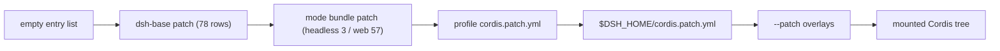
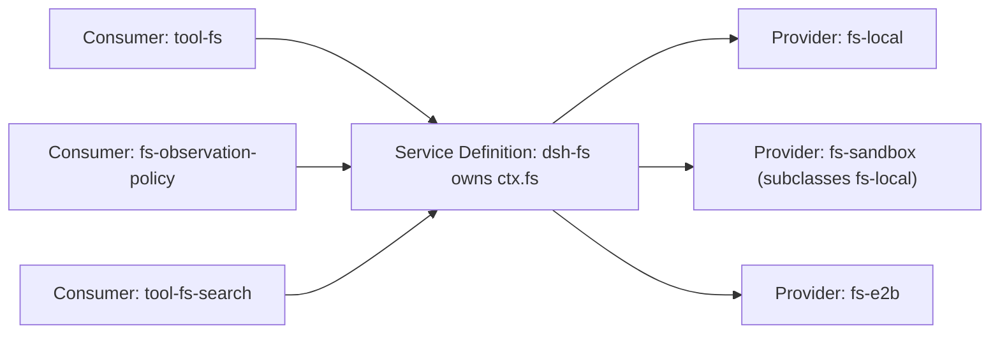

# DeepSeek Harness: consolidated foundation assessment

Date: 2026-08-20. Checkout: `141eb6fef8` on `master`, `0.1.0-rc.8`, tracked tree clean.

> **Status (2026-08-20): §9 superseded, ledger A partly superseded.** Read [the remediation report](qwen38-harness-remediation.html) first, then [the bring-up report](qwen38-harness-bringup.html).
>
> **Superseded here.** §9's candidate route — corrected field by field on the wire as C1–C6 of the bring-up report. Ledger A4's `session-title*` row — titling is now fixed rather than deleted, at one non-thinking request per session. Any claim that this checkpoint cannot prefix-cache — see R1 of the remediation report.
>
> **Still authoritative here, with no equivalent anywhere else.** Purge ledger A in §6 and purge ledger B in §7 — the row groups, their measured package/dependency/LOC effect, and the ordering constraints. Ledger A3 now carries a second rationale beyond token cost: see D4 of the remediation report.

This document is the decision layer over two surviving prior assets: [foundation assessment](deepseek-harness-foundation-assessment.md) and [plugins overview](deepseek-harness-plugins-overview.md). It keeps what survived falsification, applies the corrections from a since-retired adversarial review, and adds measurements neither contains — the real cost of each shipped plane, and the effect of each purge, computed from this checkout.

It supersedes their architecture narratives, dependency figures, port sizing, and staging advice, which carry the errors corrected in §2. It does not replace them: the plugins overview remains the only row-by-row inventory of all 138 composition rows, needed to resolve the row groups in §6 to ids and packages; and the foundation assessment retains the benchmark matrix, the pi-ai settings-layer risk register, and the adapter-justification criteria. Each of the two carries a status header naming what in it is still authoritative.

Every quantitative claim below was produced by a command in this checkout and is reproducible from the appendix. Claims are labelled: **[V]** verified here, **[I]** inherited from a prior asset that survived falsification, **[U]** unproven and dependent on facts outside the repository. `node_modules` is absent, so no gate, test, build, or model call was executed; nothing below asserts a passing test run.

## 1. Verdict

The architecture is worth the investment; the repository around it is not, for your purpose. Those are separable, and separating them is the whole finding.

**[V]** The framework that makes this valuable is small: the vendored Cordis kernel is 2,693 lines across 9 files (`vendor/cordis/src`), 6,550 lines for all of `vendor/`. The composability properties you want — key-addressed services, reversible registrations, patch-layered composition, an append-only session log — are all in that kernel plus roughly a dozen core packages.

**[V]** The bloat is not in the architecture. It is in 226 workspace packages (239,844 source lines), a test surface larger than the product (285,875 lines), 219 documentation files of which 107 are Chinese translations, ~728 Agent Notes carried as English/Chinese/i18n triplets (2,176 files), 164 files in `scripts/`, 29 `verify-*` gates, 128 root npm scripts, and 16 CI workflows. That machinery exists to publish a bilingual multi-platform product with per-file 100% coverage. You are publishing nothing.

**[V]** The decisive structural fact, and the one all three assets miss: **you do not need to fork or port anything to compose your own agent.** Profiles live outside the repository at `$DSH_HOME/profiles/<name>`, hold their own `package.json` and `cordis.patch.yml`, and resolve bundles installation-first then profile-local (`packages/boot/app-boot/src/profile.ts:1-24`, `:113-171`). A private composition is a directory of two files. Repository debloating is a separate, later, optional operation, and framing it as a "port" — as the plugins overview does — overstates the entry cost by two orders of magnitude of effort.

Proceed, in this order: prove the model wire, compose a private profile, and only then decide whether to delete anything.

## 2. Corrections that change a decision

The adversarial review's fourteen findings are sound (that document has been retired; its findings survive as the corrections below). I re-derived the two high-severity ones independently and reproduced them exactly. These are the corrections that change what you would do:

| # | Prior claim | Corrected | Why it matters |
|---|---|---|---|
| C1 **[V]** | The minimum viable composition needs "42 in-repository packages" | **67** packages (61 value-imported, 6 type-only) | The 42-item list was computed over `dependencies`; this repository declares non-optional `peerDependencies` the canonical runtime signal (`scripts/gen-module-graph.ts`, `docs/module-graph.md:6`, `scripts/verify-runtime-closure.ts`). The 25 omitted packages are precisely the capability seams the providers extend, so the 42-package port does not build. My recomputation returns the same 25 names. |
| C2 **[V]** | `shell` and `bash-local` are mutually exclusive alternatives (`ALT`) | Both are **required** | `bash-sandbox` subclasses `LocalBashExecutor`; `shell` owns the `ctx.shell` key that `tool-bash` injects. Labelling them `ALT` deletes shell execution from the "minimum" composition. |
| C3 **[V]** | The shipped profiles are "138 configuration rows" | 138 inserted rows **plus 30 id-targeted overrides** (0 Base / 3 Headless / 27 Web) | The Headless overrides are load-bearing: they supply the entire deployment persona (Base ships `persona: ''`) and the `tools.mode` opt-in. A composition built from inserted rows alone produces an agent with no persona. |
| C4 **[V]** | Two `@deepseek-ai/*` names counted as external dependencies | 9 external, not 11 | `schemastery` is vendored; `node-addon-landlock-run` is the in-repo native family under `native/`. The external footprint is smaller and the repository-owned footprint larger than stated. |
| C5 **[V]** | Deferring SQLite "avoids native SQLite packaging" | No such dependency exists | All three SQLite packages import `node:sqlite`. There is no `better-sqlite3` anywhere in the repository. The deferral saves in-repo packages and an import, not native packaging. |
| C6 **[V]** | A narrower POSIX subprocess provider removes `node-pty` and `koffi` | Removes `node-pty` (and its workspace patch); `koffi` survives | `koffi` is a direct dependency of four packages, three of which any composition keeps (`session-persistence-jsonl`, `fs-local`, `sandbox-windows-acl`). Removing it means editing four manifests and their Windows paths. |
| C7 **[V]** | 233 workspace packages | **226** | 233 counts 7 generator test fixtures below the `packages/*/*` workspace glob. |
| C8 **[V]** | A turn is "one or more steps" | **Zero or more** | `docs/architecture.md:65`. The zero case is the mechanism by which a rejected `agent/pre-step` still closes a durable turn — the exact durability property worth valuing. |
| C9 **[I]** | Build on `llm-pi-ai` | Correct, with a risk the assets omit | The owning decision (`.agents/notes/implemented/architecture/2026-06-13-twin-llm-adapters.md`) reserves retiring one of the two twin adapters through a superseding note. Your deployment would stand on the half explicitly marked retirable. |
| C10 **[V]** | `docs/capability-seams.md` is a generated capability graph | Generated renderer over a **hand-maintained** table with 5 stale package names | Use `docs/module-graph.md` for package relations; it is derived from manifests. |

Two prior claims I want to keep visible because they are right and consequential: the candidate `settings.yaml` for a self-hosted OpenAI-compatible route is **schema-valid field-by-field against this checkout** **[I]**, and the base bundle already mounts `llm-pi-ai` dormant so a route can be added without touching a bundle row **[I]**.

## 3. How it is built, in seven mechanisms

Reading these seven is sufficient to predict how any plugin in the repository behaves. Each is verified at the cited location.

**1. A plugin is a service or a function. [V]** Either a `Service` subclass whose constructor calls `super(ctx, '<key>')` — which is `ctx.reflect.provide(name, this, check)` (`vendor/cordis/src/service.ts:43-57`) — or a plain object with `name`, `inject`, `Config`, and `apply(ctx)`. There is no other plugin form, and no separate "framework object" for tools, adapters, or UI.

**2. The context is a repository of services addressed by key. [V]** Consumers reach `ctx.llm`, `ctx.tools`, `ctx.sessions`, `ctx.fs` by name, never by importing an implementation (`docs/cordis-primer.md:9-15`). This is the entire substitution mechanism: swapping a filesystem, a shell, a sandbox, or a model provider is swapping which package claims the key.

**3. `inject` is an activation gate, not an assertion. [V]** "A plugin that names required services **waits** until those services exist" (`docs/cordis-primer.md:11`). Load order is derived from service requirements. Read §4 for the consequence — this is the single most important operational fact in the repository.

**4. Registrations are reversible effects. [V]** Prompt sections, tool schemas, providers, adapters, and listeners install through `ctx.effect()` (`vendor/cordis/src/fiber.ts:415-418`) or `ctx.on()`, each returning a disposer bound to the owning plugin fiber. Unloading and hot replacement are the ordinary path, not a cleanup special case. This is why a rejected config reload leaves the previous working tree mounted rather than a half-torn-down one.

**5. Typed events in four dispatch modes, with waterfall as around-middleware. [V]** `emit`, `waterfall`, `parallel`, `serial`; the mode is part of the event's public contract (`docs/cordis-primer.md:19-27`). A waterfall listener receives `(...args, next)`: calling `next()` delegates, returning without it short-circuits and owns the decision. The agent loop exposes `agent/pre-step`, `agent/request`, `llm/stream`, and three `tools/*` waterfalls plus serial `agent/turn-stopping` (`docs/architecture.md:84`). Policy, retry, compaction, permissions, and spill are all listeners on these, not loop edits.

**6. Composition is four ordered patch layers over an empty list. [V]** `[bundle patches, profile patches, home patch, --patch overlays]` (`apps/cli/src/profile-boot.ts:151`; `apps/cli/README.md:34-37`). A later layer addresses a row by id and **replaces that row's entire `config`** — it does not deep-merge (stated in `packages/bundle/base/cordis.patch.yml:1-13`). Row order carries no load semantics; activation is service-availability driven.



**7. The session log is the source of truth for everything model-visible. [V]** `deriveMessages()` projects model history from an append-only event log; raw `assistant/chunk` events preserve replay fidelity; fork, resume, transcripts, telemetry, and persistence all derive from the same stream (`docs/architecture.md`, § Session log). `SESSION_FORMAT_VERSION = 0` with no compatibility promise (`packages/core/session/src/types.ts:56`). The adapter protocol is a closed seven-variant `StreamChunk` union with tool arguments as raw JSON string deltas, usage before finish, nothing after finish (`packages/llm/llm/src/types.ts:312-324`).

The repository's own rule states the invariant plainly: model-visible ⟺ logged. This is the property that makes it a credible experiment platform — a provider swap does not invalidate the record of what the model saw.

## 4. The composability pattern, and its one hazard

A replaceable capability is always three roles, never one: a **Service Definition** (provider-neutral API, owns the `ctx.<key>`), one or more **Providers**, and **Consumers** (tools, loop, policy, UI) that depend on the definition only.



This is why the substitution story is real: `ctx.fs`, `ctx.shell`, `ctx.subprocess`, `ctx.sandbox`, `ctx.llm`, `ctx.sessionPersistence`, `ctx.compaction`, `ctx.spillStore`, `ctx.settings`, `ctx.credentials`, `ctx.skills`, `ctx.subagents`, `ctx.web`, `ctx.lsp` are all definition packages with swappable providers behind them.

**The hazard, and it is the one thing to internalize before you delete anything: [V]** because `inject` waits rather than asserts (§3.3), removing a provider row does **not** fail. Its consumers stay mounted and inactive, silently. The `read_image` tool already demonstrates the intended version of this — `ctx.inject(['attachments'], …)` makes it composition-conditional by design. The unintended version is a composition that boots cleanly, prints no error, and quietly lacks shell execution or filesystem writes.

Three mitigations, in the order they cost you time:

1. `dsh --profile <name> --dump-config` prints the composed tree without booting it (`apps/cli/src/args.ts:102,133`). Review the resolved tree, never the topmost patch — whole-`config` replacement makes the top layer unreadable in isolation.
2. Keep `packages/runtime-diagnostics/invariants` in your composition. It is the registry for package-owned runtime invariants and the only in-repo mechanism that asserts owned relationships at runtime.
3. Make one keyless replay snapshot of a real multi-tool task your gate. It is the only check that proves the assembled application still does the work; per-package tests cannot.

## 5. Measured cost of every plane

None of the three assets measured what the shipped profiles actually cost. This is the table that should drive the decision. "Packages" counts workspace members under `packages/`; "closure" is `dependencies` plus non-optional `peerDependencies`; LOC counts `.ts`/`.tsx` under each package's `src` and `tests`.

| Composition | Packages | vendor+native | external npm | src LOC | test LOC |
|---|---:|---:|---:|---:|---:|
| **[V]** Shipped headless (`dsh-base` + `dsh-headless`) | 124 (+1 with `app-boot`) | 8 | 25 | 109,336 | 153,382 |
| **[V]** Shipped web (`dsh-base` + `dsh-web-app`) | 171 | 9 | 32 | 181,451 | 221,721 |
| **[V]** Corrected minimum viable core | 67 | 6 | 12 | 57,022 | 89,832 |
| **[I]** The plugins overview's stated minimum | 42 | 1 | 11 | — | does not build (C1) |

Two readings matter.

**[V]** The shipped headless profile carries **57 packages beyond the minimum viable core** — that is the concrete bloat list for your plane, and it is enumerated in §7. Notably it includes the entire Host/Web RPC plumbing: `api-gateway`, `client-connection`, `host-webserver`, `host-apiproxy`, `api-remotes`, `cordis-host-runner`, `workspace`, `agent-presets`, `host-plugin-inventory`, `host-directory-picker`, `storage`, `storage-domain`, `session-projection-cache`, `session-reference`, `file-reference`, `message-feedback`, `native-command`, `typert-registry`, `typert-loader`.

**[V]** All of that enters through **one Base row**: `typert-gateway` → `dsh-api-gateway`. The chain is `api-gateway → client-connection → host-webserver / host-apiproxy → api-remotes, cordis-host-runner, workspace, agent-presets`. The imports are **type-only** at both hops (`packages/api/gateway/src/index.ts:8`, `packages/client/connection/src/index.ts:6`), so none of it executes in a headless run — but all of it is in your install, typecheck, and maintenance graph. This directly corrects the plugins overview's Priority 1: deferring the Web *layer* does not remove the Web *plumbing*; dropping the three `typert` Base rows does.

**[V]** Web is +47 packages and +72,000 source lines over headless, with 7 additional external dependencies (`@tanstack/react-virtual`, `clsx`, `immer`, `open`, `use-sync-external-store`, `zustand`, plus the `apps/web` frontend workspace). `packages/client` alone is 40 packages and 74,362 source lines.

## 6. Purge ledger A: composition-level, free and reversible

These require no repository edit. Each is a row removed or disabled in **your own** profile patch, measured against the shipped headless profile. Do these first; they are reversible in one line.

| # | Remove rows | Packages out | External npm out | src LOC out | Cost to you |
|---|---|---:|---:|---:|---|
| A1 **[V]** | `typert`, `typert-loader`, `typert-gateway` | **19** | `ws`, `fflate`, `js-yaml` | 26,552 | Loses the Typert RPC gateway. Nothing headless uses it. Highest ratio in the ledger. |
| A2 **[V]** | `pwsh-sandbox`, `tool-pwsh`; `session-telemetry-otel` | 4 | 6 × `@opentelemetry/*` | 1,763 | POSIX-only, no product analytics. |
| A3 **[V]** | `subagent` ×4, `tool-subagent*` ×4, `workflow*` ×2, `tool-ralph` | 11 | — | 9,883 | No delegation or orchestration tools. Add back once single-agent completion has a baseline. |
| A4 **[V]** | `attachment-local`, `session-query*`, `session-title*`, `goal*`, `jobs*`, `plan-mode`, `web*`, `tool-web`, `commands`, `user-questions`, `command-*`, `skill-badge`, `llm-deepseek`, `anonymous-user-id` | 23 | `sharp`, `turndown`, `@joplin/turndown-plugin-gfm`, `eventsource-parser` | 14,116 | Text-only, no session search, no titles, no slash commands, no live web. Lands exactly on the 67-package minimum. |

Cumulative: **124 → 67 packages, 25 → 12 external dependencies, 109,336 → 57,022 source lines.** Two caveats: **[V]** keep the headless `code-runtime` row and you keep `@babel/code-frame` and `picomatch`; and **[V]** every one of these removals is silent per §4, so `--dump-config` plus one replay snapshot after each step is the discipline that makes the ledger safe.

**[V]** Also restore what row-removal loses: the Headless bundle's three override operations carry the persona and `tools.mode` (C3). Copy them into your profile patch, or your agent has no deployment persona.

## 7. Purge ledger B: repository-level, one-way

These delete files. Do none of them until a composition runs and passes a snapshot, because a broken gate is a much worse debugging position than a large repository. Ranked by volume removed per unit of risk.

| # | Delete | Volume **[V]** | Gates that will complain **[V]** | Risk |
|---|---|---|---|---|
| B1 | Chinese translations and translation machinery: 107 `docs/*.zh.md`, 724 `*.zh.md` + 724 `*.i18n.yaml` under `.agents/notes`, `verify-translation-pairing`, `verify-translation-prompt`, `gen-translation-brief`, `merge-translation-pairing`, `dsh-translate-docs` | ~1,555 files | 2 verify gates, `doc-sync` | Very low. Nothing runtime reads them. |
| B2 | `website/` (7 files), `docs:*` and `website:*` scripts, `docs-pages.yml`, `verify-doc-site-fragments`, `verify-public-repository-links` | 7 files + 2 gates + 1 workflow | `doc-sync` leaves | Very low. VitePress projection only. |
| B3 | Release and publishing machinery: `scripts/release/*`, `publish:npm-baseline`, `publint-all`, `gen-third-party-notices`, `verify-dsh-package-licenses`, `release*.yml`, `python-release.yml`, `build-exe-for-python-sdk.yml`, `landlock-run-release.yml` | 6 workflows, ~8 scripts, `hygiene` chain | `hygiene`, 3 verify gates | Low. You publish nothing. Keep `knip` — it is the only dead-code signal you have. |
| B4 | CI matrix breadth: keep one Linux job. Delete `sandbox.yml` (macOS/Windows lanes), `check:windows-*` gates, `check:windows-wine`, `check-macos-deployment-target.py`, `e2b-e2e.yml` | 3–4 workflows, ~4 gate aggregates of 16 workflows | `run-gates.ts` aggregates | Low, and it removes the largest single source of process verbosity. |
| B5 | Windows and macOS runtime support: `sandbox-windows-acl`, `pwsh-*` (3 packages), `*/win32.ts`, seatbelt e2e, the `node-pty` patch; then drop `koffi` from four manifests (C6) | ~82 Windows-touched files, 4 packages | `verify-optional-dependency-imports`, `verify-runtime-closure`, `verify-package-invariants` | **Medium.** `sandbox-local` value-imports `sandbox-windows-acl` at module top level (`packages/sandbox/sandbox-local/src/index.ts:40`), so this is a code change to the sandbox provider, not a deletion. Do it last, and keep the Linux Landlock path intact. |
| B6 | Web plane: `packages/client` (40 pkgs, 74,362 LOC), `packages/host` (8), `apps/web` (247 files), `packages/api`, web test lanes and snapshot fixtures | ~100 packages, ~110k LOC | `verify-client-*` ×3, `client-*` gates, web vitest configs | **Medium-high, and irreversible.** Only do this once you are certain you never want a browser surface. Ledger A1+A4 already removes it from your *runtime* at zero risk. |
| B7 | `python/` (33 files), `native/` (51), `packages/e2b`, `packages/experimental`, `packages/hooks`, `packages/acp`, `packages/sdk`, `examples/acp-agent` + `examples/jsonrpc-agent` snapshot fixtures (~3.7 MB) | ~15 packages, ~700 files | `verify-runtime-closure`, snapshot lanes | **High if done blind.** `native/landlock-run` is your Linux sandbox launcher — keep it. The Python SDK and ACP/JSON-RPC planes are genuinely independent; `examples/` snapshot fixtures are your only assembled-application regression evidence, so delete the planes but keep at least `examples/headless-agent`. |

**[V]** The single largest verbosity reduction available is not code deletion at all: the per-file 100% coverage gate on `packages/*/*/src` (`vitest.config.ts:177`) is why the test surface (285,875 lines) exceeds the product (239,844). Relaxing that gate in your fork changes the marginal cost of every future change more than any deletion in this table. That is a policy edit in one file.

## 8. What must not be purged

These are the properties that make the repository worth adopting. Losing any of them converts it into an ordinary agent loop with extra indirection.

- **The three-role seam.** Never let a tool handler call a concrete provider. The definition/provider/consumer split is the substitution mechanism.
- **Registration-as-effect.** Every contribution through `ctx.effect()`/`ctx.on()` with a real disposer. This is what makes hot replacement and config reload safe.
- **Model-visible ⟺ logged.** Any new model-visible input needs a session event. This is the invariant that keeps experiment records valid across provider swaps.
- **Security decisions independently testable.** `sandbox`, `sandbox-policy`, `fs-sandbox`, `bash-sandbox`, `user-approval`, `permission-presets` may share a package, but the operation that enforces a decision must stay separately reachable by a test. Collapsing enforcement into tool handlers is the one merge that cannot be undone by refactoring.
- **`invariants` and one assembled-application snapshot.** Per §4, these are your only defenses against silent inactivity.
- **The Landlock path.** `native/landlock-run` plus `sandbox-local`'s Linux branch is your actual confinement on WSL2.

## 9. Actionable sequence

**Hour 1 — prove the wire, no repository changes. [U] on outcome, [V] on mechanism.** Probe your vLLM endpoint directly with `curl`: `GET /v1/models` for the exact served id, then one streaming chat completion with a forced tool call, and one with `chat_template_kwargs.enable_thinking` toggled. Record the served id, context limit, output limit, whether reasoning arrives as `reasoning_content`, and whether effort control changes behavior. This is the gate on everything else, and it is entirely outside the repository.

Prove each of the following at the endpoint before touching the harness. The list is the foundation assessment's, retained here because it is the actual gate; every row is an endpoint fact, so the whole table is **[U]** until you run it.

| Area | Required observation |
|---|---|
| Model identity | `GET /v1/models` returns the exact id you will configure in the route. |
| Streaming | SSE terminates cleanly and reports a finish reason; no content follows finish. |
| Reasoning | Thinking arrives as structured `reasoning_content` deltas, or another form the adapter maps to reasoning chunks. |
| Effort control | Off, low, medium, and xhigh each produce a distinct serialized request and the intended server behavior. |
| Tool choice | A forced simple tool task yields a structured tool call with a stable id, name, and JSON arguments. |
| Multi-step tools | The server accepts assistant tool calls plus tool results and produces the next assistant response. |
| Parallel tools | Multiple calls in one response stay distinguishable and their arguments stream correctly. |
| Usage | Streaming usage is present and does not violate the adapter's usage-before-finish rule. |
| Cancellation | Client abort promptly stops generation and releases server work. |
| Overflow | Context overflow maps to a stable failure rather than a truncated or empty success. |
| Empty output | An empty terminal response becomes `EMPTY_RESPONSE` and follows the configured retry policy. |

Stop and diagnose — do not proceed to Hour 2 — if effort controls are ignored, reasoning leaks into visible text, tool arguments are malformed, or a follow-up after a tool result fails. Those four are the failures the harness cannot compensate for by configuration.

**Hour 2 — run the thing as shipped.** `pnpm install`, then `pnpm dsh --profile headless "<task>"`. The `headless` profile auto-initializes at `$DSH_HOME/profiles/headless` from a shipped template (`packages/boot/app-boot/src/profile.ts:113-116`) **[V]**. Add your route to `$DSH_HOME/settings.yaml` under `llm-pi-ai.providers.<name>`, using the candidate block below. Set the credential through `$DSH_HOME/.credentials.yaml` (the provider-managed writable store) or the process environment, which wins over it; `.env` files are read-only fallbacks below both, and the manifest description naming `.env` as the store is stale **[V]** (`packages/credentials/credentials-local/src/index.ts:1-11,52`). Do not use `headers`, which is visible in config description surfaces.

The candidate route below is **schema-valid field-by-field against this checkout** **[V]** — every key was matched to its schema here: `apiKeyEnv`, `displayName`, `api`, `baseURL`, `models`, `compat`, `reasoning`, `streamIdleTimeoutMs`, and `retryPolicy` are profile fields (`packages/llm/llm-pi-ai/src/config.ts:295-315`); `openai-completions` is in the protocol table (`src/provider.ts:47-50`); `qwen-chat-template` is in the thinking-format gate and `off/minimal/low/medium/high/xhigh/max` in the level gate (`src/catalog.ts:70-85,98-108`); `chatTemplateKwargs` accepts `{$var, omitWhenOff}` with exactly `thinking.enabled` and `thinking.effort` as permitted placeholders (`src/catalog.ts:140-146`, `src/config.ts:216-231`); the valueless `off:` key survives validation by design (`src/config.ts:266-272`). Schema-valid is not endpoint-valid: replace every angle-bracket value with an Hour-1 measurement.

```yaml
llm-pi-ai:
  providers:
    local-qwen:
      displayName: Local Qwen3.8-27B
      apiKeyEnv: VLLM_API_KEY
      api: openai-completions
      baseURL: http://<gpu-host>:8000/v1
      reasoning: medium
      streamIdleTimeoutMs: 300000
      retryPolicy:
        mode: normal
        maxRetries: 2
        backoff:
          initialDelayMs: 500
          maxDelayMs: 5000
          jitterRatio: 0.1
      compat:
        supportsDeveloperRole: false
        supportsReasoningEffort: false
        supportsUsageInStreaming: true
        supportsStrictMode: false
        maxTokensField: max_tokens
        thinkingFormat: qwen-chat-template
        chatTemplateKwargs:
          enable_thinking:
            $var: thinking.enabled
          reasoning_effort:
            $var: thinking.effort
            omitWhenOff: true
      models:
        - id: <exact-id-returned-by-GET-/v1/models>
          name: Qwen3.8-27B
          contextWindow: <served-context-limit>
          maxTokens: <safe-default-output-limit>
          reasoningEfforts:
            off:
            low: low
            medium: medium
            xhigh: xhigh

agent-default-model:
  provider: local-qwen
  model: <exact-id-returned-by-GET-/v1/models>
```

The block deliberately does not claim the endpoint accepts top-level `reasoning_effort`. It routes effort through `chat_template_kwargs.reasoning_effort`, the on/off state through `chat_template_kwargs.enable_thinking`, and omits the effort when Off is selected. That is valid only if the deployed chat template reads those exact keys, which is Hour 1's "Effort control" row.

Five settings-layer semantics bite when you edit this file **[I]**, all documented in `packages/llm/llm-pi-ai/README.md` and retained in the foundation assessment's risk register:

- A user patch replaces the targeted row's complete `config`. Omitting a field removes it.
- Provider dictionaries merge by key, but there is no delete operation for a nested dictionary key.
- Arrays replace wholesale. A configured `models` list replaces the inherited route catalog, so a hand-declared route must supply a non-empty list.
- `contextWindow` and `maxTokens` are configuration claims, not discovered facts. Wrong values break compaction or request admission.
- A modality declaration is never verified against the endpoint. Over-claiming image support can durably admit an image and leave the session unable to proceed on a text-only route.

**Day 1 — compose a private profile.** Create `$DSH_HOME/profiles/mine/` with `dsh.profile.bundles: ['@deepseek-ai/dsh-base', '@deepseek-ai/dsh-headless']` and a `cordis.patch.yml` applying purge ledger A. Copy the Headless bundle's three override operations in (C3). Verify with `--dump-config` after each step. Record one keyless replay snapshot of a task that reads a file, writes under approval, runs a command, survives a failing tool, and takes a second model step. **You now have your foundation, with zero repository edits and full reversibility.**

**Week 1 — decide on deletion, with evidence.** Only now is B-ledger deletion a rational choice, because you have a working composition and a regression gate. Take B1–B4 in order; they are low-risk and remove most of the verbosity. Relax the coverage gate. Leave B5–B7 until you have a reason beyond tidiness.

**Deferred — the adapter question.** Keep `llm-pi-ai` until the wire is proven and you have measured what its transitive graph actually costs (unmeasurable here, `node_modules` absent). A narrow vLLM adapter is the largest remaining dependency reduction, but it makes you the owner of SSE parsing, tool-call assembly, reasoning normalization, usage ordering, cancellation, replay envelopes, and error taxonomy. Given C9 — the repository reserves retiring one twin adapter — treat this as scheduled work, not speculative work.

## 10. Still unproven

Stated so silence is not read as confirmation.

- **[U]** Every fact about your vLLM deployment: served model id, context and output limits, chat-template revision, whether `chat_template_kwargs.reasoning_effort` is read, whether reasoning surfaces as `reasoning_content`, tool-call parsing correctness, cancellation behavior, and overflow failure mapping. The adapter can express these; whether your endpoint honors them is measurable only at the endpoint.
- **[U]** The size of `@earendil-works/pi-ai@0.82.1`'s transitive graph, and therefore the real saving from a narrow adapter. Requires an install.
- **[U]** That any gate, test, build, or snapshot currently passes. `node_modules` is absent; nothing here was executed.
- **[U]** The benchmark matrix inputs. The prior assets' arithmetic and Pareto frontier are correct, but `fp8/medium` over `fp8/off` is a point-estimate preference whose margin (2.0 mean points) sits inside the reported per-benchmark intervals (±0.8 to ±4.3). Treat it as a starting default, not an established one.
- **[U]** Whether the two-anchor profile module resolution behaves as documented for out-of-tree plugins on WSL2. Documented at `packages/boot/app-boot/src/profile.ts:16-22`; not executed.

## Appendix: reproduction

Run from the repository root. The closure and scenario scripts are the only non-trivial ones; both traverse `dependencies` plus non-optional `peerDependencies` from bundle-patch rows, and agree with `docs/module-graph.md`'s peer-edge closure.

```sh
# scale
find packages -mindepth 3 -maxdepth 3 -name package.json | wc -l            # 226
find packages -path '*/src/*' \( -name '*.ts' -o -name '*.tsx' \) | xargs wc -l | tail -1    # 239,844
find packages -path '*/tests/*' \( -name '*.ts' -o -name '*.tsx' \) | xargs wc -l | tail -1  # 285,875
wc -l vendor/cordis/src/*.ts | tail -1                                      # 2,693
find docs -name '*.zh.md' | wc -l ; find docs -name '*.md' | wc -l          # 107 / 219
find .agents/notes -name '*.i18n.yaml' | wc -l                              # 724
ls scripts/verify-* | grep -v spec | wc -l                                  # 29
python3 -c "import json;print(len(json.load(open('package.json'))['scripts']))"  # 128

# rows and overrides (a !!js-tolerant YAML loader over the three bundle patches)
#   inserts 78 / 3 / 57 = 138 ; overrides 0 / 3 / 27 = 30

# closures (deps + non-optional peers, from bundle-patch row package names)
#   base+headless -> 124 packages, 8 vendor/native, 25 external
#   base+web      -> 171 packages, 9 vendor/native, 32 external
#   minimum core  ->  67 packages, 6 vendor/native, 12 external
#   same roots over `dependencies` only -> 42 (the prior assets' figure)

# the one row that carries the Host/Web plumbing into headless
python3 -c "import json;j=json.load(open('packages/api/gateway/package.json'));print(j['peerDependencies'])"
grep -n "dsh-client-connection" packages/api/gateway/src/index.ts           # import type, line 8
```

Scripts used: `closure.py`, `p1.py`, `why.py`, `scen.py`, written under the session scratchpad, outside the repository. No file in the repository was modified other than this document.
