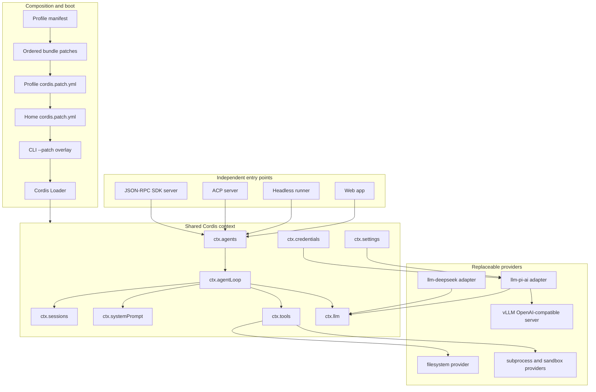
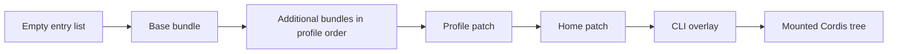
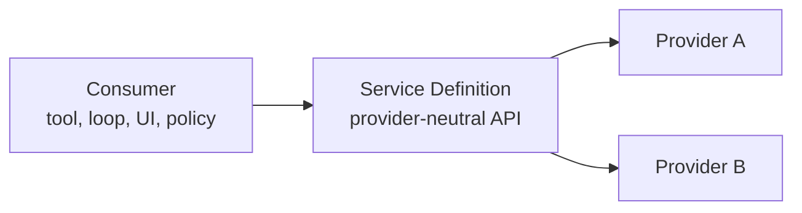
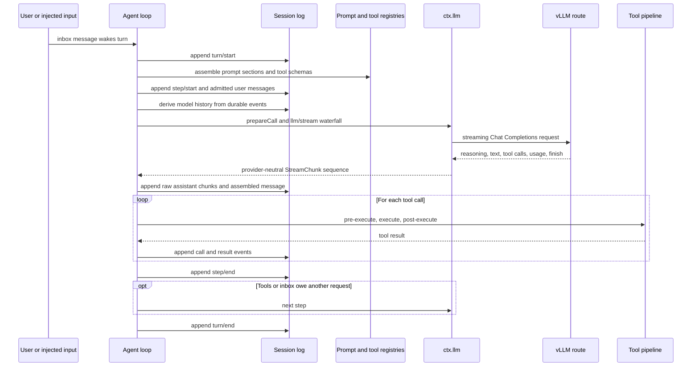

# DeepSeek Harness foundation assessment

> **Status (2026-08-20): partly superseded.** Read [the consolidated assessment](deepseek-harness-consolidated-assessment.md) first — it is the decision layer over this document.
>
> **Still authoritative here.** The benchmark matrix and its Pareto analysis; the pi-ai settings-layer risk register under "Important constraints and risks"; the criteria for when a custom adapter is justified; and the four-phase evaluation plan with its go/no-go criteria.
>
> **Superseded.** The system map, composition narrative, capability-modularity discussion, turn/tool/persistence lifecycle, and investment scorecard are rewritten in §3–§5 of the consolidated assessment. Four claims here are wrong and were corrected: 233 workspace packages is 226 (C7); a turn is zero or more steps, not one or more (C8); `docs/capability-seams.md` is a hand-maintained catalog rendered by a generator, not a source-derived graph (C10); and the `llm-pi-ai` recommendation omits that the owning architecture note reserves retiring one of the two twin adapters (C9). The candidate `settings.yaml` block is correct — it was re-verified field-by-field against this checkout and now also lives in §9 of the consolidated assessment.

Date: 2026-08-20

Scope: repository architecture, modularity, plugin composition, runtime lifecycle, and the shortest credible path to a self-hosted vLLM Qwen3.8-27B deployment. This is an engineering assessment, not a compatibility certification. The vLLM server version, exact served model id, chat template, context limit, output limit, authentication mode, and effort-control request fields were not supplied and must be measured at the endpoint.

## Executive verdict

DeepSeek Harness is a strong experimental foundation if the objective is to assemble and replace agent capabilities rather than adopt a small monolithic coding agent. Its architecture is unusually consistent: model adapters, tools, persistence, permissions, subagents, compaction, user interfaces, and the agent loop are all Cordis plugins. Registrations are lifecycle effects, durable model-visible state comes from an append-only session event log, and capabilities normally split into a provider-neutral service definition, one or more providers, and consumers.

The fit for the proposed vLLM deployment is high enough to run a no-code integration trial. The shipped base bundle already mounts `@deepseek-ai/dsh-llm-pi-ai` in a dormant state. Adding a `llm-pi-ai` settings section can register a hand-declared OpenAI Chat Completions route at runtime. The adapter exposes the compatibility fields needed by a Qwen endpoint, including `chat_template_kwargs`, selectable reasoning efforts, streaming usage behavior, output-token field selection, developer-role behavior, tool-schema strictness, and Qwen thinking formats.

The main investment risk is maturity and complexity, not lack of extension points. This checkout is `0.1.0-rc.8`, explicitly rejects compatibility obligations before the first tagged release, contains 233 workspace packages under `packages/`, and vendors its underlying Cordis framework. The resulting decomposition is powerful but demands discipline in package ownership, configuration layering, event durability, generated references, snapshots, and bilingual documentation.

Recommendation: proceed with a bounded technical evaluation. First configure the existing pi-ai adapter; do not create a new adapter unless wire captures prove the compatibility layer cannot represent the endpoint. Use `fp8/medium` as the initial general-purpose deployment and keep `fp8/off` as a separate route or selectable effort for latency-sensitive and GPQA-like work. Require multi-step tool-use, cancellation, retry, context-overflow, compaction, and session-resume acceptance tests before treating the harness as a foundation.

## System map



The core architectural sources are [the architecture map](../docs/architecture.md), [the Cordis primer](../docs/cordis-primer.md), [the generated capability graph](../docs/capability-seams.md), and [the package hierarchy](../packages/README.md).

## Composition and plugin model

A running harness is a Cordis plugin tree, not a fixed application object graph. A plugin contributes services, event listeners, tools, prompt sections, or providers to a shared context. Service packages normally export a Cordis `Service` class; function plugins export `name`, `inject`, `Config`, and `apply`. Contributions register through `ctx.effect()`, `ctx.on()`, or waterfall listeners, and their disposer is tied to the owning plugin fiber. This makes unloading and hot replacement part of the normal lifecycle rather than an exceptional cleanup path.

The plugin tree is assembled from ordered configuration layers:



A profile names an ordered list of bundle packages and owns out-of-tree plugin dependencies. A bundle is an npm package whose manifest points to a patch file. Later layers can replace an entry by id or insert a new one. A patch targeting an existing row replaces that row's entire `config`; it does not deep-merge it. User patches are watched, and a rejected update leaves the last working tree mounted.

This layering gives an experiment a clean ownership model: a private profile or overlay can change the model route, tools, permissions, persistence, or entry point without forking core packages. The cost is that a seemingly small patch must restate every config field it intends to retain. Configuration review must therefore compare the resolved tree (`dsh --profile <name> --dump-config`), not only the topmost patch.

The base bundle is especially relevant here. Its [patch](../packages/bundle/base/cordis.patch.yml) mounts the provider-neutral LLM service, settings and credentials providers, the direct DeepSeek adapter, and a dormant pi-ai adapter. The dormant adapter owns no live route until settings add one, so the self-hosted provider can be introduced without replacing the bundle row or colliding with `deepseek-official`.

## Capability modularity

The repository distinguishes three roles for a replaceable capability:



For example, `@deepseek-ai/dsh-llm` defines `ctx.llm`, `llm-deepseek` and `llm-pi-ai` register providers, and the agent loop consumes the provider-neutral stream. Filesystem, subprocess, shell, terminal, sandbox, web access, compaction, subagents, persistence, credentials, settings, and approvals follow the same general organization. Consumers depend on service definitions, not concrete providers; bundle packages are allowed to select implementations.

The LLM registry enforces one adapter per provider route. Registration and route replacement are atomic: a conflicting candidate is rejected without withdrawing the current working routes. Provider/model metadata is advisory for selectors, while exact model resolution validates the route actually requested. A prepared model call captures the selected adapter registration and retry policy so hot replacement cannot combine one adapter's capability result with another adapter's dispatch.

Modularity is therefore strong at provider replacement and policy interception. It is weaker at the level of operational comprehension: 233 fine-grained packages, declaration-merged event maps, injection topology, Loader rules, generated catalogs, and lifecycle disposal tests create a substantial contributor learning curve. The decomposition is an asset for long-lived experiments with several backends; it is overhead for a single fixed model and a small tool set.

## Turn, tool, and persistence lifecycle

The default loop treats one model request plus its tool calls as a step and one or more steps as a turn. It exposes waterfalls before model dispatch and around tool execution rather than asking extensions to patch loop code.



The append-only session log is the architectural center of gravity. `deriveMessages()` reconstructs model history from durable events; raw assistant chunks support replay and UI fidelity; forks, resumes, transcripts, persistence, projections, titles, telemetry, and compaction derive from the same stream. The governing invariant is that every model-visible input must be reconstructable from the log. This is a valuable foundation for experiments because a provider swap does not replace the experiment record.

The adapter stream vocabulary is closed and provider-neutral: block starts and ends, text deltas, reasoning deltas, tool-call argument deltas, usage, and one terminal finish. Tool-call arguments remain raw JSON strings. Provider failures normalize into stable failure fields, while the agent retry plugin owns visible retry attempts and logs them as separate durable steps. The detailed obligations are in [LLM streaming](../docs/subsystems/llm-streaming.md) and [the adapter cookbook](../docs/cookbook/adding-an-llm-adapter.md).

## LLM adapter choice for vLLM

### Preferred path: configure `llm-pi-ai`

`llm-pi-ai` wraps `@earendil-works/pi-ai` and supports a hand-declared OpenAI Chat Completions route. The route can define its endpoint, credential reference, model catalog, capacities, input modalities, effort levels, retry policy, timeouts, headers, and compatibility switches. Settings changes are read per operation and update registrations atomically without restarting the harness.

This is the right first path because it already maps:

- streamed text, reasoning, tool calls, usage, and finish events into the harness protocol;
- model catalogs and exact model resolution;
- `reasoningEfforts` keys `off`, `minimal`, `low`, `medium`, `high`, `xhigh`, and `max` to endpoint spellings;
- Qwen and chat-template thinking formats, including dynamic `thinking.enabled` and `thinking.effort` values;
- `max_tokens` versus `max_completion_tokens`, streaming usage, developer-role, strict-tool, and related OpenAI-compatible differences;
- per-request credentials, cancellation, stream-idle timeout, replay metadata, images, and provider-owned retry policy.

The current repository depends on `@earendil-works/pi-ai ^0.82.1`. The local [adapter contract](../packages/llm/llm-pi-ai/README.md) is the authority for what this checkout exposes; upstream behavior must not be inferred from a newer pi release.

### Candidate settings

The base profile already mounts the adapter, settings provider, and credentials provider. The following is a candidate `$DSH_HOME/settings.yaml`, not a copy-ready certification. Replace every angle-bracket value with a fact read from the running server or its model configuration.

```yaml
llm-pi-ai:
  providers:
    local-qwen:
      displayName: Local Qwen3.8-27B
      apiKeyEnv: VLLM_API_KEY
      api: openai-completions
      baseURL: http://<gpu-host>:8000/v1
      reasoning: medium
      streamIdleTimeoutMs: 300000
      retryPolicy:
        mode: normal
        maxRetries: 2
        backoff:
          initialDelayMs: 500
          maxDelayMs: 5000
          jitterRatio: 0.1
      compat:
        supportsDeveloperRole: false
        supportsReasoningEffort: false
        supportsUsageInStreaming: true
        supportsStrictMode: false
        maxTokensField: max_tokens
        thinkingFormat: qwen-chat-template
        chatTemplateKwargs:
          enable_thinking:
            $var: thinking.enabled
          reasoning_effort:
            $var: thinking.effort
            omitWhenOff: true
      models:
        - id: <exact-id-returned-by-GET-/v1/models>
          name: Qwen3.8-27B
          contextWindow: <served-context-limit>
          maxTokens: <safe-default-output-limit>
          reasoningEfforts:
            off:
            low: low
            medium: medium
            xhigh: xhigh

agent-default-model:
  provider: local-qwen
  model: <exact-id-returned-by-GET-/v1/models>
```

Set `VLLM_API_KEY` in the process environment or the managed credential store. Even if the server does not enforce authentication, this adapter's OpenAI-compatible path may require a placeholder such as `EMPTY`; the adapter README documents keyless local servers as requiring a placeholder credential or an authorization header. Prefer the credential reference because plain `headers` values are visible through configuration description surfaces.

The proposed compatibility settings deliberately avoid claiming that the endpoint accepts top-level `reasoning_effort`. Instead, they send the selected effort through `chat_template_kwargs.reasoning_effort`, send the on/off state through `chat_template_kwargs.enable_thinking`, and omit the effort when Off is selected. This matches the configurable mechanism present in this checkout, but it is valid only if the deployed Qwen3.8 chat template reads those exact keys. Capture one request for each effort and reject the configuration if the serialized JSON or generated behavior does not change as expected.

Qwen's official vLLM guidance confirms the broader transport assumptions: Qwen can be served through `/v1/chat/completions`; `chat_template_kwargs.enable_thinking` controls the hard thinking switch; a Qwen reasoning parser exposes `reasoning_content`; and Hermes tool parsing enables structured tool calls. These extensions are not all part of the OpenAI specification, so endpoint-level validation is mandatory. See [Qwen's vLLM deployment guide](https://qwen.readthedocs.io/en/stable/deployment/vllm.html), [Qwen function calling](https://qwen.readthedocs.io/en/stable/framework/function_call.html), and [vLLM reasoning outputs](https://docs.vllm.ai/en/stable/features/reasoning_outputs/).

### vLLM launch requirements to verify

The harness needs structured reasoning and tool calls, not only text completion. The vLLM launch must therefore use the parser combination appropriate to the exact Qwen3.8 artifact and installed vLLM version. Current official Qwen examples use a Qwen reasoning parser and Hermes tool parser for Qwen-family models, but the exact accepted flags are version-dependent. Confirm them from the installed vLLM help and an actual request rather than copying a command from another release.

At minimum, prove the server behavior below:

| Area | Required observation |
|---|---|
| Model identity | `GET /v1/models` returns the exact id configured in the route. |
| Streaming | SSE terminates cleanly and reports a finish reason; no content follows finish. |
| Reasoning | Thinking arrives as structured `reasoning_content` deltas or another form pi-ai maps to reasoning chunks. |
| Effort control | Off, low, medium, and xhigh produce distinct serialized request controls and the intended server behavior. |
| Tool choice | A forced simple tool task yields a structured tool call with a stable id, name, and JSON arguments. |
| Multi-step tools | The server accepts assistant tool calls plus tool results and produces the next assistant response. |
| Parallel tools | Multiple calls in one response remain distinguishable and their arguments stream correctly. |
| Usage | Streaming usage is present and does not violate the adapter's usage-before-finish rule. |
| Cancellation | Client abort promptly stops generation and releases server work. |
| Overflow | Context overflow maps to a stable failure rather than a truncated or empty success. |
| Empty output | An empty terminal response becomes `EMPTY_RESPONSE` and follows the configured retry policy. |

### When a custom adapter is justified

Create a dedicated `llm-vllm-qwen` adapter only if a captured incompatibility cannot be expressed by `llm-pi-ai` configuration. Examples include a nonstandard SSE event structure, effort control that cannot be represented by `thinkingFormat` plus `chatTemplateKwargs`, unsupported replay fields required for correct multi-turn reasoning, incorrect tool-call parsing, or missing failure metadata that materially affects policy.

A new adapter is not justified merely to rename the provider, set defaults, or call a private endpoint. Those are already configuration. If an adapter becomes necessary, use `llm-deepseek` as the direct HTTP/SSE layout reference and implement the full stream, catalog, exact-model, reasoning, retry, cancellation, attribution, replay, documentation, unit, real-composition, snapshot, and real-provider obligations described by the adapter cookbook.

## Benchmark interpretation

The supplied matrix is preserved below exactly as reported.

| Cell | GSM8K | IFEval | GPQA Diamond | MMLU Pro | HumanEval Chat | Mean | Wall clock |
|---|---:|---:|---:|---:|---:|---:|---:|
| nvfp4/off | 96.7 ±1.6 | 82.5 ±3.5 | 76.7 ±3.9 | 76.2 ±2.9 | 94.2 ±2.1 | 85.2 | 19 min |
| nvfp4/low | 97.5 ±1.4 | 89.2 ±2.8 | 75.8 ±3.9 | 81.0 ±2.7 | 98.3 ±1.2 | 88.4 | 30 min |
| nvfp4/medium | 97.5 ±1.4 | 90.8 ±2.6 | 74.2 ±4.0 | 78.6 ±2.7 | 97.5 ±1.4 | 87.7 | 37 min |
| nvfp4/xhigh | 98.3 ±1.2 | 94.2 ±2.1 | 70.0 ±4.2 †18% | 80.0 ±2.7 | 96.7 ±1.6 | 87.8 | 83 min |
| fp8/off | 96.7 ±1.6 | 85.0 ±3.3 | 81.7 ±3.5 | 78.1 ±2.8 | 96.7 ±1.6 | 87.6 | 23 min |
| fp8/low | 98.3 ±1.2 | 88.3 ±2.9 | 75.0 ±4.0 | 80.0 ±2.7 | 98.3 ±1.2 | 88.0 | 52 min |
| fp8/medium | 99.2 ±0.8 | 91.7 ±2.5 | 76.7 ±3.9 | 80.5 ±2.7 | 100.0 ±0.0 | 89.6 | 40 min |
| fp8/xhigh | 99.2 ±0.8 | 95.0 ±2.0 | 67.5 ±4.3 †17% | 77.6 ±2.8 | 95.8 ±1.8 | 87.0 | 104 min |

The point-estimate Pareto frontier for mean score versus wall time is `nvfp4/off` (19 min, 85.2), `fp8/off` (23 min, 87.6), `nvfp4/low` (30 min, 88.4), and `fp8/medium` (40 min, 89.6). Every other cell has both a lower mean and a longer wall time than at least one of these cells.

`fp8/medium` is the best general default. It has the highest mean, ties the best GSM8K point estimate, has the best HumanEval result, and completes faster than the reported `fp8/low`. Relative to `fp8/off`, it adds 2.0 mean points at a cost of 17 minutes. Relative to `nvfp4/low`, it adds 1.2 points at a cost of 10 minutes.

`fp8/off` is the best latency-oriented quality route and has the highest GPQA point estimate. The result argues against assuming that more reasoning is always better: GPQA falls from 81.7 at `fp8/off` to 67.5 at `fp8/xhigh`, while wall time rises from 23 to 104 minutes. `xhigh` improves IFEval, but its general mean and latency make it unsuitable as the default. Preserve xhigh as an explicit opt-in for tasks whose measured objective rewards it.

The uncertainty intervals overlap for several cells, so point-estimate differences should not be presented as statistically significant without the underlying sample design and paired results. The dagger annotations are reproduced but not interpreted because their definition was not supplied.

## Investment scorecard

| Dimension | Assessment | Evidence and consequence |
|---|---|---|
| Architectural coherence | High | Plugin composition, effect-based registrations, durable events, and capability roles repeat consistently across subsystems. |
| Backend replaceability | High | Providers register behind service definitions; the base composition already carries two LLM adapter families. |
| Experimental reproducibility | High | Model-visible inputs and outputs are durable session events; raw chunks, provider/model provenance, retries, forks, and replay are represented. |
| vLLM/Qwen fit | Medium-high before trial | The generic adapter exposes the needed protocol and Qwen compatibility controls, but the exact Qwen3.8 template and parser behavior remain endpoint facts. |
| Safety architecture | High in design | Filesystem, subprocess, sandbox, approval, credentials, and policy are independent capabilities with explicit composition. This assessment did not perform a security audit. |
| Contributor simplicity | Low-medium | 233 packages and extensive lifecycle, documentation, generator, and snapshot rules create high cognitive and process overhead. |
| Configuration ergonomics | Medium | Profiles, bundles, settings, and overlays are powerful; whole-row patch replacement and layered dict behavior are easy to misread. |
| API stability | Low-medium | The checkout is a release candidate and explicitly permits breaking formats and APIs before the first tagged release. |
| Documentation and verification discipline | High | Generated catalogs and graphs, package contracts, invariants, strict typing, coverage policy, real composition tests, and snapshot rules are first-class. |
| Licensing | Favorable for experimentation | The repository root is MIT licensed; dependency and model licenses still require separate review. |

## Important constraints and risks

- A user patch replaces the complete config of the targeted row. Omitting an old field removes it.
- The pi-ai settings layer merges provider dictionaries by key and has no general delete operation for nested dictionary keys. Arrays such as `models` replace wholesale.
- A configured `models` list replaces the inherited route catalog. A hand-declared route must provide a non-empty model list.
- Model context and output limits are configuration claims, not facts discovered reliably from most OpenAI-compatible model listings. Incorrect values can break compaction or request admission.
- A modality declaration is not verified against the endpoint. Over-claiming image support can durably admit an image and leave the session unable to proceed on a text-only route.
- The generic adapter is intentionally dependency-heavy and inherits pi-ai protocol behavior. Pinning and regression testing the exact dependency version matters.
- Provider HTTP status is not consistently available through pi-ai error events, which reduces failure diagnostics and routing precision.
- Pre-release persistence formats reject old data rather than promise compatibility. Preserve evaluation sessions with the exact checkout and configuration that created them.
- Vendored Cordis reduces upstream drift but makes framework upgrades a repository-owned synchronization task.
- A foundation decision should include a separate security review of process confinement, credential flows, remote content, tool approvals, and Web/ACP exposure. Architectural separation is not proof of correct enforcement.

## Evaluation plan and go/no-go criteria

### Phase 1: wire qualification

Run direct HTTP probes against the exact vLLM server. Record the server command, vLLM version, model artifact and revision, quantization, served model id, tokenizer/chat-template revision, parser flags, GPU topology, context limit, output limit, and request/response captures for every effort. The outcome is a fixed provider profile, not adapter code.

Go when structured reasoning, usage, and tool calls stream correctly for all intended efforts. Stop and diagnose when effort controls are ignored, reasoning leaks into visible text, tool arguments are malformed, or a follow-up after a tool result fails.

### Phase 2: harness qualification

Add the candidate settings and environment credential, dump the resolved profile, select `local-qwen`, and run a headless task that reads a file, performs a write under approval policy, runs a command, handles one failing tool, and completes a second model step. Capture the session JSONL and stdout.

Go when the durable log reconstructs the conversation, the assistant resumes after tool results, cancellation settles promptly, failures produce stable codes, and the same session resumes after process restart.

### Phase 3: agentic regression set

Build a keyless replay snapshot from the successful real run and a small real-provider suite covering single tool, parallel tools, long context plus compaction, retry after transient failure, cancellation, malformed tool arguments, empty response, and context overflow. Add workload measurements for tokens per second, time to first token, total task time, tool-call validity, task completion, retry frequency, and peak GPU memory.

Go when `fp8/medium` improves end-to-end task completion enough to justify its latency over `fp8/off`, not merely when it wins standalone benchmarks. Keep separate routes or selectable efforts if interactive and deep-work workloads have different optima.

### Phase 4: foundation decision

Adopt the harness when the existing adapter passes the regression set, session replay survives the intended workflows, the team accepts the package and documentation discipline, and the pre-release upgrade policy is tolerable. Fork or build a dedicated adapter only for demonstrated wire gaps. Reject it as the foundation if the experiment requires frequent core-loop edits, cannot express provider behavior without bypassing durability, or the team cannot sustain the repository's verification surface.

## Source trail

Repository sources reviewed include [architecture](../docs/architecture.md), [Cordis primer](../docs/cordis-primer.md), [app boot](../packages/boot/app-boot/README.md), [base bundle](../packages/bundle/base/README.md), [package hierarchy](../packages/README.md), [LLM service](../packages/llm/llm/README.md), [pi-ai adapter](../packages/llm/llm-pi-ai/README.md), [LLM streaming](../docs/subsystems/llm-streaming.md), [adapter cookbook](../docs/cookbook/adding-an-llm-adapter.md), [generated capability graph](../docs/capability-seams.md), the relevant TypeScript implementations and tests, root package metadata, and the repository's agent and documentation rules. Code discovery used a freshly indexed knowledge graph containing 43,015 nodes and 71,812 relationships; exact service methods and adapter configuration types were then checked against source snippets.

External compatibility statements are limited to current official [Qwen vLLM deployment](https://qwen.readthedocs.io/en/stable/deployment/vllm.html), [Qwen function calling](https://qwen.readthedocs.io/en/stable/framework/function_call.html), and [vLLM reasoning output](https://docs.vllm.ai/en/stable/features/reasoning_outputs/) documentation. These sources establish supported mechanisms, not compatibility with the specific unreported server build.
