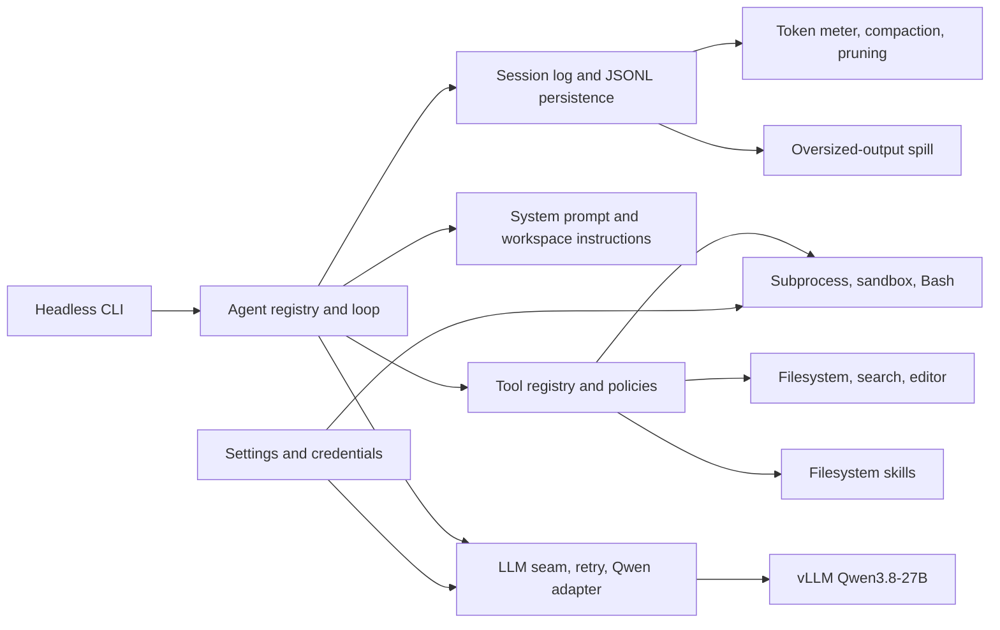

# DeepSeek Harness plugins overview

> **Status (2026-08-20): roster authoritative, port sizing superseded.** Read [the consolidated assessment](deepseek-harness-consolidated-assessment.md) first.
>
> **Still authoritative here, with no equivalent anywhere else.** The row-by-row inventory of all 138 composition rows under "Shipped profile inventory" — id, package, intent, and label for the Base, Headless, and Web layers. Purge ledger A in §6 of the consolidated assessment names row *groups*; this inventory is how you resolve them to ids and packages. Also the 71 additional runtime-capable packages and the module-collapse table.
>
> **Superseded, and wrong where it counts.** The executive recommendation, the P1 dependency footprint, the dependency-reduction priorities, and the recommended staging. Six corrections apply: the minimum closure is 67 packages, not 42, because this repository declares non-optional `peerDependencies` the canonical runtime-dependency signal (C1); `shell` and `bash-local` are required, not `ALT` (C2); the profiles carry 30 id-targeted override operations beyond the 138 inserted rows, including the only source of the headless deployment persona (C3); two of the eleven "external" names are workspace members (C4); no native or npm SQLite dependency exists (C5); and a narrower POSIX subprocess provider does not remove `koffi` (C6). Do not act on the 42-package list or on the `ALT` labels for `shell` and `bash-local`.

Date: 2026-08-20

Scope: every plugin row mounted by the shipped Base, Headless, and Web profile layers, plus package roots that expose additional Cordis runtime plugins but are not directly mounted by those layers. Pure type libraries, build generators, SDK clients, and test helpers without a runtime plugin export are outside the inventory. Package descriptions come from each package manifest; port recommendations are specific to a text-first POSIX fork using self-hosted vLLM/Qwen.

## Executive recommendation

The shipped profiles contain 138 configuration rows: 78 Base rows, 3 Headless rows, and 57 Web rows. They reference 133 unique package roots. The repository also contains 71 runtime-capable package roots not directly named by those three layers; many are service definitions pulled transitively, provider alternatives, or opt-in products.

Do not port this graph one package at a time. Start with the 41-row P1 composition below (40 directly named package roots). Its workspace runtime dependency closure is 42 in-repository packages, plus 11 direct external package names and 1 external Cordis plugin not represented under `packages/`. This preserves the durable session log, agent loop, tools, settings/credentials, Qwen adapter, retries, compaction, guarded POSIX execution, filesystem access, skills, and headless entry point.

Use the existing pi-ai adapter for wire qualification. After the Qwen route passes multi-step tool, reasoning, retry, cancellation, and replay tests, decide whether to retain pi-ai or replace it with a narrow vLLM/Qwen adapter. A narrow adapter is the largest plausible dependency reduction that does not weaken the harness architecture; it can remove pi-ai's multi-provider transitive graph while keeping `ctx.llm` and the stream protocol intact.

## Port labels

| Label | Meaning |
|---|---|
| P1 | First port: required for the proposed text-first headless coding agent. |
| P1-DEP | Service definition or helper in the P1 dependency closure; port with its P1 consumer even though no shipped row names it directly. |
| P2 | Add only after P1 passes end-to-end tests; valuable but not foundational. |
| ALT | Mutually exclusive platform or backend alternative. |
| WEB | Part of the browser product plane; take the Web layer as a coherent feature, not piecemeal. |
| DEV | Development, example, diagnostic, or replay support; preserve tests where applicable but exclude from production runtime. |
| DEFER | Exclude from the first fork because it adds a product plane, external runtime, or unusually broad authority. |

## Recommended first-port topology

### P1 composition rows

| Layer | ID | Package |
|---|---|---|
| Base | `timer` | `cordis:timer` |
| Base | `llm` | [llm](../packages/llm/llm/README.md) |
| Base | `session` | [session](../packages/core/session/README.md) |
| Base | `agent` | [agent](../packages/core/agent/README.md) |
| Base | `agent-default-model` | [agent-default-model](../packages/core/agent-default-model/README.md) |
| Base | `llm-retry` | [llm-retry](../packages/llm/llm-retry/README.md) |
| Base | `settings` | [settings-file](../packages/settings/settings-file/README.md) |
| Base | `credentials` | [credentials-local](../packages/credentials/credentials-local/README.md) |
| Base | `llm-pi-ai` | [llm-pi-ai](../packages/llm/llm-pi-ai/README.md) |
| Base | `session-persistence-jsonl` | [session-persistence-jsonl](../packages/session/session-persistence-jsonl/README.md) |
| Base | `subprocess` | [subprocess-local](../packages/subprocess/subprocess-local/README.md) |
| Base | `sandbox` | [sandbox-local](../packages/sandbox/sandbox-local/README.md) |
| Base | `sandbox-policy` | [sandbox-policy](../packages/sandbox/sandbox-policy/README.md) |
| Base | `bash-sandbox` | [bash-sandbox](../packages/shell/bash-sandbox/README.md) |
| Base | `approval` | [user-approval](../packages/interaction/user-approval/README.md) |
| Base | `permission` | [permission-presets](../packages/interaction/permission-presets/README.md) |
| Base | `shell-env` | [shell-env](../packages/shell/shell-env/README.md) |
| Base | `tool-bash` | [tool-bash](../packages/shell/tool-bash/README.md) |
| Base | `fs-observation-policy` | [fs-observation-policy](../packages/fs/fs-observation-policy/README.md) |
| Base | `tool-fs` | [tool-fs](../packages/fs/tool-fs/README.md) |
| Base | `tool-fs-search` | [tool-fs-search](../packages/fs/tool-fs-search/README.md) |
| Base | `agent-instructions` | [agent-instructions](../packages/context/agent-instructions/README.md) |
| Base | `skill` | [skill](../packages/skill/skill/README.md) |
| Base | `skill-filesystem` | [skill-filesystem](../packages/skill/skill-filesystem/README.md) |
| Base | `tool-skill` | [tool-skill](../packages/skill/tool-skill/README.md) |
| Base | `token-meter` | [token-meter](../packages/llm/token-meter/README.md) |
| Base | `compaction-basic` | [compaction-basic](../packages/compaction/compaction-basic/README.md) |
| Base | `timeout-policy` | [tool-call-timeout-policy](../packages/guard/timeout-policy/README.md) |
| Base | `spill-local` | [spill-local](../packages/spill/spill-local/README.md) |
| Base | `spill-policy` | [spill-policy](../packages/spill/spill-policy/README.md) |
| Base | `session-checkpoint-policy` | [session-checkpoint-policy](../packages/session/session-checkpoint-policy/README.md) |
| Base | `tool-result-pruner` | [compaction-tool-result-pruner](../packages/compaction/compaction-tool-result-pruner/README.md) |
| Base | `tool-todo` | [tool-todo](../packages/todo/tool-todo/README.md) |
| Base | `tool-str-replace-editor` | [tool-str-replace-editor](../packages/fs/tool-str-replace-editor/README.md) |
| Base | `repeat-tool-reminder` | [repeat-tool-reminder](../packages/guard/repeat-tool-reminder/README.md) |
| Base | `tools` | [tools](../packages/core/tools/README.md) |
| Base | `system-prompt` | [system-prompt](../packages/core/system-prompt/README.md) |
| Base | `agent-loop` | [agent-loop](../packages/core/agent-loop/README.md) |
| Base | `fs-sandbox` | [fs-sandbox](../packages/fs/fs-sandbox/README.md) |
| Headless | `headless-startup` | [headless/startup](../packages/bundle/headless/README.md) |
| Headless | `headless-runner` | [headless](../packages/bundle/headless/README.md) |

### P1 direct dependency footprint

The in-repository closure contains 42 packages:

- `agent`
- `agent-default-model`
- `agent-instructions`
- `agent-loop`
- `bash-sandbox`
- `cmdline`
- `code-runtime-worker-thread`
- `compaction-basic`
- `compaction-tool-result-pruner`
- `credentials-local`
- `fs-observation-policy`
- `fs-sandbox`
- `headless`
- `llm`
- `llm-pi-ai`
- `llm-retry`
- `permission-presets`
- `repeat-tool-reminder`
- `sandbox-local`
- `sandbox-policy`
- `sandbox-windows-acl`
- `session`
- `session-checkpoint-policy`
- `session-persistence-jsonl`
- `settings-file`
- `shell-env`
- `skill`
- `skill-filesystem`
- `spill-local`
- `spill-policy`
- `subprocess-local`
- `system-prompt`
- `token-meter`
- `tool-bash`
- `tool-call-timeout-policy`
- `tool-fs`
- `tool-fs-search`
- `tool-skill`
- `tool-str-replace-editor`
- `tool-todo`
- `tools`
- `user-approval`

Direct external package names visible in those manifests are:

- `@deepseek-ai/node-addon-landlock-run`
- `@deepseek-ai/schemastery`
- `@earendil-works/pi-ai`
- `@vscode/ripgrep`
- `chokidar`
- `commander`
- `diff`
- `koffi`
- `node-pty`
- `yaml`
- `zod`

The additional external Cordis plugin is `@deepseek-ai/cordis-plugin-timer`. These counts describe the current workspace manifests, not the smallest achievable fork. They exclude transitive dependencies, vendored Cordis packages, Node built-ins, and development dependencies. In particular, `sandbox-windows-acl` is present because the current cross-platform sandbox provider declares it, while `code-runtime-worker-thread` is present because the current Headless bundle declares it even when its composition row is omitted. A POSIX-only port can remove both after replacing those package-level dependencies. The application bootstrap is outside the composition rows; retain the `app-boot` behavior or equivalent startup glue.

## How to collapse the port

Preserve capability ownership while reducing package granularity. A lean fork can merge the P1 packages into the following modules without merging their public responsibilities:

| Port module | Current responsibilities to combine | Keep separate inside the module |
|---|---|---|
| Plugin kernel | Cordis context, effects, injection, profile loading, timer | Lifecycle disposal and configuration validation |
| Agent runtime | Agent registry, loop, session service, system prompt, tool registry | Durable events versus live interception events |
| Qwen transport | LLM seam, Qwen/vLLM adapter, retry policy | Provider-neutral chunks versus wire translation |
| Durability | JSONL persistence and semantic checkpoints | Append semantics, flush/checkpoint timing, recovery |
| Configuration | Settings and credentials | Secret references versus ordinary settings |
| Execution | Subprocess, sandbox, sandbox policy, Bash, approval, permissions | Process ownership, confinement, and human decisions |
| Filesystem | FS provider, observation policy, read/write/search/editor tools | Provider operations versus model-facing schemas |
| Context and skills | Workspace instructions, skill registry/provider/tool | Durable injected context versus filesystem discovery |
| Context control | Token meter, compaction, tool-result pruning, spill | Token policy, summarization, and storage |
| Loop guards | Request retry, tool timeout, repeated-call reminder | Advisory guidance versus enforced deadlines |
| Basic tools | Todo and string replacement | Session state versus file mutation |
| Headless app | CLI parsing and one-shot runner | Boot diagnostics versus task execution |
| Test laboratory | Mock server, replay fixtures, real-composition harness | Keyless replay versus real-provider qualification |

Do not collapse security decisions into the tool handlers. The executor, filesystem, sandbox, approval, and permission components may share a package, but the operation that enforces a decision must remain independently testable.

## Dependency-reduction priorities

| Priority | Change | Expected effect | Risk |
|---|---|---|---|
| 1 | Defer the entire Web layer | Removes React/client runtime, Host RPC, localization, static serving, UI slots, browser HMR, and their build graph. | No browser interface or visual settings editor. |
| 2 | Defer subagents and workflows | Removes child lifecycle, worker-thread orchestration, product SDKs, ACP child transport, and multi-agent prompt/tool additions. | No delegation or Ralph/workflow tools. |
| 3 | Qualify pi-ai, then consider a dedicated vLLM adapter | Can remove the multi-provider SDK graph while preserving the LLM service. | The fork owns SSE, tool-call, reasoning, usage, replay, and error normalization. |
| 4 | Keep JSONL; defer SQLite query/storage | Avoids native SQLite packaging and projection/search services. | No full-text session search or relational application storage. |
| 5 | Keep text only; defer attachments | Avoids image decoding/storage and `sharp`. | No image prompts or durable image history. |
| 6 | Keep ordinary Bash; defer PTY terminals | Avoids the persistent-terminal service and its UI/tool lifecycle. | No interactive long-lived shell session. The current local subprocess package still brings `node-pty` and `koffi`; a narrower POSIX subprocess provider is needed to remove them. |
| 7 | Select one Web search provider only if required | Avoids vendor-specific credential and transport code. | The model has no live web access in P1. |
| 8 | Defer telemetry and anonymous identity | Removes OpenTelemetry export and correlation state. | No product analytics or remote feedback correlation. |
| 9 | Defer self-modifying Cordis tools and Agent Teams | Removes the broadest runtime authority and experimental coordination state. | No model-written live plugins or peer-team orchestration. |

## Shipped profile inventory

The tables below map configuration rows, not only package roots. Two rows may mount different configurations or subpath exports from the same package. The intent is package-owned; the row id is the patch and override identity.

### Base layer

| ID | Package | Intent | Port |
|---|---|---|---|
| `timer` | `cordis:timer` | Cordis timer service used by lifecycle-aware delayed work. | P1 |
| `hmr` | `cordis:hmr` | Reloads mounted configuration and plugin fibers during development. | DEFER |
| `llm` | [llm](../packages/llm/llm/README.md) | Provider-neutral LLM service interface for the DeepSeek Harness | P1 |
| `session` | [session](../packages/core/session/README.md) | Event-sourced session store for the DeepSeek Harness | P1 |
| `typert` | [typert-registry](../packages/typert/registry/README.md) | Runtime registry for generated package reflection and Zod schemas | DEFER |
| `typert-loader` | [typert-loader](../packages/typert/loader/README.md) | Loader integration for generated Typert package contributions | DEFER |
| `typert-gateway` | [api-gateway](../packages/api/gateway/README.md) | Typert Remote Host dispatcher and Client API endpoint | DEFER |
| `session-title` | [session-title](../packages/session/session-title/README.md) | Log-backed session title service and provider registry for the DeepSeek Harness | P2 |
| `session-title-llm` | [session-title-first-prompt-llm](../packages/session/session-title-first-prompt-llm/README.md) | First-message LLM provider plugin for DeepSeek Harness session titles | P2 |
| `user-questions` | [user-questions](../packages/interaction/user-questions/README.md) | Abstract user-questions seam (ctx.userQuestions) for asking the human during agent runs | P2 |
| `agent` | [agent](../packages/core/agent/README.md) | Agent interface, registry, initiator scope, and event vocabulary for the DeepSeek Harness | P1 |
| `agent-default-model` | [agent-default-model](../packages/core/agent-default-model/README.md) | Default model selection shared by Agent entry points | P1 |
| `jobs` | [jobs-local](../packages/jobs/jobs-local/README.md) | Process-local implementation of the DeepSeek Harness background job registry seam | P2 |
| `llm-retry` | [llm-retry](../packages/llm/llm-retry/README.md) | Provider-routed LLM request retry policy for the DeepSeek Harness | P1 |
| `settings` | [settings-file](../packages/settings/settings-file/README.md) | File-backed settings provider (settings.yaml) for the DeepSeek Harness | P1 |
| `credentials` | [credentials-local](../packages/credentials/credentials-local/README.md) | File-backed credentials provider ($DSH_HOME/.env under the live process environment) for the DeepSeek Harness | P1 |
| `llm-pi-ai` | [llm-pi-ai](../packages/llm/llm-pi-ai/README.md) | pi-ai-backed DeepSeek adapter for the DeepSeek Harness LLM seam (design-verification twin of dsh-llm-deepseek) | P1 |
| `session-persistence-jsonl` | [session-persistence-jsonl](../packages/session/session-persistence-jsonl/README.md) | JSONL durable session persistence backend for the DeepSeek Harness | P1 |
| `attachment-local` | [attachment-local](../packages/attachment/attachment-local/README.md) | Private content-addressed DSH_HOME attachment storage | P2 |
| `session-query-sqlite` | [session-query-sqlite](../packages/session-query/session-query-sqlite/README.md) | Concrete ctx.sessionQuery backend with SQLite FTS5 search | P2 |
| `session-projection` | [session-projection](../packages/session/session-projection/README.md) | Session-projection seam: the merge-extensible projection type table, the provider contract, and the ctx.sessionProjections registry serving whole current values of log-derived per-session state | P2 |
| `session-telemetry-otel` | [session-telemetry-otel](../packages/session/session-telemetry-otel/README.md) | OpenTelemetry backend for the DeepSeek Harness telemetry seam: hands captured session records to the OTel JS SDK's log pipeline | DEFER |
| `subprocess` | [subprocess-local](../packages/subprocess/subprocess-local/README.md) | Local-subprocess implementation of the DeepSeek Harness subprocess seam | P1 |
| `sandbox` | [sandbox-local](../packages/sandbox/sandbox-local/README.md) | Local process-sandbox backends for the DeepSeek Harness sandbox seam: bwrap, the npm-distributed landlock-run launcher, macOS Seatbelt, or the Windows ACL restricted-token runner — functionally probed, fail-closed | P1 |
| `sandbox-policy` | [sandbox-policy](../packages/sandbox/sandbox-policy/README.md) | Per-call sandbox policy resolver and current model context: deployment fallbacks plus each session's mode and workspace root, shared by every enforcing capability family | P1 |
| `bash-sandbox` | [bash-sandbox](../packages/shell/bash-sandbox/README.md) | Sandbox-consuming implementation of the DeepSeek Harness bash executor seam (confines every command via ctx.sandbox, reports denial/enforcement result facts) | P1 |
| `pwsh-sandbox` | [pwsh-sandbox](../packages/shell/pwsh-sandbox/README.md) | Sandbox-consuming implementation of the DeepSeek Harness PowerShell executor seam (confines every command via ctx.sandbox, reports denial/enforcement result facts) | ALT |
| `approval` | [user-approval](../packages/interaction/user-approval/README.md) | User-approval seam (ctx.approval) for the DeepSeek Harness: one-shot permission decisions dispatched to composed answerers over the approval/request waterfall, fail-closed by default | P1 |
| `permission` | [permission-presets](../packages/interaction/permission-presets/README.md) | User-facing permission presets (ctx.permissionPresets) for the DeepSeek Harness: one product-level Permissions select bundling the sandbox-mode and approval-policy knobs, written through to their own session events | P1 |
| `shell-env` | [shell-env](../packages/shell/shell-env/README.md) | Tool-independent managed DSH_* shell environment registry | P1 |
| `tool-bash` | [tool-bash](../packages/shell/tool-bash/README.md) | Model-facing bash tool with optional generic background-job and sandbox-escalation support | P1 |
| `tool-pwsh` | [tool-pwsh](../packages/shell/tool-pwsh/README.md) | Model-facing pwsh tool over the bash executor seam | ALT |
| `tool-jobs` | [tool-jobs](../packages/jobs/tool-jobs/README.md) | Model-facing background job control tools (job_output, job_list, job_kill) over the ctx.jobs registry | P2 |
| `fs-observation-policy` | [fs-observation-policy](../packages/fs/fs-observation-policy/README.md) | File-context policy plugin for the DeepSeek Harness — observed-state, read-before-edit, and version-guarded write/edit added over the ctx.fs provider seam through the fs/* event gate (no service API) | P1 |
| `tool-fs` | [tool-fs](../packages/fs/tool-fs/README.md) | Model-facing filesystem tools (read, write, edit) over the DeepSeek Harness filesystem seam (ctx.fs) | P1 |
| `tool-fs-search` | [tool-fs-search](../packages/fs/tool-fs-search/README.md) | Model-facing filesystem discovery tools (glob, grep) backed by the packaged ripgrep binary (@vscode/ripgrep) | P1 |
| `agent-instructions` | [agent-instructions](../packages/context/agent-instructions/README.md) | Workspace context loader for AGENTS.md/CLAUDE.md instruction files | P1 |
| `skill` | [skill](../packages/skill/skill/README.md) | Agent skill provider registry for the DeepSeek Harness | P1 |
| `skill-filesystem` | [skill-filesystem](../packages/skill/skill-filesystem/README.md) | Local filesystem skill provider for the DeepSeek Harness | P1 |
| `skill-badge` | [skill-badge](../packages/skill/skill-badge/README.md) | Bundled dsh badge skill provider for DeepSeek Harness | DEFER |
| `tool-skill` | [tool-skill](../packages/skill/tool-skill/README.md) | Model-facing skill loading tool for the DeepSeek Harness | P1 |
| `commands` | [commands](../packages/interaction/commands/README.md) | Plugin-owned human command registry for DeepSeek Harness UIs | P2 |
| `command-feedback` | [command-feedback](../packages/feedback/command-feedback/README.md) | Log-only session feedback producer and human-facing slash command | P2 |
| `goal` | [goal](../packages/goal/goal/README.md) | Event-sourced same-session goal state and lifecycle service for the DeepSeek Harness | P2 |
| `goal-round-driver` | [goal-round-driver](../packages/goal/goal-round-driver/README.md) | Race-fenced same-session goal-round driver | P2 |
| `command-goal` | [command-goal](../packages/goal/command-goal/README.md) | Human-facing slash command for persisted same-session goals | P2 |
| `plan-mode` | [plan-mode](../packages/plan/plan-mode/README.md) | Logged per-agent plan mode with deployment guidance, a direct slash command, and a user-reviewed exit | P2 |
| `token-meter` | [token-meter](../packages/llm/token-meter/README.md) | Replay-aware token measurement service (ctx.tokenMeter) for the DeepSeek Harness | P1 |
| `compaction-basic` | [compaction-basic](../packages/compaction/compaction-basic/README.md) | Token-meter-driven compaction policy and LLM summarization backend for the DeepSeek Harness | P1 |
| `command-compact` | [command-compact](../packages/compaction/command-compact/README.md) | Human-facing slash command for explicit session compaction | P2 |
| `subagent` | [subagent](../packages/subagent/subagent/README.md) | Abstract subagent seam (ctx.subagents): named-provider registry for delegating to child agents | P2 |
| `subagent-spawn-in-process` | [subagent-spawn-in-process](../packages/subagent/subagent-spawn-in-process/README.md) | In-process spawn subagent backend: runs a fresh child agent on ctx.agents | P2 |
| `subagent-fork-in-process` | [subagent-fork-in-process](../packages/subagent/subagent-fork-in-process/README.md) | In-process fork subagent backend: runs a child agent seeded with a prefix of the parent's log | P2 |
| `tool-subagent-control` | [tool-subagent-control](../packages/subagent/tool-subagent-control/README.md) | Globally named send_message, interrupt_agent, and list_agents tools over ctx.subagents continuations | P2 |
| `tool-subagent-list-agents` | [tool-subagent-control/list-agents](../packages/subagent/tool-subagent-control/README.md) | Lists continuable child agents independently of messaging. | P2 |
| `tool-subagent` | [tool-subagent](../packages/subagent/tool-subagent/README.md) | Model-facing subagent delegation tool over the ctx.subagents seam | P2 |
| `tool-subagent-fork` | [tool-subagent](../packages/subagent/tool-subagent/README.md) | Model-facing subagent delegation tool over the ctx.subagents seam | P2 |
| `tool-subagent-report` | [tool-subagent-report](../packages/subagent/tool-subagent-report/README.md) | Child-scoped report tool over ctx.subagents continuations | P2 |
| `workflow-worker-thread` | [workflow-worker-thread](../packages/workflow/workflow-worker-thread/README.md) | worker-thread workflow engine: executes model-written orchestration scripts off the host event loop, bridging agent() calls back to ctx.subagents | P2 |
| `tool-workflow` | [tool-workflow](../packages/workflow/tool-workflow/README.md) | Model-facing workflow tool: run a JavaScript orchestration script over ctx.workflowEngine | P2 |
| `timeout-policy` | [tool-call-timeout-policy](../packages/guard/timeout-policy/README.md) | Tool-call timeout policy: a tools/execute wrapper that arms a per-tool deadline on exec.signal and returns TOOL_TIMEOUT when it wins | P1 |
| `spill-local` | [spill-local](../packages/spill/spill-local/README.md) | Local-filesystem implementation of the DeepSeek Harness spill storage seam (private session-scoped files) | P1 |
| `spill-policy` | [spill-policy](../packages/spill/spill-policy/README.md) | Tool-result spill policy for the DeepSeek Harness — replaces oversized plain-text tool results with a retained preview plus a spill-file path (no service API) | P1 |
| `session-checkpoint-policy` | [session-checkpoint-policy](../packages/session/session-checkpoint-policy/README.md) | Semantic session durability checkpoints before model requests and tool side effects | P1 |
| `tool-result-pruner` | [compaction-tool-result-pruner](../packages/compaction/compaction-tool-result-pruner/README.md) | Replay-safe model-free head/middle/tail pruning for tool-result surface nodes | P1 |
| `tool-todo` | [tool-todo](../packages/todo/tool-todo/README.md) | Model-facing todo_write tool over the DeepSeek Harness event-sourced session log | P1 |
| `tool-goal` | [tool-goal](../packages/goal/tool-goal/README.md) | Model-facing same-session goal tools with execution-time authority checks | P2 |
| `tool-ralph` | [tool-ralph](../packages/workflow/tool-ralph/README.md) | Model-facing fresh-agent Ralph loop over the workflow and subagent seams | P2 |
| `tool-str-replace-editor` | [tool-str-replace-editor](../packages/fs/tool-str-replace-editor/README.md) | Model-facing view, create, literal replace, and line insert tool over the Harness filesystem service | P1 |
| `repeat-tool-reminder` | [repeat-tool-reminder](../packages/guard/repeat-tool-reminder/README.md) | Repeat-tool-call guard plugin: advisory reminders when an agent loops on identical tool calls | P1 |
| `web` | [web](../packages/web/web/README.md) | Abstract web access capability seam (ctx.web) for the DeepSeek Harness — search/fetch provider registry, registration-order-independent selection, request/result vocabulary, and the WebError taxonomy | P2 |
| `web-search-deepseek` | [web-search-deepseek](../packages/web/web-search-deepseek/README.md) | DeepSeek-backed search provider (native web_search via the Anthropic-compatible API) for the DeepSeek Harness web capability seam (ctx.web) | P2 |
| `tool-web` | [tool-web](../packages/web/tool-web/README.md) | Model-facing web tools (web_search, web_fetch) over the DeepSeek Harness web capability seam (ctx.web) | P2 |
| `tools` | [tools](../packages/core/tools/README.md) | Tool registry and execution pipeline for the DeepSeek Harness | P1 |
| `system-prompt` | [system-prompt](../packages/core/system-prompt/README.md) | System prompt assembly registry for the DeepSeek Harness | P1 |
| `agent-loop` | [agent-loop](../packages/core/agent-loop/README.md) | The concrete agent loop plugin for the DeepSeek Harness | P1 |
| `fs-sandbox` | [fs-sandbox](../packages/fs/fs-sandbox/README.md) | Sandbox-enforcing implementation of the DeepSeek Harness filesystem seam: fences write/edit by the per-call sandbox mode (read-only denies mutation, workspace-write contains it to the workspace + temp roots) while reads pass through | P1 |
| `llm-deepseek` | [llm-deepseek](../packages/llm/llm-deepseek/README.md) | DeepSeek chat-completions adapter for the DeepSeek Harness LLM seam | ALT |

### Headless layer

| ID | Package | Intent | Port |
|---|---|---|---|
| `code-runtime` | [code-runtime-worker-thread](../packages/code-runtime/code-runtime-worker-thread/README.md) | Worker-thread implementation of the DeepSeek Harness code-execution seam | P2 |
| `headless-startup` | [headless/startup](../packages/bundle/headless/README.md) | Parses the headless command line and publishes the task. | P1 |
| `headless-runner` | [headless](../packages/bundle/headless/README.md) | The dsh one-shot bundle: a direct core Agent/Session runner over dsh-base with no Host, HTTP, or browser layer | P1 |

### Web layer

Every Web row is labeled WEB because the host, RPC, client runtime, slot system, and feature packages form one browser application plane. A fork can trim features after the full Web path passes, but copying individual UI rows without their Host and client dependencies is not a valid first port.

| ID | Package | Intent | Port |
|---|---|---|---|
| `code-runtime` | [code-runtime-worker-thread](../packages/code-runtime/code-runtime-worker-thread/README.md) | Worker-thread implementation of the DeepSeek Harness code-execution seam | WEB |
| `storage` | [storage](../packages/storage/storage/README.md) | Storage hub (ctx.storage): named backend registry plus mounted data-form facilities for the DeepSeek Harness | WEB |
| `storage-json` | [storage-json](../packages/storage/storage-json/README.md) | JSON file KV storage backend for the DeepSeek Harness storage hub | WEB |
| `storage-domain` | [storage-domain](../packages/storage/storage-domain/README.md) | Domain data form (ctx.storage.domain): schema-validated, event-emitting KV domains over storage backends for the DeepSeek Harness | WEB |
| `message-feedback` | [message-feedback](../packages/feedback/message-feedback/README.md) | Lifecycle-bound per-message rating and note sidecar for the DeepSeek Harness | WEB |
| `session-log-download` | [session-log-export](../packages/session-query/session-log-export/README.md) | Web Session-log export command and shared download dialog | WEB |
| `workspace` | [workspace](../packages/workspace/workspace/README.md) | Workspace entity registry (ctx.workspaceRegistry): durable workspace records with validated session attachment over the domain data form for the DeepSeek Harness | WEB |
| `session-projection-cache` | [session-projection-cache](../packages/session/session-projection-cache/README.md) | Persisted projection cache (ctx.sessionProjectionCache): durable per-session projection checkpoints over the domain data form, throttled write-behind, and the cold-read ladder (cache row + persistence tail replay) | WEB |
| `session-reference` | [session-reference](../packages/context/session-reference/README.md) | Cross-session snapshot references and durable untrusted model context (ctx.sessionReferenceResolver) | WEB |
| `file-reference-local` | [file-reference-local](../packages/context/file-reference-local/README.md) | Local-filesystem ctx.fileReferences provider with bounded fuzzy indexes | WEB |
| `session-stats` | [session-stats](../packages/session/session-stats/README.md) | Whole-log conversation counts and wall times projection (sessionStats) for the DeepSeek Harness | WEB |
| `directory-picker` | [host-directory-picker-auto](../packages/host/directory-picker-auto/README.md) | Adaptive chooser of the directory-picker seam: resolves the host situation at boot and mounts the native or browse backend for the DeepSeek Harness web GUI host | WEB |
| `plugin-inventory` | [host-plugin-inventory](../packages/host/plugin-inventory/README.md) | Read-only Remote projection of current Cordis Loader plugin state | WEB |
| `api-gateway` | [host-apiproxy](../packages/host/apiproxy/README.md) | API gateway: the ApiProxy contract (api/), the fetch carrier pair (fetch/), and the host-side gateway plugin providing ctx.apiProxy | WEB |
| `cordis-host-runner` | [cordis-host-runner](../packages/extensions/cordis-host-runner/README.md) | Dynamic package definition registry, host-half sandbox lifecycle, and invoke handler table for model-mounted dual-half packages | WEB |
| `web-startup` | [web-app/startup](../packages/bundle/web-app/README.md) | The dsh browser-surface bundle: the web patch layer over dsh-base plus the runtime glue plugin (frontend dist serving, web-surface prompt, bash runtime variables, URL line) | WEB |
| `webserver` | [host-webserver](../packages/host/webserver/README.md) | Web route-registration plugin: HTTP and upgrade routes, index transform taps, and static dist fallback; knows no harness concepts | WEB |
| `web-runtime` | [web-app](../packages/bundle/web-app/README.md) | The dsh browser-surface bundle: the web patch layer over dsh-base plus the runtime glue plugin (frontend dist serving, web-surface prompt, bash runtime variables, URL line) | WEB |
| `client-hmr` | [client-hmr](../packages/client/hmr/README.md) | Dev-only hot-reload driver for script-loaded client entries: SSE rebuilt frames → invalidate/prefetch → fiber swap through the vendored Loader entry | WEB |
| `modules` | [client-modules](../packages/client/modules/README.md) | Client module system, dual-face: node half composes the __DSH_BOOT__ entry graph (incremental dsh.client scan, bundle route, index tap, webPlugins service); browser half is the lazy-CJS module table the vendored cordis Loader consumes as its internal seam | WEB |
| `connection` | [client-connection](../packages/client/connection/README.md) | Wire consumer layer: HTTP-up/WebSocket-down client, ConnectionController dual streams with reconnect, and fixture api | WEB |
| `api-remotes` | [api-remotes](../packages/api/remotes/README.md) | Remote BFF assembly and Host Agent/Session lookup policy | WEB |
| `client-runtime` | [client-runtime](../packages/client/runtime/README.md) | Client core services: SlotRegistry, SessionRuntime (scope tree + object layer) | WEB |
| `cordis-client-runner` | [cordis-client-runner](../packages/extensions/cordis-client-runner/README.md) | Browser half of dynamic dual-half plugin packages: event subscription, closure evaluation, guard facade, and loader entries | WEB |
| `ui-theme` | [client-ui-theme](../packages/client/ui-theme/README.md) | Theme plugin: Host bootstrap for the pre-plugin palette; DOM-free ThemeRuntime for light/dark/system state; --dsw-* token styles and Appearance settings row | WEB |
| `locale` | [client-locale](../packages/client/locale/README.md) | Locale plugin: Host-backed zh/en preference, browser-derived fallback, locale snapshots, and typed namespace dictionaries | WEB |
| `ui-layout` | [client-ui-layout](../packages/client/ui-layout/README.md) | Shell plugin: three-column AppFrame with drag handles, ctx.layout viewing-state service (navigation + panels) | WEB |
| `ui-renderer` | [client-ui-renderer](../packages/client/ui-renderer/README.md) | Browser UI renderer: React slot bindings, ctx.uiRenderer, and the assembled application root | WEB |
| `ui-sidebar` | [client-ui-sidebar](../packages/client/ui-sidebar/README.md) | Sidebar plugin: session multi-level tree, search, grouping, state dots | WEB |
| `ui-settings` | [client-ui-settings](../packages/client/ui-settings/README.md) | Settings domain base plugin: the settings-namespace scope service and the canonical settings slot-type contract | WEB |
| `ui-settings-general` | [client-ui-settings-general](../packages/client/ui-settings-general/README.md) | Settings ownerless-copy and product onboarding plugin: the General section, shell trigger/header chrome content, settings dictionaries, and the versioned welcome notice | WEB |
| `ui-settings-models` | [client-ui-settings-models](../packages/client/ui-settings-models/README.md) | Models settings and shared product-onboarding dialogs over existing settings and credential joins | WEB |
| `ui-settings-plugin-inventory` | [client-ui-settings-plugin-inventory](../packages/client/ui-settings-plugin-inventory/README.md) | Read-only Cordis Loader inventory tab in Web Plugins settings | WEB |
| `ui-conversation` | [client-ui-conversation](../packages/client/ui-conversation/README.md) | Conversation domain: skeleton, ordered chat flow, composer with the Host-backed busy-Enter preference, and details host | WEB |
| `ui-brand-official` | [client-ui-brand-official](../packages/client/ui-brand-official/README.md) | Official DeepSeek Harness brand occupants for the Web client's sidebar and conversation Hero slots | WEB |
| `ui-attachment` | [client-ui-attachment](../packages/client/ui-attachment/README.md) | Dynamic attachment presentation plugin for conversation input and message-image slots | WEB |
| `ui-tool` | [client-ui-tool](../packages/client/ui-tool/README.md) | Client Tool call-tree renderer and keyed per-tool presentation slot | WEB |
| `ui-cordis` | [client-ui-cordis](../packages/extensions/ui-cordis/README.md) | Cordis dynamic-plugin definition card: the keyed cordis_define tool row with its run/stop switch | WEB |
| `ui-workflow-run` | [client-ui-workflow-run](../packages/client/ui-workflow-run/README.md) | Durable workflow-run Conversation Node and nested member disclosure for dsh web | WEB |
| `ui-deliverables` | [client-ui-deliverables](../packages/client/ui-deliverables/README.md) | Produced-files turn tail and clickable final-response file references for Web | WEB |
| `ui-workspace` | [client-ui-workspace](../packages/client/ui-workspace/README.md) | Workspace picker plugin: one WorkspacePicker registered into the sidebar and empty-state workspace slots | WEB |
| `ui-input-trigger` | [client-ui-input-trigger](../packages/client/ui-input-trigger/README.md) | Input trigger pipeline: '/' and '@' detection, candidate menu, pick routing to registered sources | WEB |
| `ui-commands` | [client-ui-commands](../packages/client/ui-commands/README.md) | Client command surface: global directory cache, '/' source, three command UI kinds, popupSelect registry | WEB |
| `ui-skill` | [client-ui-skill](../packages/client/ui-skill/README.md) | Web skill references and the dedicated skill tool row | WEB |
| `ui-subagent` | [client-ui-subagent](../packages/client/ui-subagent/README.md) | Subagent conversation catalog, continuation routing UI, and '@' reference source | WEB |
| `ui-reference` | [client-ui-reference](../packages/client/ui-reference/README.md) | Unified Web @file and @session reference source | WEB |
| `ui-jobs` | [client-ui-jobs](../packages/client/ui-jobs/README.md) | Session-header background-job list: live registry state mirrored from session/jobs frames | WEB |
| `ui-goal` | [client-ui-goal](../packages/client/ui-goal/README.md) | Session goal surface: GoalBar docked above the composer, read from the goal session projection | WEB |
| `ui-message-feedback` | [client-ui-message-feedback](../packages/client/ui-message-feedback/README.md) | Per-message feedback controls contributed to the assistant-message action strip, backed by the messageFeedback Host Remote | WEB |
| `ui-model-selection` | [client-ui-model-selection](../packages/client/ui-model-selection/README.md) | Model selection: the /model popupSelect over session.models / session.selectModel | WEB |
| `ui-permission` | [client-ui-permission-presets](../packages/client/ui-permission-presets/README.md) | Permission surfaces: a new-session default in General settings and a current-session /permission popup over the permissions projection | WEB |
| `ui-agent-preset` | [client-ui-agent-preset](../packages/client/ui-agent-preset/README.md) | Agent-preset surfaces: the default for later sessions, this session's seat, and the composition editor | WEB |
| `ui-settings-plugins` | [client-ui-settings-plugins](../packages/client/ui-settings-plugins/README.md) | Plugins settings section with feature-owned tabs and configurable host-plane plugin cards | WEB |
| `ui-plan` | [client-ui-plan](../packages/client/ui-plan/README.md) | Plan-mode composer control: the conversation.input.plan seat over the plan projection and the /plan command channel | WEB |
| `ui-user-questions` | [client-ui-user-questions](../packages/client/ui-user-questions/README.md) | Web ask_user_question feature: host tool mount plus composer-takeover question UI | WEB |
| `ui-trajectory` | [client-ui-trajectory](../packages/client/ui-trajectory/README.md) | Trajectory event ledger with an interactive timing overview: pure-consumer plugin registering into the conversation ViewMap (no service) | WEB |
| `agent-presets` | [agent-presets](../packages/preset/agent-presets/README.md) | Per-session agent composition from preset cordis.yml files for the DeepSeek Harness | WEB |

## Additional runtime-capable packages

These package roots expose a Cordis runtime form or bundle/client metadata but are not named directly by the three shipped profile layers. Some are P1 transitive service definitions; others are alternatives, examples, or opt-in integrations. The classification is intentionally conservative.

### acp

| Package | Intent | Port |
|---|---|---|
| [acp](../packages/acp/acp/README.md) | Automation-only Agent Client Protocol server for driving DeepSeek Harness agents over JSON-RPC stdio | DEFER |

### attachment

| Package | Intent | Port |
|---|---|---|
| [attachment](../packages/attachment/attachment/README.md) | Durable immutable attachment storage seam for the DeepSeek Harness | P2 |

### boot

| Package | Intent | Port |
|---|---|---|
| [app-boot](../packages/boot/app-boot/README.md) | Shared boot glue for the app bins: .env loading, fail-loud Loader guards, snapshot-aware config resolution, and the Loader boot sequence | P1 |

### bundle

| Package | Intent | Port |
|---|---|---|
| [base](../packages/bundle/base/README.md) | The shared dsh core as a profile bundle: every profile's first patch layer, inserting the base plugin rows over the empty profile root | DEFER |

### client

| Package | Intent | Port |
|---|---|---|
| [client-ui-directory-picker-browse](../packages/client/ui-directory-picker-browse/README.md) | In-app directory browsing surface: the workspace directory-flow owner rendering the host's listing and creation primitives | WEB |
| [client-ui-directory-picker-native](../packages/client/ui-directory-picker-native/README.md) | Native directory-picker surface: the renderless workspace directory-flow occupant driving the host's OS chooser | WEB |
| [client-ui-slots](../packages/client/ui-slots/README.md) | Slot registry pure core: SlotMap declaration merging, single register composition API, four-share props types, store-seat types, renderer install seam | WEB |

### code-runtime

| Package | Intent | Port |
|---|---|---|
| [code-runtime](../packages/code-runtime/code-runtime/README.md) | Abstract code-execution seam (ctx.codeRuntime) for the DeepSeek Harness | P2 |

### compaction

| Package | Intent | Port |
|---|---|---|
| [compaction](../packages/compaction/compaction/README.md) | Abstract compaction service seam (ctx.compaction) for the DeepSeek Harness | P1 |

### context

| Package | Intent | Port |
|---|---|---|
| [file-reference](../packages/context/file-reference/README.md) | File-reference discovery contract and shared @file grammar | P2 |
| [time-context](../packages/context/time-context/README.md) | Opt-in durable per-step context with the current time and elapsed time | P2 |
| [tmux-context](../packages/context/tmux-context/README.md) | Opt-in durable per-step context with this agent's tmux pane and window location | P2 |

### core

| Package | Intent | Port |
|---|---|---|
| [agent-tool-presentation](../packages/core/agent-tool-presentation/README.md) | Agent-plane presentation selector: composes one agent's tools as Code Mode, native, or both | P2 |

### credentials

| Package | Intent | Port |
|---|---|---|
| [credentials](../packages/credentials/credentials/README.md) | Abstract credential seam (ctx.credentials): settings carry references to secrets, providers own the values | P1 |

### e2b

| Package | Intent | Port |
|---|---|---|
| [e2b](../packages/e2b/e2b/README.md) | Shared E2B sandbox lifecycle for DeepSeek Harness provider adapters | ALT |
| [fs-e2b](../packages/e2b/fs-e2b/README.md) | E2B filesystem implementation for DeepSeek Harness | ALT |
| [subprocess-e2b](../packages/e2b/subprocess-e2b/README.md) | E2B subprocess implementation for DeepSeek Harness | ALT |

### examples

| Package | Intent | Port |
|---|---|---|
| [acp-demo](../packages/examples/acp-demo/README.md) | ACP automation server app: agent spine + JSONL persistence + ACP transport, with a JSON-RPC stdio bin | DEV |
| [agent-spine-demo](../packages/examples/agent-spine-demo/README.md) | The default executor-less/UI-less agent spine with fallback session titles, provider-routed retry, and optional persisted goals | DEV |

### experimental

| Package | Intent | Port |
|---|---|---|
| [experimental-agent-team](../packages/experimental/agent-team/README.md) | Implicit-root Agent Teams roster, durable peer mailbox, and shared task DAG | DEFER |
| [experimental-tool-agent-team](../packages/experimental/tool-agent-team/README.md) | Scoped model-facing Agent Teams tools over ctx.agentTeams | DEFER |

### extensions

| Package | Intent | Port |
|---|---|---|
| [tool-cordis](../packages/extensions/tool-cordis/README.md) | Self-referential cordis toolset: inspect the live runtime, mount and dispose model-written plugins | DEFER |

### fs

| Package | Intent | Port |
|---|---|---|
| [fs](../packages/fs/fs/README.md) | Abstract filesystem capability seam (ctx.fs) for the DeepSeek Harness — vocabulary types, the FileSystem service (text IO + optional version-guarded atomic mutations), and the fs/* policy event vocabulary | P1 |
| [fs-local](../packages/fs/fs-local/README.md) | Local-filesystem implementation of the DeepSeek Harness filesystem seam (ctx.fs) | P1 |

### hooks

| Package | Intent | Port |
|---|---|---|
| [hooks-claude-code](../packages/hooks/hooks-claude-code/README.md) | Bridge plugin: run a Claude Code hooks.json / settings hook config on the DeepSeek Harness interception seams | DEFER |
| [hooks-codex](../packages/hooks/hooks-codex/README.md) | Bridge plugin: run a Codex hooks.json hook config on the DeepSeek Harness interception seams | DEFER |

### host

| Package | Intent | Port |
|---|---|---|
| [host-directory-picker](../packages/host/directory-picker/README.md) | Abstract workspace-directory picking seam (ctx.directoryPicker) for the DeepSeek Harness web GUI host | WEB |
| [host-directory-picker-browse](../packages/host/directory-picker-browse/README.md) | In-app browsing backend of the directory-picker seam (listing/creation primitives over the host filesystem) | WEB |
| [host-directory-picker-native](../packages/host/directory-picker-native/README.md) | Native-OS-chooser backend of the directory-picker seam for the DeepSeek Harness web GUI host | WEB |
| [host-frontend-static](../packages/host/frontend-static/README.md) | SPA dist server for the Web shell: owns the webserver fallback seat, serving the built frontend with index-tap injection, traversal rejection, and SPA index fallback | WEB |

### interaction

| Package | Intent | Port |
|---|---|---|
| [tool-ask-user](../packages/interaction/tool-ask-user/README.md) | Model-facing ask_user_question tool over the ctx.userQuestions seam | P2 |

### jobs

| Package | Intent | Port |
|---|---|---|
| [jobs](../packages/jobs/jobs/README.md) | Background job registry (ctx.jobs) for the DeepSeek Harness — shared ids, owner isolation, polling, cancellation, and completion listeners for long-running tool work | P2 |

### lsp

| Package | Intent | Port |
|---|---|---|
| [lsp](../packages/lsp/lsp/README.md) | Abstract LSP capability seam (ctx.lsp) for the DeepSeek Harness — language-server provider registry keyed by branded id and extension mapping, order-independent per-query selection, normalized definition/references/implementation/hover requests and results, and the LspError taxonomy | P2 |
| [lsp-stdio](../packages/lsp/lsp-stdio/README.md) | Generic stdio language-server provider for the DeepSeek Harness LSP capability seam (ctx.lsp) — spawns configured servers, translates JSON-RPC, and serves transient-open goToDefinition/findReferences/goToImplementation/hover queries in the host filesystem namespace | P2 |
| [tool-lsp](../packages/lsp/tool-lsp/README.md) | Model-facing lsp tool over the DeepSeek Harness LSP capability seam (ctx.lsp) — one read-only tool with goToDefinition/findReferences/goToImplementation/hover operations, one-based UTF-16 cursor coordinates, bounded location rendering, and hover normalization | P2 |

### mcp

| Package | Intent | Port |
|---|---|---|
| [mcp-client](../packages/mcp/mcp-client/README.md) | MCP client bridge: connects to MCP servers and registers their tools on ctx.tools | P2 |

### preset

| Package | Intent | Port |
|---|---|---|
| [persona](../packages/preset/persona/README.md) | Composition-authored deployment persona section for the DeepSeek Harness | P2 |

### runtime-diagnostics

| Package | Intent | Port |
|---|---|---|
| [invariants](../packages/runtime-diagnostics/invariants/README.md) | Registry service for package-owned DeepSeek Harness runtime invariants | DEV |

### sandbox

| Package | Intent | Port |
|---|---|---|
| [sandbox](../packages/sandbox/sandbox/README.md) | Abstract process-sandbox seam (ctx.sandbox) for the DeepSeek Harness: same-world confinement vocabulary and the SandboxProvider contract | P1 |
| [sandbox-windows-acl](../packages/sandbox/sandbox-windows-acl/README.md) | Windows ACL write-restriction sandbox backend (restricted-token spawn with capability-SID write allowlist) for the DeepSeek Harness sandbox seam | P1-DEP |

### schedule

| Package | Intent | Port |
|---|---|---|
| [schedule](../packages/schedule/schedule/README.md) | Agent-scoped durable after, at, and fixed-rate reminders over the session event log | P2 |

### sdk

| Package | Intent | Port |
|---|---|---|
| [sdk-jsonrpc-server](../packages/sdk/server/README.md) | Stdio JSON-RPC server plugin for out-of-process DeepSeek Harness SDK clients | DEFER |

### session

| Package | Intent | Port |
|---|---|---|
| [session-persistence](../packages/session/session-persistence/README.md) | Abstract durable session persistence seam (ctx.sessionPersistence) for the DeepSeek Harness | P2 |
| [session-persistence-sqlite](../packages/session/session-persistence-sqlite/README.md) | SQLite durable session persistence with physical chunk-row packing | ALT |
| [session-telemetry](../packages/session/session-telemetry/README.md) | SessionTelemetryBackend seam for the DeepSeek Harness: session-event capture, projection, redaction, and handoff to a reporting backend | P2 |
| [session-title-all-prompts-llm](../packages/session/session-title-all-prompts-llm/README.md) | All-user-messages LLM provider plugin for DeepSeek Harness session titles | P2 |

### session-query

| Package | Intent | Port |
|---|---|---|
| [session-query](../packages/session-query/session-query/README.md) | Combined session query service contract with concrete reads, traces, and filters | P2 |
| [tool-session-query](../packages/session-query/tool-session-query/README.md) | Workspace-authorized model-facing session history search, trace, and event read tools | P2 |

### settings

| Package | Intent | Port |
|---|---|---|
| [settings](../packages/settings/settings/README.md) | Abstract user-settings seam (ctx.settings) for the DeepSeek Harness | P1 |

### shell

| Package | Intent | Port |
|---|---|---|
| [bash-local](../packages/shell/bash-local/README.md) | Local-subprocess implementation of the DeepSeek Harness bash executor seam | ALT |
| [pwsh-local](../packages/shell/pwsh-local/README.md) | Local PowerShell implementation of the DeepSeek Harness bash executor seam | ALT |
| [shell](../packages/shell/shell/README.md) | Abstract bash executor seam (ctx.shell) for the DeepSeek Harness | ALT |
| [tool-bash-persistent](../packages/shell/tool-bash-persistent/README.md) | Model-facing owner-scoped persistent Bash tool backed by the Harness PTY service | ALT |
| [tool-pwsh-persistent](../packages/shell/tool-pwsh-persistent/README.md) | Model-facing owner-scoped persistent PowerShell tool backed by the Harness PTY service | ALT |

### spill

| Package | Intent | Port |
|---|---|---|
| [spill](../packages/spill/spill/README.md) | Abstract spill storage seam (ctx.spillStore) for the DeepSeek Harness — save oversized tool text and return a retrieval locator | P1 |

### storage

| Package | Intent | Port |
|---|---|---|
| [storage-sqlite](../packages/storage/storage-sqlite/README.md) | SQLite storage backend (kv facet) for the DeepSeek Harness storage hub | ALT |

### subagent

| Package | Intent | Port |
|---|---|---|
| [subagent-acp](../packages/subagent/subagent-acp/README.md) | Out-of-process ACP subagent backend: drives a child agent in a spawned subprocess over the Agent Client Protocol | P2 |
| [subagent-claude-code](../packages/subagent/subagent-claude-code/README.md) | One-shot Claude Code subagent provider over the official Agent SDK | DEFER |
| [subagent-codex](../packages/subagent/subagent-codex/README.md) | One-shot Codex subagent provider over the official app-server protocol | DEFER |
| [subagent-dsh-sdk](../packages/subagent/subagent-dsh-sdk/README.md) | Out-of-process SDK subagent backend: drives a child DeepSeek Harness runtime subprocess over stdio JSON-RPC through the TypeScript SDK client | P2 |

### subprocess

| Package | Intent | Port |
|---|---|---|
| [subprocess](../packages/subprocess/subprocess/README.md) | Subprocess seam (ctx.subprocess) for the DeepSeek Harness — managed process groups, bounded spill-backed output, and escalated kills behind one abstract service | P1 |

### terminal

| Package | Intent | Port |
|---|---|---|
| [terminal](../packages/terminal/terminal/README.md) | Persistent PTY session seam for the DeepSeek Harness — owner-scoped ids, backend registry, interactive sends, reads, signals, and awaited cleanup | P2 |
| [terminal-bash](../packages/terminal/terminal-bash/README.md) | Persistent shell PTY backend over the DeepSeek Harness subprocess terminal primitive | P2 |
| [tool-terminal](../packages/terminal/tool-terminal/README.md) | Six model-facing persistent PTY tools with owner isolation and generic background-job integration | P2 |

### test-support

| Package | Intent | Port |
|---|---|---|
| [client-test-runtime](../packages/test-support/client-runtime/README.md) | jsdom slot test runtime: real Cordis Context + SlotRegistry + UI renderer with test-owned session/workspace doubles for feature specs | DEV |
| [llm-replay](../packages/test-support/llm-replay/README.md) | Replay LLM plugin: short-circuits llm/stream with model chunks reconstructed from a recorded session JSONL (keyless snapshot tests) | DEV |

### typert

| Package | Intent | Port |
|---|---|---|
| [typert-protocol](../packages/typert/protocol/README.md) | Compiler-independent Remote metadata and Typert provider protocols | DEFER |

### web

| Package | Intent | Port |
|---|---|---|
| [web-fetch-http](../packages/web/web-fetch-http/README.md) | Anonymous public HTTP(S) fetch provider for the DeepSeek Harness web capability seam (ctx.web) | P2 |
| [web-search-exa](../packages/web/web-search-exa/README.md) | Exa-backed search provider for the DeepSeek Harness web capability seam (ctx.web) | P2 |
| [web-search-perplexity](../packages/web/web-search-perplexity/README.md) | Perplexity-backed search provider for the DeepSeek Harness web capability seam (ctx.web) | P2 |

### workflow

| Package | Intent | Port |
|---|---|---|
| [workflow](../packages/workflow/workflow/README.md) | Workflow capability seam: ctx.workflowEngine service, run vocabulary, and workflow/* events | P2 |

## Recommended staging

### Phase 1: 41-row headless foundation

Port exactly the P1 rows and their dependency closure. Keep the existing event types, stream protocol, effect disposal, model-visible logging invariant, and security enforcement points. Remove configuration rows rather than leaving dormant packages in the production dependency closure.

### Phase 2: choose product capabilities

Add only capabilities with a measured use case. The strongest candidates are MCP, LSP, ordinary Web fetch/search, background jobs, human questions, session titles, and in-process subagents. Each candidate must bring its service definition, provider, consumer, durable events, and replay/snapshot coverage together.

### Phase 3: choose an interface plane

Choose one of Headless, ACP/JSON-RPC, or Web as the primary interface. Headless is already P1. ACP/JSON-RPC is materially smaller than Web for automation. Web should remain a coherent bundle until the fork has enough tests to split its Host, client runtime, and feature roster safely.

### Phase 4: specialize the provider

If the experiment standardizes on one self-hosted Qwen deployment, implement a narrow adapter only after the pi-ai route defines the correct wire behavior. Preserve `LlmAdapter`, `GenerateOptions`, `StreamChunk`, replay envelopes, stable failures, cancellation, usage ordering, and exact-model metadata; remove only the generic provider implementation and unused compatibility catalog.

## Decision checkpoints

- P1 is successful when a clean install can run a multi-step coding task, survive a tool failure, compact a long session, restart from JSONL, and preserve tool and model provenance.
- Add skills only from explicitly trusted roots; filesystem skill discovery is code and prompt supply-chain input.
- Add subagents only when one-agent task completion establishes a baseline, otherwise orchestration can hide provider defects.
- Add Web only when the experiment needs interactive session management or configuration that headless/ACP cannot provide.
- Replace pi-ai only when a lockfile and bundle-size comparison demonstrates material savings and the narrow adapter passes the same real-provider and keyless replay suite.
- Revisit package merging only after dependency closure and test ownership are stable; fewer directories do not automatically mean fewer runtime concepts.

## Source trail

The authoritative roster sources are [the Base patch](../packages/bundle/base/cordis.patch.yml), [Headless patch](../packages/bundle/headless/cordis.patch.yml), and [Web patch](../packages/bundle/web-app/cordis.patch.yml). Package intent comes from package manifests and the group-owned maps under [packages](../packages/README.md). Architecture and extension rules come from [the architecture map](../docs/architecture.md), [capability graph](../docs/capability-seams.md), [Cordis primer](../docs/cordis-primer.md), and the companion [foundation assessment](deepseek-harness-foundation-assessment.md).

Inventory discovery used the repository knowledge graph first, then inspected non-code manifests and composition YAML. The knowledge graph identified 112 root `apply` functions and 49 root service classes before invariant/test exclusions; the composition manifests remain authoritative for shipped profile counts.
