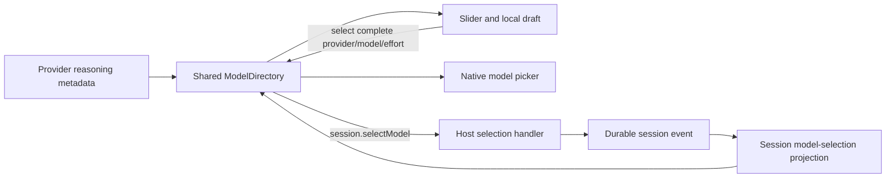

# Reasoning-effort plugin mechanics

Status: implemented, fork-local. This document is the plugin's design record and reference for future work. It describes the selected DSH revision named in the [README](README.md), rather than a compatibility promise for later releases.

## Ownership and data flow

The component subscribes with `useSyncExternalStore` to the existing per-session directory. It owns only presentation state: panel visibility, draft index, pending display, and local failure display. Catalog loading, remote calls, session projection, and directory disposal belong to DSH. A model selection always includes the captured provider and model; moving the slider never searches for another adapter or changes routes implicitly.

DSH's existing selection path records the model-visible choice. Adding a separate event or storing the effort in browser local storage would introduce a second authority. Removing this UI leaves previously recorded selections intact; it removes the control, not session history.

## Host and browser loading

The Host entry exports a plugin with no runtime behavior. DSH discovers its nearest manifest and `dsh.client` metadata, then loads the `./client` export into the browser. The manifest's `inject` list names prerequisite client **modules**. The browser's exported `inject` array names Cordis **services**. These are distinct dependency declarations and neither substitutes for the other.

Cordis service methods execute with the caller's tracked context. `modelDirectories.directoryFor(sessionId)` reads `remote.session` when it creates a directory. This plugin therefore declares both `remote` and `remote.session`, even though the React component only calls `directory.select()`. A warm directory can conceal a missing dependency; a fresh-session browser test exercises creation.

The browser output registers a factory with `window.__ModuleLoader__.load`. React and its JSX runtime remain external so the component uses the shell's React instance. The local CSS loader emits a string into that factory. The plugin inserts that string only during `apply()` and removes the element through the owning effect. It has no evaluation-time DOM mutations, polling loop, MutationObserver, animation loop, or WebGL context.

## Slot and lifecycle

`conversation.input.left` is a session-scoped list slot. A stable contribution ID identifies this control. `ctx.slots.inject()` waits for the slot declaration and reinstalls the contribution if its declaring component is replaced. `ctx.slots.register()` already participates in Cordis effects; its returned disposer belongs to the injection. Locale and style registrations explicitly use `ctx.effect()`.

The session ID supplied to the slot injector resolves the same directory used by the native picker. The directory belongs to the session scope, so unloading the slider must not dispose it. The slider removes its store subscription and outside-pointer listener through React cleanup. An in-flight selection belongs to the shared directory and can finish after the panel closes; the unmounted component suppresses its own state updates.

The left slot has no owner-provided lock flag. This is a deliberate limitation of an additive control at this revision. A future need for exact native-seat locking should use a documented lifecycle signal or an appropriate typed slot. Reading CSS classes or scraping the native picker would make the plugin depend on unrelated rendering details.

## Discrete selection and concurrency

The provider's effort list is the ordered domain. The input value is an integer index into that list; only the selected item's opaque ID reaches the directory. The component resolves a missing selection effort from the provider's declared default and refuses to guess if neither resolves to an advertised item.

`onChange` updates the local draft. Pointer release and supported key release commit it. A synchronous ref closes the interval before React renders pending state, preventing two events from submitting the same draft. The shared `selecting` status disables this range when the native picker owns a pending selection. The Host and directory retain their existing ordering rules for calls from other clients.

Successful projection updates reset the draft while keeping the range element mounted, preserving its identity for keyboard use. A different provider/model or effort catalog replaces the range and discards the previous draft. The trigger always reads the shared projection. Failed requests leave the authoritative selection unchanged and reset the local draft; error text is localized by the UI except for errors supplied by the shared directory.

## Tests and maintenance

Component tests use real React with one fresh store per test and manually resolved promises for pending requests. They make no network calls and use no fixed sleeps. The built-module test uses the real Cordis context and slot registry, with small stubs for unexercised services; it verifies module registration and cleanup, not the Host RPC implementation. A real browser run is necessary for cold-directory dependency access, native range events, layout, and the connection between selection and persisted session data.

The local TypeScript program inherits upstream browser compiler options and repeats the upstream client project references because TypeScript does not inherit `references` through `extends`. Those references use the prepared upstream declaration outputs; they do not enroll this directory in the root workspace. After an upstream update, compare the references, manifest dependencies, slot declaration, `ModelDirectory` API, module factory format, and provider metadata, then run the local checks and fresh-session browser acceptance.

The plugin declares no runtime invariant installer: it owns no independently maintained model data whose observations can diverge. Its mechanically checkable obligations are covered by the local tests. If future work adds provider provisioning, durable state, or a capability service, that requires its own validation, migration policy, and ownership design; this control is not a template for silently rewriting settings.
