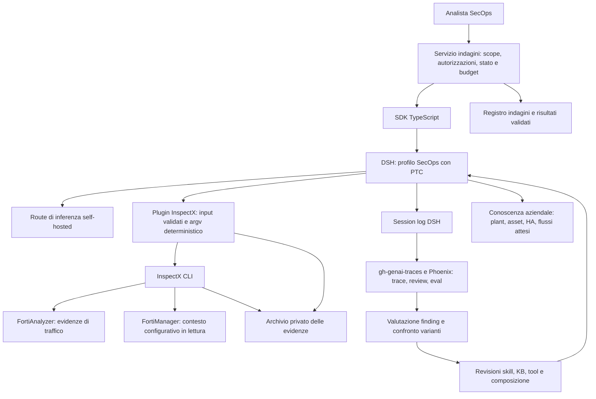

# Da chat a agente SecOps con DSH e InspectX

## Sintesi

La scelta consigliata è **DSH come runtime dell’analista, InspectX come esecutore deterministico e un piccolo servizio applicativo come proprietario delle indagini**. Il primo agente analizza l’egress e le sue correlazioni in un perimetro dichiarato, usando il know-how aziendale su host, plant e firewall HA; legge dati e produce un dossier verificabile. La prima verticale è delimitata, ma include almeno due plant e un caso HA per esercitare la complessità reale. Non modifica policy Fortinet e non certifica automaticamente la compliance.

**Configurazione candidata principale: SDK TypeScript + profilo SecOps con PTC**, eseguito nell’ambiente protetto previsto per l’agente. PTC offre la composizione programmabile utile a correlazioni, filtri e approfondimenti SecOps; InspectX conserva acquisizione e analisi canoniche. **Headless** usa la stessa logica per batch ed evaluation. **Native** è il confronto di riferimento per misurare se PTC migliora davvero il risultato sulla route self-hosted; non è un passaggio obbligatorio prima di PTC. SDK, headless e PTC non sono tre alternative equivalenti.[^1][^2][^3]

InspectX è in sviluppo: questo percorso ne definisce il contratto d’integrazione atteso, non richiede che tutte le caratteristiche siano complete oggi. Il contesto organizzativo comprende **12 coppie di firewall in HA**, come indicato dal responsabile del progetto; la loro topologia non è stata dedotta né verificata interrogando gli apparati. La base esaminata è DSH `77b16a8229f07790d91771622173a397c711ba67` e InspectX `384c670`. Le configurazioni nel fork dichiarano inferenza self-hosted; non è stata verificata la configurazione attualmente attiva sull’host. Deployment, chiamate agli apparati e training restano esclusi da questa valutazione.

## Indice

- [Che cosa scegliere: SDK, headless, Web e PTC](#che-cosa-scegliere-sdk-headless-web-e-ptc)
- [Architettura del primo agente](#architettura-del-primo-agente)
- [Dalla conversazione al dossier verificabile](#dalla-conversazione-al-dossier-verificabile)
- [Skill, knowledge base e ragionamento verticale](#skill-knowledge-base-e-ragionamento-verticale)
- [Il contratto tra DSH e InspectX](#il-contratto-tra-dsh-e-inspectx)
- [gh-genai-traces come ciclo di miglioramento](#gh-genai-traces-come-ciclo-di-miglioramento)
- [Stato, budget, autorizzazioni e recupero](#stato-budget-autorizzazioni-e-recupero)
- [Evaluation del caso SecOps](#evaluation-del-caso-secops)
- [Percorso di implementazione](#percorso-di-implementazione)
- [Come correggere la direzione dei deck](#come-correggere-la-direzione-dei-deck)
- [Fonti](#fonti)

## Che cosa scegliere: SDK, headless, Web e PTC

### Due decisioni indipendenti

La prima decisione è **chi guida il runtime**: una persona, uno script o un servizio. La seconda è **come il modello invoca le capacità**: chiamate di funzione native oppure un programma che chiama i tool. Il linguaggio dell’applicazione chiamante è una terza decisione: usare l’SDK Python non significa usare PTC Python.

| Opzione | Che cosa significa in DSH | Uso consigliato per SecOps |
|---|---|---|
| `headless` | Un processo esegue un task, stampa risposta finale su stdout e termina; reasoning su stderr quando presente | Prove ripetibili, benchmark del caso d’uso, batch semplici. Non basta parsare il testo finale per attestare il risultato |
| SDK TypeScript / Python | Il client avvia DSH come subprocesso e lo controlla via JSON-RPC su stdio | Integrazione applicativa: invio di indagini, sessioni, eventi, riferimenti alle evidenze e gestione errori |
| `web` | Interfaccia umana sulla composizione DSH | Esplorazione e revisione interattiva; valida anche come interfaccia operativa se viene accettata e configurata per quel compito |
| `acp` | Server per client che parlano Agent Client Protocol | Solo se un sistema da integrare richiede ACP. Non serve introdurlo tra il nostro servizio e DSH |
| `sdk-minimal` | Composizione esplicita con shell, senza numerosi servizi del profilo completo; policy `danger-full-access` | Non è la base consigliata per SecOps. “Minimal” descrive le dipendenze, non il privilegio minimo |
| Tool mode `native` | Il modello vede schemi di tool e passa argomenti tipizzati | Eccellente per poche operazioni e quando ogni risultato deve essere interpretato prima della scelta successiva; baseline di qualità |
| Tool mode `ptc` | Il modello scrive codice per `run_code`; un SDK generato espone i tool | Candidato principale per l’analisi avanzata: join, iterazioni, filtri, approfondimenti condizionali e sintesi di risultati ampi |
| Tool mode `both` | Espone sia schemi nativi sia `run_code` | Candidato ibrido: chiamate semplici dirette e codice per le analisi complesse; verificare se la route sceglie bene le due forme |

La base condivisa offre molti strumenti da coding agent. Per SecOps va **configurata una composizione specifica**, non semplicemente cambiato il prompt. Il profilo determina plugin e servizi del processo; un preset può determinare la composizione per agente; una skill contiene istruzioni procedurali. Una skill non concede né limita permessi. Le patch si applicano nell’ordine bundle → profilo → home → overlay di lancio e sostituiscono l’intero `config` della riga interessata.[^1]

### Perché l’SDK è il punto di arrivo

Il servizio SecOps deve poter associare un’indagine ai suoi eventi, distinguere errori di trasporto da risultati incompleti, salvare gli identificativi e mostrare lo stato all’operatore. L’SDK evita di costruire questi comportamenti sul parsing di stdout. Per questa integrazione TypeScript è una scelta naturale, dato che InspectX è TypeScript/Bun; tuttavia **InspectX resta un eseguibile separato**, mentre DSH e il worker SDK rispettano il runtime Node supportato. Non occorre importare Ink o il query engine Bun nel processo Cordis.[^2][^8]

Il profilo suggerito, da realizzare, è `secops-sdk`, derivato dal template `sdk`, con un bundle di dominio installato e un Harness home dedicato. Una composizione `secops-headless` può riutilizzare lo stesso bundle per i test. Non sono profili già presenti. È necessario pinning congiunto di SDK, runtime del fork, plugin e CLI: lo stesso numero di versione npm non identifica da solo le modifiche di un fork.

L’SDK non è un’API HTTP remota e non trasferisce al runtime una callback JavaScript arbitraria per ogni tool. I tool vivono nei plugin del processo DSH; il servizio chiamante avvia e controlla quel processo. Se altri sistemi richiedono HTTP o una coda, il nostro servizio espone quella superficie sopra l’SDK.

### Limiti SDK da incorporare subito

`run()` raccoglie l’intervallo dalla ricevuta durevole del prompt al successivo stato `idle`. `finalResponse` è l’ultimo testo assistant dell’intervallo, non una certificazione dell’esito e non una risposta causalmente esclusiva al singolo prompt quando entrano altri messaggi. Una nuova chiamata a `harness.run()` senza `sessionId` crea una sessione nuova; un handle di sessione esplicito consente follow-up sullo stesso caso. Il servizio deve serializzare gli input della medesima indagine.[^2]

Il protocollo non offre cancellazione del singolo prompt né un canale completo di richieste server→client per approvazioni. Chiudere il runtime interrompe tutte le sessioni che quel processo ospita: partire con **un processo per indagine attiva** rende la cancellazione più semplice da delimitare. È una proposta iniziale da misurare, non un requisito universale. Il timeout RPC non equivale al tempo massimo dell’indagine; occorre un supervisore che chiuda e riattenda il processo quando scade il budget applicativo.

### Perché PTC è promettente per questo workload

Il vantaggio di PTC non è soltanto risparmiare token. Un’indagine SecOps richiede spesso acquisire insiemi di dati, raggrupparli, confrontarli, selezionare entità sospette e approfondire soltanto quelle. Un programma può eseguire questa procedura in modo esplicito e restituire al modello risultati già organizzati, senza obbligarlo a tenere ogni riga in memoria conversazionale.[^3]

| Capacità richiesta | Native | PTC | Conseguenza per la qualità |
|---|---|---|---|
| Interpretare un singolo risultato ambiguo | Il modello osserva e sceglie il prossimo tool | Il programma restituisce l’ambiguità; il modello decide nel passo successivo | Native è già sufficiente; PTC non deve nascondere i dubbi |
| Analizzare 30 host con la stessa procedura | Più chiamate, anche parallele, con risultati nel contesto | Ciclo sul set, concorrenza limitata, raccolta uniforme | PTC rende meno probabili omissioni procedurali, ma il programma deve coprire davvero tutti gli host |
| Correlare traffico, servizi e contesto FMG | Il modello può usare tool di join già implementati | Join espliciti su chiavi composte e oggetti canonici | PTC amplia le analisi disponibili senza creare un tool nuovo per ogni combinazione |
| Gestire grandi risultati | Aggregazioni e finestre tramite InspectX | Valori intermedi restano nel programma; solo il risultato selezionato entra nel contesto | Più spazio per ragionare sui finding, purché la riduzione non perda prove decisive |
| Approfondire solo risultati che soddisfano una condizione | Un nuovo passo del modello, oppure tool dedicato | Condizione e query successive nel programma | Più esplorazione utile nello stesso budget; condizioni quantitative verificabili |
| Correggere un’interpretazione | Nuova scelta di tool e argomenti | Correzione del programma o nuovo programma | PTC aggiunge possibili errori di codice e join, quindi richiede verifiche analitiche |
| Audit della conclusione | Tool e risultati registrati | Codice, sub-call correlate e risultati registrati | Entrambi possono essere verificabili; servono evidence ID e trasformazioni riproducibili |

La raccomandazione è **provare PTC subito come candidato principale**, con gli stessi tool tipizzati impiegati dal confronto native. La superiorità sul nostro Qwen non è ancora misurata: le capacità di code generation e tool calling della route possono cambiare il risultato. La scelta finale dipende dalla qualità dei dossier e dalla copertura delle evidenze, poi da latenza e consumo.

Non occorre far riscrivere al modello le operazioni che InspectX già esegue bene. PTC le compone: acquisisce, richiama analisi canoniche, costruisce un join nuovo quando necessario, controlla cardinalità e missing, quindi restituisce finding con prove. Le trasformazioni ripetute e validate possono diventare nuove analisi deterministiche del CLI; quelle esplorative restano programmi per la singola indagine.

Per abilitarlo nel profilo SDK occorrono `tools.mode: ptc` e un `codeRuntime` compatibile. Il backend TypeScript esistente offre top-level await, binding asincroni e un nuovo worker per programma. La variabile temporanea `DSH_TOOLS_MODE` del bundle headless non è un interruttore universale del profilo SDK. Il valore di completamento e i log ritornano al modello; lo stato in memoria del programma non sopravvive alla chiamata successiva: le evidenze devono restare in uno storage esplicito.[^3][^4]

### Ambiente protetto: requisito operativo, non motivo per scartare PTC

Il worker TypeScript shipped non è un isolamento dall’host: il codice può accedere alle API Node e i subprocessi possono sopravvivere alla terminazione del thread. Nell’ambiente protetto previsto, questo si gestisce isolando **l’intero job DSH/PTC**, con workspace e identità dedicati, limiti di CPU/memoria/processi/disco/tempo e distruzione dell’intero gruppo di processi al termine. La semplice restrizione dei binding non impedisce gli accessi diretti Node.[^4]

L’archivio delle evidenze può essere montato in lettura e un’area separata può ospitare risultati derivati. Un broker InspectX separato è un’opzione utile se le credenziali Fortinet devono restare fuori dall’ambiente che esegue codice del modello: espone solo acquisizioni autorizzate, mantiene sessioni e budget e consegna evidenze. In un deployment a singolo analista può bastare un esecutore CLI isolato, purché il suo perimetro sia quello voluto. La topologia va scelta in base all’ambiente reale; non serve inventare un nuovo backend DSH prima della prima prova.

Questi vincoli non devono impoverire l’analisi: garantiscono l’accesso alle fonti e agli strumenti necessari nel perimetro del caso. Il criterio principale resta se PTC produce conclusioni più corrette, approfondite e documentate.

## Architettura del primo agente

Il modello può proporre un approfondimento, ma il tool ammette solo query entro il perimetro approvato. Il fatto che InspectX sia read-only rispetto alla configurazione degli apparati non autorizza letture illimitate, esfiltrazione di log o accesso ad altri ADOM. Le credenziali e i limiti devono essere applicati dall’adapter e dall’infrastruttura, non ricavati dal testo della conversazione.

| Responsabilità | Proprietario |
|---|---|
| Autenticazione dell’operatore e perimetro ADOM/device/VDOM | Servizio SecOps e policy dell’adapter |
| Interpretazione della domanda, ipotesi e scelta degli approfondimenti | Modello dentro DSH |
| Validazione degli argomenti e autorizzazione della chiamata | Tool DSH e guard di dominio |
| Compilazione query, protocollo Fortinet, paginazione e precisione | InspectX |
| Conti, distribuzioni, somme, selezione righe | Analisi deterministica InspectX |
| Storia model-visible e tool call/result | Session log DSH |
| Stato dell’indagine, risultati accettati, riferimenti alle evidenze | Registro del servizio |
| Tracing, review e costruzione degli eval | `gh-genai-traces`, collector e Phoenix nella prima composizione; nuova accettazione della verticale SecOps |
| Giudizio finale e azioni sulle policy | Analista; nessuna scrittura apparati nel primo agente |

Non serve riscrivere il loop di DSH, costruire un server MCP, né adottare da subito un motore di workflow distribuito. Il valore iniziale viene da un’analisi ripetibile con conclusioni verificabili.

## Dalla conversazione al dossier verificabile

### Primo caso: triage egress di un host o subnet

Domanda di riferimento: “Nel periodo indicato, quali comunicazioni di questo host sono state osservate sull’interfaccia che definiamo WAN? Quali destinazioni e servizi meritano verifica, e quali limiti hanno i dati?”

Il servizio risolve host/CIDR, ADOM, device, VDOM, intervallo con timezone e interfaccia egress. Risolve una volta espressioni relative come “ieri”, conservando l’intervallo effettivo. In assenza di dati necessari, l’agente chiede il chiarimento invece di inventare topologia o finestre temporali.

L’indagine procede in cinque passaggi:

1. **Definire il perimetro.** Mostrare domanda, scope, periodo, autorizzazioni e limite di acquisizione.
2. **Acquisire evidenza limitata.** Compilare la query, eseguirla tramite InspectX, registrare task e metadata, conservare l’export privato.
3. **Calcolare.** Distribuzioni per destinazione, porta, azione e timeline usando funzioni deterministiche. Non far contare al modello migliaia di righe.
4. **Approfondire.** Il modello propone poche query aggiuntive motivate dai risultati; l’adapter verifica scope e budget a ogni chiamata.
5. **Consegnare il dossier.** Separare osservazioni, ipotesi, dati mancanti, controlli consigliati e riferimenti alle evidenze.

Un risultato utile contiene: stato (`complete`, `partial`, `needs-input`, `failed`, `cancelled` come vocabolario applicativo proposto), scope richiesto ed effettivo, elenco evidenze, risultati delle analisi, findings con riferimenti, limiti di copertura e raccomandazioni. La parola `complete` descrive l’indagine secondo i criteri dichiarati; non cancella eventuali limiti della raccolta di log.

### Egress, east-west e compliance richiedono semantica di dominio

Un IP pubblico non dimostra traffico WAN. “East-west” richiede una mappa esplicita di segmenti, siti e interfacce; non coincide automaticamente con indirizzi RFC1918. Il `traffic-summary` corrente conta byte inviati più ricevuti sulle righe restituite: non è automaticamente egress, throughput o top-N globale. Anche NAT e identità pre/post traduzione devono essere trattati esplicitamente.[^8]

L’assenza di righe non prova l’assenza di traffico. La completezza di un task FAZ non dimostra che tutti i flussi siano stati loggati e conservati. La configurazione corrente FMG non prova quale configurazione fosse installata sul dispositivo al momento di un evento. Un policy ID senza device/VDOM non identifica necessariamente una policy in modo univoco.[^9]

Per compliance, l’agente può preparare **evidenze rispetto a controlli nominati e criteri forniti**: per esempio verificare se traffico osservato contraddice una matrice di comunicazioni autorizzate. Non deve convertire “nessuna anomalia nei dati disponibili” in “ambiente conforme”, né attribuire un’azione a una persona usando soltanto l’identità tecnica registrata.

## Skill, knowledge base e ragionamento verticale

Un agente di analisi avanzata non è un riassuntore di output CLI. Deve formulare ipotesi, acquisire prove discriminanti, confrontare spiegazioni alternative e sapere quando i dati non bastano. La qualità dipende da tre risorse complementari: capacità del modello, operazioni analitiche componibili e conoscenza pertinente.

### Quattro elementi da montare

| Elemento | Contenuto | Esempio SecOps | Collocazione DSH proposta |
|---|---|---|---|
| Istruzioni di ruolo | Obiettivo, formato del risultato, metodo probatorio | Separare osservazione, interpretazione e controprova | Sezioni di system prompt del profilo/preset |
| Skill | Procedura investigativa riutilizzabile e criteri di scelta | Egress investigation, east-west segmentation, NAT correlation, policy audit | `dsh-skill` + `skill-filesystem` + `tool-skill` |
| Knowledge base | Fatti consultabili con origine, versione e validità | Zone, reti, interfacce, asset, comunicazioni consentite, manuali della versione Fortinet | Tool di lookup/retrieval di dominio, implementato come plugin o integrazione esistente |
| Evidenze del caso | Osservazioni e risultati delle analisi | Export FAZ, snapshot FMG, query e finestre effettive | Archivio evidenze e tool InspectX |

La skill descrive **come indagare**. La knowledge base descrive **che cosa significa l’ambiente**. L’evidenza documenta **che cosa è stato osservato**. Una mappa topologica che cambia spesso non appartiene al testo statico di una skill; una policy aziendale non si può inferire dalla sola frequenza del traffico.

### Montare le skill usando capacità già presenti

DSH dispone già di registry, provider filesystem e loader. `skill-filesystem` legge directory con `SKILL.md`, incluse root personalizzate tramite `customSkillDirs`; `includeDefaultRoots: false` consente un catalogo di dominio senza le skill personali della workstation. `tool-skill` pubblica un catalogo durevole e carica il corpo su richiesta; l’invocazione esplicita `/nome` può inserire la skill all’inizio dell’indagine. Un preset può comporre le skill insieme a prompt e tool, quando il relativo servizio è montato.[^14]

Una prima libreria proposta comprende:

- `secops-investigation`: chiarimento del perimetro, ipotesi, prove, controprove e struttura del dossier.
- `network-egress-analysis`: significato di direzione, interfacce, byte, sessioni, NAT, DNS e proxy; selezione degli approfondimenti.
- `east-west-segmentation`: mappe di zone, comunicazioni attese, eccezioni e limiti della visibilità.
- `fortinet-evidence-semantics`: significato dei campi e degli endpoint, differenze FAZ/FMG, identità e tempo della configurazione.
- `security-control-assessment`: associazione tra controllo richiesto, evidenze necessarie e risultato `soddisfatto / violato / non determinabile`.

Non sono skill già create. Per renderle utili, un esperto network deve fornire esempi di ragionamento corretto, falsi indizi e controprove; riempire un `SKILL.md` di principi generici non trasferisce competenza verticale.

Con PTC, il caricamento deve arrivare al modello: un programma che chiama il loader e poi scarta il risultato non trasferisce quelle istruzioni al successivo ragionamento. Per la skill fondamentale conviene l’invocazione esplicita nel prompt iniziale; per le specialistiche, riportare il contenuto necessario dal programma oppure usare il meccanismo di caricamento appropriato alla presentazione scelta. La prova di accettazione ispeziona la richiesta registrata, non solo il fatto che il file esista.

Pinning del pacchetto di skill e dei riferimenti utilizzati rende confrontabili le evaluation. Il provider rilegge il file a ogni load: disattivare il watcher da solo non congela il contenuto; il deployment deve montare la revisione selezionata.

### Knowledge base: lookup strutturato prima, retrieval documentale quando serve

Per topologia e asset, preferire lookup esatti su chiavi: sito, device, VDOM, interfaccia, CIDR, asset ID e intervallo di validità. Per manuali e procedure, la ricerca testuale o ibrida può selezionare passaggi con citazioni. Un vector database non è obbligatorio per iniziare, e un nearest-neighbor semantico non deve decidere a quale subnet appartiene un IP.

Ogni risposta di conoscenza dovrebbe portare fonte, revisione, data di validità/osservazione, scope e passaggio utilizzato. Le conoscenze statiche di protocollo, la configurazione aziendale corrente e le evidenze storiche hanno temporalità diverse. In caso di conflitto, il dossier espone la discrepanza; non sceglie silenziosamente la fonte più simile alla domanda.

DSH offre plugin, strumenti e log per integrare questa funzione; i pacchetti skill e storage non costituiscono da soli un motore RAG completo. Il tool di conoscenza resta una capacità da comporre. Può appoggiarsi a un servizio aziendale già esistente; introdurre MCP ha senso per riuso tra client, non perché sia obbligatorio per DSH.

### Modello di conoscenza per plant e dodici coppie HA

La KB deve rappresentare l’organizzazione, non solo conservare manuali. Dodici coppie HA non implicano dodici plant, ventiquattro sorgenti indipendenti o una singola relazione ADOM→plant. Queste corrispondenze devono essere fornite o ricostruite da fonti aziendali e confermate dagli owner.

| Entità | Fatti necessari | Errori che evita |
|---|---|---|
| Plant/sito | Identità stabile, funzione, owner, criticità, orari e periodi operativi | Confrontare un plant fermo con uno in produzione o chiamare anomalo un flusso atteso |
| Host/asset | Identità, alias, IP nel tempo, ruolo, segmento, applicazioni, owner | Attribuire traffico storico all’host che usa oggi lo stesso IP |
| Cluster HA | Identità logica e membri fisici, seriali/alias, osservazioni di ruolo e failover | Doppio conteggio o perdita di evidenza dopo un cambio del membro attivo |
| Device/VDOM/interfaccia | Associazioni ai cluster, zone, reti, VRF se presenti, direzione e significato operativo | Dedurre WAN o segmento dal solo nome dell’interfaccia |
| Connettività | Collegamenti tra siti/zone, VPN, percorsi e punti di osservazione conosciuti | Scambiare il transito per origine o assumere visibilità end-to-end |
| Servizio/flow atteso | Sorgente, destinazione, porte/protocolli, motivazione, owner ed eccezioni | Trattare la frequenza di un flusso come prova della sua legittimità |
| Policy e controllo | Scope, versione, stato noto, requisito aziendale ed evidenze richieste | Confondere configurazione FMG corrente, policy installata e stato storico |
| Fonte | Provenienza, revisione, validità temporale e grado di conferma | Presentare un’ipotesi di inventario come fatto aggiornato |

Un modello strutturato relazionale o file versionati possono bastare per il primo set di queste relazioni. Un grafo può diventare utile per percorsi e dipendenze complessi; il numero di firewall da solo non obbliga a introdurre un database a grafo. Il retrieval documentale completa le relazioni con runbook, eccezioni e spiegazioni dei tecnici.

La normalizzazione HA conserva sempre identità grezza e identità logica derivata. Non deduplicare righe soltanto perché due device appartengono alla stessa coppia: occorre una regola verificata sulla semantica dei log e sul periodo. Un failover, una duplicazione di inoltro e un flusso osservato su due punti diversi non sono necessariamente lo stesso evento.

Ogni dossier multi-plant include una **matrice di copertura**: sito/cluster, device osservati, intervallo effettivo, fonti disponibili, completezza, conoscenze mancanti e finding. Un’acquisizione incompleta su un plant non scompare dentro una percentuale aggregata di tutta l’organizzazione.

### Conoscenza aziendale come prodotto mantenuto

Gli esperti network e i referenti dei plant approvano ruoli degli asset, significato delle interfacce, comunicazioni attese ed eccezioni. Il sistema importa snapshot e propone riconciliazioni, conservando differenze e date. Le osservazioni dell’agente possono diventare proposte di aggiornamento della KB; non modificano automaticamente ciò che l’azienda considera autorizzato.

Tre insiemi restano distinti: **ciò che è previsto**, **ciò che è configurato** e **ciò che è osservato**. Una buona indagine mette in relazione i tre e individua le discrepanze. Questa è una capacità più importante della sola classificazione “traffico sospetto”.

### Ciclo analitico consigliato

**Domanda → conoscenza pertinente → ipotesi → piano di acquisizione → programma PTC → risultati intermedi → revisione delle ipotesi → controprove → dossier.**

Per esempio, un volume elevato verso una destinazione esterna può suggerire esfiltrazione, backup autorizzato o aggiornamenti software. InspectX misura traffico e dettagli; la KB descrive ruoli degli asset e flussi attesi; PTC unisce dati e seleziona gli host da approfondire; il modello valuta le spiegazioni. Non basta una soglia sul volume per scegliere tra queste ipotesi.

Un programma PTC deve fermarsi e restituire un risultato intermedio quando serve un nuovo giudizio: un ciclo JavaScript non sostituisce il ragionamento del modello. La profondità viene da alternare calcolo e interpretazione, non da massimizzare la dimensione del programma.

### Specialisti quando migliorano il risultato

Per indagini ampie, subagenti specialisti possono verificare in parallelo semantica di protocollo, policy/topologia e ipotesi alternative. Il lead mantiene domanda ed evidenze comuni; assegna riferimenti a dati già acquisiti, domande precise e risultati con citazioni. Acquisizioni duplicate e conclusioni scollegate non aggiungono qualità.

Non serve imporre “sempre un agente” o “sempre una squadra”. La prima verticale stabilisce la qualità del lead PTC; aggiungere uno specialista è giustificato se trova errori o approfondimenti utili su casi che il lead non risolve. Un secondo modello che approva il primo non è automaticamente una verifica indipendente.

## Il contratto tra DSH e InspectX

### Tool di dominio componibili

I nomi seguenti sono una proposta di adapter, non API già implementate:

| Tool proposto | Input controllato | Risultato per il modello |
|---|---|---|
| `secops_compile_query` | Criteri tipizzati entro scope | Query effettiva, periodo, limiti, avvisi; nessuna acquisizione |
| `secops_collect_logs` | Query approvata e budget | `evidenceId`, metadata di acquisizione, piccolo campione |
| `secops_analyze_evidence` | `evidenceId`, analisi e filtri ammessi | Aggregati deterministici con selezione e riferimenti |
| `secops_read_evidence` | `evidenceId`, offset, limite, campi | Finestra limitata; nessun accesso a path arbitrari |
| `secops_lookup_knowledge` | Domanda o chiavi di dominio, scope e riferimento temporale | Fonti e fatti pertinenti, revisioni e conflitti |
| `secops_get_config_context` | Lookup FMG ammesso e scope | Contesto configurativo con origine e limiti |
| `secops_submit_findings` | Risultato strutturato con evidenze | Validazione e registrazione del dossier nel servizio |

Queste operazioni devono consentire filtri strutturati, analisi composte e accesso progressivo alle evidenze: non ridurre le capacità del CLI a riassunti precostituiti. Non tutti devono esistere nel primissimo incremento: compilazione, acquisizione, analisi e consegna possono bastare. Il principio è esporre operazioni che l’analista comprende, evitando sia un wrapper per ogni flag del CLI sia un unico tool “esegui qualsiasi comando”.

### Requisiti dell’adapter

L’adapter traduce input validato in una lista di argomenti per un eseguibile pin, senza interpolazione shell. Il modello non controlla eseguibile, variabili d’ambiente, riferimenti alle credenziali, directory di lavoro o destinazione arbitraria degli export. Il launcher e l’adapter propagano deadline e cancellazione e registrano esiti parziali o incerti.

InspectX restituisce `{rows, metadata}`; il metadata include scope della query, numero di righe, pagine, avvisi e `completeness: complete | partial | unknown`. L’exit code 0 da solo non garantisce completezza. JSONL termina con un record metadata: uno stream interrotto prima di quel record non va interpretato come acquisizione completa. Interi grandi possono restare stringhe: convertirli indiscriminatamente in `Number` perde precisione.[^8]

L’adapter conserva i metadata originali e aggiunge identificativo evidenza, versione CLI/adattatore, impronta della query e riferimento all’archivio. Analisi e finestre mantengono separati metadata della sorgente e criteri della selezione locale. Il modello riceve aggregati e finestre piccole; i dati grezzi restano nell’archivio privato.

L’SDK DSH non fornisce un parametro universale di structured output del risultato finale. La route versionata nel fork dichiara `supportsStrictMode: false`: non assumere JSON vincolato dal gateway. La validazione deve essere effettiva nel tool di consegna e nel servizio; eventuali riparazioni sono limitate. Un JSON valido può contenere un’interpretazione sbagliata: gli evidence ID e i calcoli vanno verificati separatamente.[^10]

### Cosa chiedere a InspectX quando serve

Un contratto machine-readable versionato, errori distinguibili, metadata completi, limiti e cancellazione sono obiettivi sensati per l’integrazione. Non serve bloccare l’adozione in attesa di un manifest universale, di MCP, di ogni protocollo Fortinet o di un framework generico per tutti gli agenti. I comandi e le analisi locali già presenti consentono di progettare la prima verticale; la loro evoluzione resta responsabilità del CLI.

## gh-genai-traces come ciclo di miglioramento

`gh-genai-traces` è un componente della prima composizione SecOps. Il suo scopo qui è consentire di capire **quale variante dell’agente produce l’analisi migliore e perché una conclusione è o non è sostenuta dalle evidenze**. Non è una componente accessoria da aggiungere dopo il pilota.

### Riutilizzo concreto del lavoro già fatto

Il plugin offre cattura di richieste, tool, usage ed esiti; mapping in Phoenix; replay da sessioni canoniche; annotazioni native HUMAN; candidati di curation con grade, hash e provenienza. L’overlay esplicito abilita cattura rich-redacted e feedback; il mounting diretto ha default diversi. Queste capacità vanno riutilizzate, evitando di ricostruire un secondo sistema di tracing o di raccolta dataset.[^15]

Il mapping raggruppa un turno in un trace. Un’indagine con follow-up può quindi corrispondere a più trace: **case ID non deve essere confuso con trace ID**. L’applicazione collega case, tentativi, sessioni, turni e risultati. La cattura PTC va verificata nella composizione scelta: le sub-call devono essere riconducibili al programma e il programma alle evidenze prodotte; non basta un unico span `run_code` opaco.

### Metadati di dominio da integrare

Il contratto SecOps proposto collega: case/attempt ID; plant e cluster interessati; revisione DSH, InspectX e adapter; route/modello/template; versione skill e KB; evidence ID; query e periodo effettivi; trasformazioni; finding e annotazioni. Il plugin dispone già di metadata configurabili e identificatori canonici, ma **non si assume che tutti questi campi di dominio siano già automatici**. Il bundle e il registro indagini devono produrli e verificarne la correlazione.

Se si usa un processo per caso, alcuni metadata possono essere statici per il lancio. Nei processi riutilizzati devono essere legati alla sessione/caso, evitando che un’etichetta globale attribuisca tutte le indagini allo stesso plant. Le prove e le conoscenze che raggiungono il modello passano nei canali loggati DSH; il solo campo di telemetria non deve diventare un input occulto.

Gli export grezzi non devono essere compressi dentro attributi span: il plugin limita il contenuto per attributo e distingue omissione, troncamento e redazione. Conservare identificativi e riferimenti ai dati canonici consente di verificare finding anche quando il trace non contiene il dataset intero. I programmi di trasformazione e i risultati derivati devono essere riproducibili sulle evidenze selezionate.

### Review orientata alla qualità

Le annotazioni SecOps devono distinguere almeno correttezza del finding, sostegno delle evidenze, copertura della domanda, profondità utile, controprove considerate e giudizio finale dell’analista. Il thumbs-up nativo è utile ma non sostituisce questi giudizi; il plugin lo tratta correttamente come preferenza, non come successo deterministico.

La catena di miglioramento è: **indagine → trace ed evidenze → review → caso di eval → confronto PTC/native/skill/KB → revisione dell’agente**. Per i casi multi-plant, congelare anche scope e revisioni della conoscenza. Fare split per indagine/famiglia e connessioni tra dati, evitando che parti dello stesso incidente finiscano tra train e test.

Il training viene dopo, se emerge un errore ricorrente che tool, conoscenza o skill non risolvono adeguatamente. Le 300 selezioni sintetiche esistenti validano la pipeline; la prima collezione rappresentativa sarà quella SecOps. Le tracce di reasoning emesso non provano da sole la fedeltà del ragionamento interno: si valutano finding, passaggi osservabili e prove, senza scambiare una spiegazione plausibile per una verifica.

### Accettazione della verticale osservabile

Prima del pilota, una singola indagine campione deve essere navigabile dal finding al record/aggregato InspectX, alla query, al programma PTC e ai passaggi modello, con le revisioni di skill/KB. Verificare anche una cattura incompleta: diagnostica e replay devono renderla riconoscibile, non convertirla in un caso apparentemente completo. È il nuovo controllo di integrazione richiesto; non occorre ripetere tutte le campagne e i test già completati del plugin.

## Stato, budget, autorizzazioni e recupero

### Stato dell’indagine e ripartenza

Conservare nel servizio almeno: `caseId`, scope e sua versione, query richieste, `attemptId`, `sessionId`, evidence ID, stato e risultato accettato. Il log DSH conserva ciò che è stato presentato al modello e ciò che è stato eseguito nella pipeline; l’archivio conserva le evidenze. Nessuno dei due sostituisce il registro delle decisioni applicative.

DSH dispone di barriere durevoli e recupero delle sessioni. Non riavvia magicamente lo stack di un tool interrotto: un effetto senza risultato può avere esito sconosciuto. Anche read-only produce effetti operativi, come task temporanei FAZ, sessioni di autenticazione e file locali. Un retry deve distinguere una nuova acquisizione dal riuso di un’evidenza già disponibile.[^5][^8]

Per il primo caso basta un job con stato persistito e retry delimitati, oppure esecuzione sincrona supervisionata se è accettabile rilanciare l’indagine. Temporal, DBOS o Inngest diventano opzioni da confrontare quando servono attese di ore/giorni, scheduling affidabile, coordinamento distribuito o compensazioni. Non sono equivalenti per API, modello di esecuzione e operatività. Nessun motore elimina la necessità di trattare gli effetti esterni in modo idempotente.[^13]

### Budget adatti all’inferenza self-hosted

Il budget utile non è soltanto in dollari: durata, token, occupazione GPU, richieste FAZ/FMG, righe e byte acquisiti, spazio delle evidenze e concorrenza sono risorse finite. Partire con un lead e un piano di acquisizione che rispetti i limiti per apparato/account; misurare quale parallelismo tra fonti indipendenti è sostenibile. Dodici coppie HA non richiedono dodici subagenti: PTC può comporre acquisizioni e analisi, mentre gli specialisti servono dove aggiungono giudizio. Misurare code e latenze insieme alla qualità del dossier.

`maxTokens` nell’SDK limita l’output della singola richiesta del modello, non l’intera indagine. Un guard per step non vede necessariamente tutti i retry nello stesso step né tutte le richieste ausiliarie. Un limite complessivo richiede accounting condiviso, riserva del lavoro ammesso e registrazione dell’uso effettivo; il supervisore impone anche una deadline esterna.[^2]

Nel primo incremento non è necessario implementare un sistema universale di contabilità finanziaria. Servono limiti configurati per il caso, terminazioni chiaramente distinte dal successo e metriche per calibrare i valori. I numeri del vecchio benchmark W9 non costituiscono il dimensionamento del workload SecOps.

### Autorizzazioni senza dipendere dal prompt

Il profilo SecOps espone le capacità analitiche necessarie e PTC nell’ambiente isolato. Shell amministrativa, installazione plugin e self-modification non sono prerequisiti dell’analisi; eventuali accessi diretti del codice sono governati dall’ambiente del job. Anche nel percorso dei binding, un mask sul catalogo non basta da solo: i guard di dominio controllano l’esecuzione e tutti i tool eventualmente registrati nello scope. Lo scope delle query deriva dal servizio, non da ADOM o path scelti liberamente dal modello.

I log sono input potenzialmente ostili: URL, hostname, user-agent, nomi di oggetti e messaggi possono contenere istruzioni. L’agente li interpreta come dati, mentre le autorizzazioni restano esterne al modello. Un log append-only può conservare perfettamente un payload malevolo: non lo rende attendibile.[^12]

DSH offre il servizio di approvazione, una UI Web e un bridge ACP; l’SDK corrente non offre il corrispondente dialogo bidirezionale completo. Per questo primo agente, approvare scope e limiti prima di avviare il job è più semplice che sospendere un tool aspettando un dialogo SDK. Una richiesta fuori scope può terminare con `needs-input` e produrre una nuova decisione esplicita. Non usare una concessione generica “approva sempre” per aggirare il problema.[^6]

### Evidenze, tracing e dati sensibili

Il log di sessione, gli export InspectX, le risposte del modello, stderr e Phoenix sono percorsi dati distinti. Redigere un trace non redige retroattivamente il session log. Stabilire quali campi possono raggiungere il modello, quali restano grezzi nell’archivio e chi può aprire ciascun archivio.

Il plugin `gh-genai-traces` e le campagne del fork sono una base concreta. La conferma del receiver OTLP non prova persistenza finale in Phoenix; il replay dal log canonico può ricostruire evidenza più completa, ma non riporta indietro lo stato degli apparati. La readiness operativa richiede accettazione della composizione SecOps, controllo dei backup e una prova di diagnosi, non soltanto trace visibili nella UI.[^7]

Per il primo pilota, evitare sampling che renda incompleto il dataset di valutazione; usare un campione esplicito di casi e dati autorizzati. Retention, sampling e redazione sono decisioni del deployment, non percentuali obbligatorie della specifica OpenTelemetry.

## Evaluation del caso SecOps

Servono tre livelli separati: test deterministici del CLI/adattatore, replay di regressione del runtime, evaluation live del modello su casi congelati. Il replay DSH verifica il comportamento con risposte registrate; non misura se la route self-hosted saprà scegliere oggi gli approfondimenti giusti. Quella misura richiede esecuzioni del modello su dati controllati, da autorizzare e pianificare separatamente.

Il confronto principale usa gli stessi casi nelle diverse presentazioni dei tool. Misurare prima **correttezza dei finding, copertura della domanda, profondità degli approfondimenti utili e qualità delle prove**. Latenza e token servono a scegliere tra risultati di qualità comparabile, non a premiare una risposta economica ma superficiale. Non imporre una sequenza golden di chiamate: una strategia alternativa è valida se produce il risultato corretto e documentato.

Una prima suite di 20–50 casi reali o realistici, autorizzati e anonimizzati dove necessario, è una base ragionevole; non una certificazione di affidabilità. I casi devono includere risultati normali, anomalie, dati parziali e impossibilità di rispondere. La fonte Anthropic suggerisce esplicitamente di iniziare con poche decine di casi, non di aspettarne 500.[^11]

| Caso | Criterio di accettazione |
|---|---|
| Scope ambiguo | Chiede device/interfaccia/periodo necessari; non inventa topologia |
| Acquisizione parziale | Mantiene gli avvisi e non conclude “nessun traffico” |
| Autenticazione o trasporto falliti | Distingue errore da zero risultati |
| Destinazione pubblica su interfaccia interna | Non classifica automaticamente come WAN |
| NAT e policy ID ambigui | Conserva identità grezze e contesto device/VDOM |
| Integer oltre precisione JavaScript | Somme deterministiche senza arrotondamento silenzioso |
| Failover HA o identità riutilizzate tra plant | Mantiene identità logica e grezza; nessun doppio conteggio o join cross-site improprio |
| Knowledge base incompleta o contraddittoria | Espone il conflitto; non inventa ruoli, flussi autorizzati o topologia |
| FMG corrente diverso dall’epoca del log | Esplicita che manca prova dello stato storico installato |
| Payload di injection dentro un campo log | Non amplia scope né introduce comandi non consentiti |
| Follow-up su evidenza già presente | Riutilizza analisi locale quando non occorre una nuova query |
| Timeout/cancellazione | Risultato non presentato come successo; riferimenti alle evidenze parziali conservati |

Valutare anche con e senza skill/KB selezionate, mantenendo costanti i casi, per capire quali conoscenze migliorano davvero l’analisi. Inserire casi in cui il modello deve confutare un’ipotesi iniziale, usare una definizione specifica del sito o riconoscere una fonte obsoleta.

Misurare copertura delle affermazioni tramite evidenze, falsi positivi e falsi negativi per categorie, conservazione degli unknown, correttezza dei calcoli, query ammesse, intervento umano, durata e consumo. Per le regole inderogabili — per esempio nessun accesso fuori ADOM autorizzato — una media del 95% non è un criterio accettabile: il controllo deve impedire la violazione e i test devono tentarla.

`pass@k` e `pass^k` descrivono tentativi ripetuti, non sostituiscono le metriche SecOps. La formula `0,75³ ≈ 42%` vale per prove indipendenti con probabilità costante; non elevarne alla terza una media eterogenea e chiamarla affidabilità del servizio. Calibrare il grader con esperti su finding ed evidenze; Pearson elevato da solo non misura accordo né errori critici.

## Percorso di implementazione

Le fasi hanno criteri di uscita, non una promessa “due plugin in una settimana”. Non occorre completare una piattaforma enterprise generale per ottenere il primo agente utile.

| Fase | Consegna | Uscita verificabile |
|---|---|---|
| 1. Specificare la prima indagine | Una domanda egress su due plant con caso HA, output atteso, conoscenza richiesta ed esempi buoni/cattivi | Un analista può dire senza ambiguità se il dossier risponde correttamente |
| 2. Collegare CLI e DSH | Bundle di dominio, tool componibili, skill investigative, lookup KB, profilo PTC, gh-genai-traces, ambiente isolato e route esplicita | Da fixture offline si ottiene un dossier con analisi e riferimenti corretti |
| 3. Confrontare con headless | Stessi casi in PTC, native e se utile both; stessa route e stessi limiti | Scegliere per correttezza, profondità e copertura delle evidenze; spiegare le differenze, poi misurare efficienza |
| 4. Integrare tramite SDK | Worker Node, registro indagini, session ID, deadline, stato e risultato strutturato | Due indagini non si mescolano; follow-up serializzato; crash e cancel producono uno stato interpretabile |
| 5. Pilota assistito | Casi autorizzati sugli apparati e sul modello target, tracing accettato e revisione umana | Operatore ricostruisce un finding dalle evidenze; qualità e limiti misurati sul workload |
| 6. Estendere in base alle misure | East-west, controlli di audit, più fonti; eventualmente subagenti e orchestrazione durevole | Ogni estensione conserva scope, provenienza, budget e evaluation del caso precedente |

Il codice d’integrazione appartiene a un plugin/bundle del fork sotto `artifacts/`; la semantica Fortinet resta in InspectX. Il servizio chiamante può essere un progetto separato. Il profilo dedicato usa un home esplicito, evitando di ereditare implicitamente impostazioni e patch della postazione Web personale. Gli esempi di nomi e componenti in questo documento sono una proposta di implementazione; non è stata creata o lanciata questa composizione.

### Primo backlog concreto

| Consegna | Contenuto da realizzare | Responsabilità |
|---|---|---|
| Caso di riferimento multi-plant | Domanda, due plant campione, cluster HA interessati, periodo ed esempio di dossier accettato | Analista network/SecOps e responsabile prodotto |
| Pacchetto di conoscenza iniziale | Inventario minimo dei due plant, mapping HA/device/VDOM, ruoli host e flussi attesi, con revisioni | Owner network e referenti dei plant |
| Bundle `secops` | Adapter InspectX, tool di conoscenza/evidenze, skill investigative e configurazioni PTC/native confrontabili | Integrazione DSH; semantica delle query resta nel CLI |
| Worker applicativo | SDK, case/session ID, stato, deadline, risultato strutturato e riferimenti all’archivio | Servizio SecOps |
| Esperimento Phoenix | Casi congelati, identificativi di variante, cattura gh-genai-traces, rubriche e review | Valutazione AI con analista di dominio |
| Decisione di composizione | Confronto PTC/native/both sui finding e sulle prove; scelta della variante migliore | Responsabile AI e owner del caso |

Il deliverable iniziale è **un dossier multi-plant verificabile end-to-end**, non una demo che elenca comandi. Deve saper approfondire una domanda nuova entro le capacità concordate, usare il contesto aziendale e spiegare un conflitto o un limite dei dati. Dopo questa prova si estende la copertura alle dodici coppie HA; non si assume che moltiplicare i worker equivalga a scalare la qualità.

La prima decisione da prendere è il formato di una singola indagine egress e dei suoi risultati accettabili. Subito dopo viene l’adapter componibile e la prova PTC contro native. La selezione di Temporal e il training non sono prerequisiti di questi due passi.

## Come correggere la direzione dei deck

La tesi utile dei deck è che affidabilità e sicurezza richiedono controlli oltre al modello. È sbagliato trasformarla in “il modello non conta”: capacità della route, template, tool calling e qualità del dominio restano essenziali. Gli esempi generati nei deck non sono implementazioni pronte da copiare.

La [revisione delle slide](SLIDE-REVIEW.md) distingue errori, dati contestuali, concetti corretti e affermazioni non dimostrate. Le correzioni che incidono sulla scelta sono: disponibilità delle approvazioni diversa per canale; PTC non isolato dal suo worker thread; idempotenza legata all’operazione di business; limiti SDK; sicurezza non “coperta” da una checkbox; maturità del deployment distinta dalla validazione del codice.

La direzione pratica è investire nel runtime DSH e nel CLI InspectX con un primo caso stretto e misurabile. La piattaforma cresce quando un requisito reale richiede il componente successivo.

## Fonti

[^1]: DSH, [architettura](../../../docs/architecture.md) e [profili](../../../packages/boot/app-boot/README.md), checkout `77b16a8`; [SDK minimal](../../../packages/bundle/sdk-minimal/README.md).
[^2]: DSH, [SDK TypeScript](../../../packages/sdk/client/README.md), [tipi](../../../packages/sdk/client/src/types.ts), [raccolta receipt-to-idle](../../../packages/sdk/client/src/api.ts), [headless](../../../packages/bundle/headless/README.md).
[^3]: DSH, [tool registry e PTC](../../../packages/core/tools/README.md), [presentazione per agente](../../../packages/core/agent-tool-presentation/README.md), [patch SDK](../../../packages/bundle/sdk-app/cordis.patch.yml) e [patch headless](../../../packages/bundle/headless/cordis.patch.yml).
[^4]: DSH, [code-runtime-worker-thread](../../../packages/code-runtime/code-runtime-worker-thread/README.md), autorità e limiti dichiarati.
[^5]: DSH, [checkpoint](../../../packages/session/session-checkpoint-policy/README.md) e [persistenza JSONL](../../../packages/session/session-persistence-jsonl/README.md).
[^6]: DSH, [approval service](../../../packages/interaction/user-approval/README.md), [UI Web](../../../packages/client/ui-approval/README.md), [bridge ACP](../../../packages/acp/acp/src/index.ts), limiti SDK in fonte 2.
[^7]: Fork DSH, [handoff tracing](../../plugins/gh-genai-traces/HANDOFF.md), [foundation report](../fireworks-sft-20260909/REPORT.md), [stato della sessione](../../NEXT-SESSION.md).
[^8]: InspectX, [contratti di sviluppo](/home/andrea/management/it-security/docs/development-contracts.md), [CLI investigations](/home/andrea/management/it-security/docs/cli-investigations.md), [recipes](/home/andrea/management/it-security/docs/recipes.md), [tipi](/home/andrea/management/it-security/src/core/types.ts), revisione `384c670`.
[^9]: InspectX, [FortiManager foundation](/home/andrea/management/it-security/docs/fortimanager-foundation.md), [configuration context](/home/andrea/management/it-security/docs/configuration-context.md) e [handoff](/home/andrea/management/it-security/docs/HANDOFF.md). Fonti locali: non presuppongono stato corrente degli apparati.
[^10]: Fork DSH, [settings versionati](../../dsh-settings.yaml); DSH, [ToolDefinition](../../../packages/core/tools/src/index.ts), validazione canonica input/output. Settings dichiarati, non verifica del runtime remoto.
[^11]: Anthropic, [Demystifying evals for AI agents](https://www.anthropic.com/engineering/demystifying-evals-for-ai-agents), 2026, sezioni metriche e costruzione degli eval. Raccomanda iniziare con 20–50 casi e validare task e grader.
[^12]: OWASP, Idan Habler, [Memory Is a Feature. It Is Also an Attack Surface](https://genai.owasp.org/2026/05/13/memory-is-a-feature-it-is-also-an-attack-surface), 13 maggio 2026, ASI06.
[^13]: Temporal, [Saga pattern](https://docs.temporal.io/design-patterns/saga-pattern); LangGraph, [Graph API e checkpoint](https://docs.langchain.com/oss/python/langgraph/graph-api). Le garanzie richiedono configurazione e gestione degli effetti, non il solo nome del framework.

[^14]: DSH, [skill family](../../../packages/skill/README.md), [provider filesystem](../../../packages/skill/skill-filesystem/README.md), [catalogo e loader](../../../packages/skill/tool-skill/README.md), [agent presets](../../../packages/preset/agent-presets/README.md).

[^15]: Fork DSH, [gh-genai-traces](../../plugins/gh-genai-traces/README.md), controlli di cattura, mapping V4, feedback e curation; [schema di configurazione](../../plugins/gh-genai-traces/src/config.ts).
